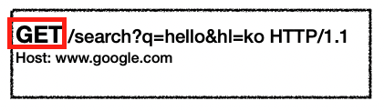

# HTTP 메시지

> 참고 기호
>  CRLF : ( \n )는 엔터를 의미
>     SP : 간격
> OWE : 띄어써도되고 안해도 된다는 의미

## http메시지에 모든 것을 전송

- HTML, TEXT
- IMAGE, 음성, 영상, 파일
- JSON, XML
- 거의 모든 형태의 데이터 전송 가능
- 서버간에 데이터를 주고 받을 때도 대부분 HTTP 사용 **지금은** **HTTP** **시대**!

  

### HTTP메시지 구조

  
(Empty line은 내용이 없어도 공간은 무조건 있어야 한다.)

   

**<u>응답메시지</u>**는 **<u>요청메시지</u>**랑 시작라인 내용이 다르다. ( 위 이미지에서 요청메시지에 body부분이 안보이는데 그냥 하나의 예시일뿐 요청메시지도 body내용을 가질 수 있다.)

### 공식 스펙

 
Header-field : 여러개의 헤더필드들 

## 1-1. <시작 라인 : 요청 메시지>

    

- start-line : **request-line** 또는 status-line 내용이 start-line에 속한다. 여기서 요청 메시지에서는 start line을 **request line**이라고 한다.
- **request-line** : <u>method</u>(get,  post...) SP(공백) <u>request-target</u>(요청하는 대상의 path) SP <u>HTTP-version</u> CRLF(엔터)
  - HTTP 메서드 (예 - GET : 조회 / POST / PUT / PATCH)
  - 요청 대상  (예 -  /search?q=hello&hl=ko) 
  - HTTP Version   (예 - http/1.1, http/2.0, http/3.0 )

### method

요청 메시지 - http 메서드
 

- 종류: GET, POST, PUT, DELETE... 서버가 수행해야 할 동작 지정 
- GET: 리소스 조회 POST: 요청 내역 처리

### request-target

요청 메시지 - 요청대상
 

- absolute-path[?query] (절대경로[?쿼리])
- 절대경로= "/" 로 시작하는 경로
- 참고: *****, http://...?x=y 와 같이 다른 유형의 경로지정 방법도 있다. 

### HTTP-version

요청메시지 - HTTP 버전
 

- HTTP Version

## 1-2. <시작 라인 : 응답 메시지>

   

start-line : request-line / **status-line**. 응답메시지에서는 start-line을 status-line이라고 한다.

status-line 
~~~
HTTP-version SP status-code SP reason-phrase CRLF
~~~

- HTTP 버전(HTTP-version)
- HTTP 상태 코드(status-code) : 요청 성공, 실패를 나타냄(응답메시지에만 넣을 수 있다. / 요청메시지에는 못 넣음)
  - 200: 성공
  - 400: 클라이언트 요청에 오류가 있음
  - 500: 서버 내부에 오류가 있음

- 이유 문구(reason-phrase) : 상태코드 숫자의 의미를 보충설명해주는 사람이 이해할 수 있는 짧은 상태 코드의 설명 글

## 2. <HTTP 헤더>

  

- header-field

  ~~~java
  field-name ":" OWS field-value OWS
    /*
      OWS? 띄어쓰기를 허용한 다는 의미다. 즉, 띄어쓰기를 하던 안하던 상관 없음 
      근데 field-name다음에 OWS는 없으므로 field-name다음에 띄어쓰기는 안된다!
  	*/
  ~~~

- field-name은 대소문자 구문 없음

### HTTP응답메시지 헤더의 용도

- **헤더에는 HTTP 전송에 필요한 모든 부가정보가 다 들어간다.**
- 헤더에 들어가는 내용의 예 :
  - 메시지 바디 내용의 타입(Content-type) : text타입일때 내용에 따라 text/html, text/xml 등등(MME타입일때 Multipart/related , Application/X-FixedRecord ...)
  - 메시지 바디의 크기(Content-Length)
  - 압축 유무
  - 인증 정보
  - 요청 클라이언트의 웹브라우저 정보(내가 크롬으로 요청했는지 explorer로 했는지 등) .
  - 응답에서 서버 애플리케이션 정보가 무엇인지
  - 캐시 관리 정보 등
  - **❗️결론 --> HTTP 헤더에는 메시지 바디내용 빼고 필요한 메타 데이터가 다 들어있다고 보면 된다.**

- 표준 헤더가 너무 많음
  - https://en.wikipedia.org/wiki/List_of_HTTP_header_fields (나중에 싹 정리할것임)
- 필요시 임의의 헤더 추가 가능(물론, 임의의 헤더를 추가하면 약속을 한 클라이언트와 서버만 이해할 것이다.)
  - helloworld: hihi

## 3. <HTTP 메시지 바디>

  

- 실제 전송할 데이터 내용을 의마한다.

  - HTML 문서, 이미지, 영상, JSON 등등 byte로 표현할 수 있는 이 모든 데이터들이 메시지 바디가 될 수 있다. 그리고 압축해서 보내면 그 압축된 내용이 메시지바디 들어간다.

## http 스펙 내용의 결론 : 단순함 과 확장 가능함

- HTTP는 단순하다. 스펙도 읽어볼만...
- HTTP 메시지도 매우 단순
- 크게 성공하는 표준 기술은 단순하지만 확장 가능한 기술
