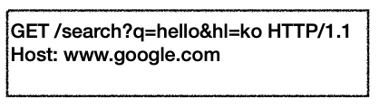
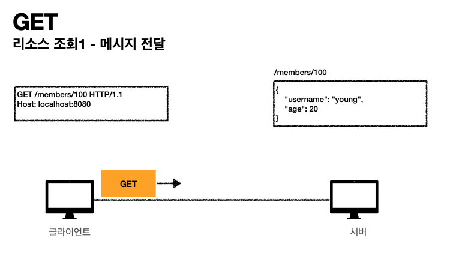
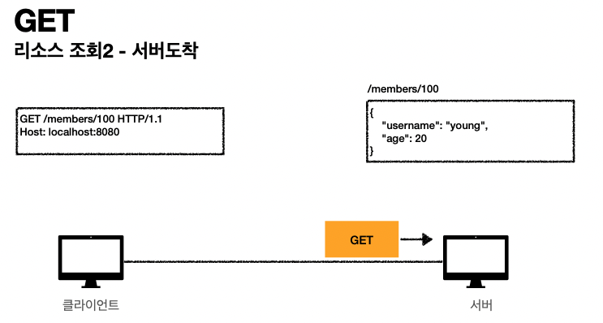
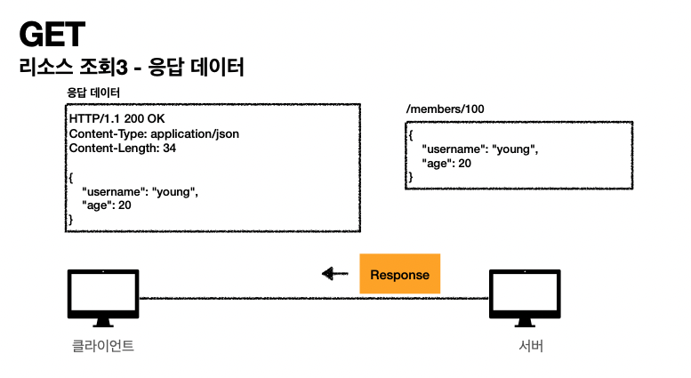
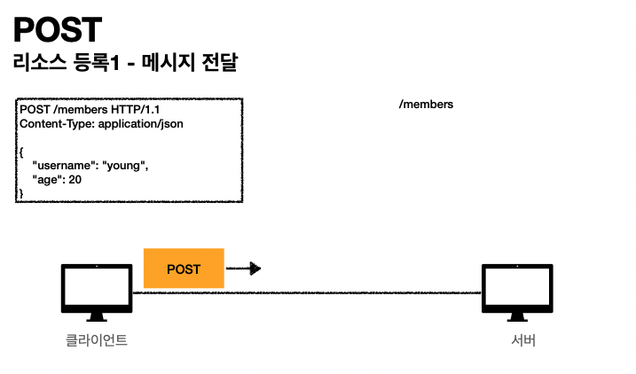
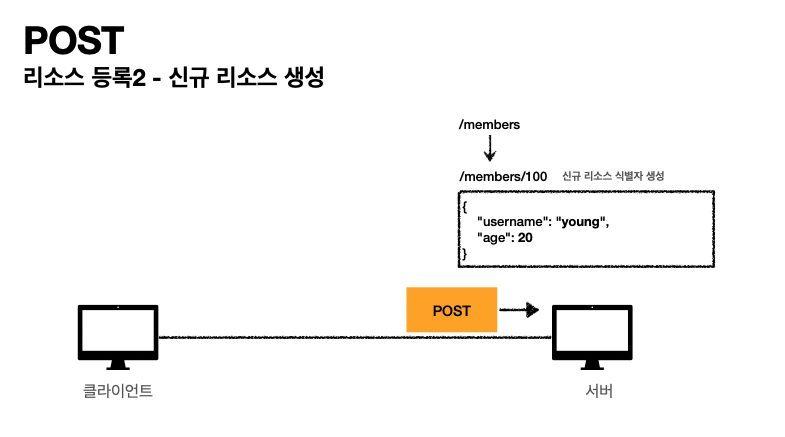
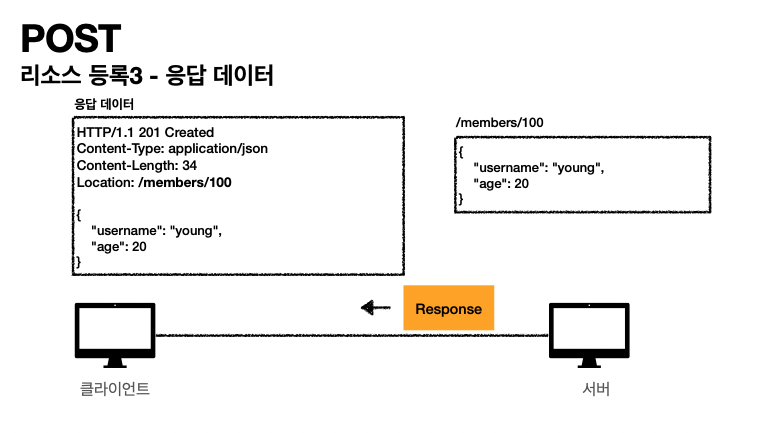

# HTTP API 만들기 : HTTP메서드 - GET, POST

## **주요 메서드**

- GET: 리소스(현재는 representation이라고 부른다.) 조회
- POST: 요청 데이터 처리, 주로 등록에 사용 
- PUT: 리소스를 대체, 해당 리소스가 없으면 생성 
- PATCH: 리소스 부분 변경
- DELETE: 리소스 삭제

## 기타 메서드

- HEAD: GET과 동일하지만 메시지 부분을 제외하고, 상태 줄과 헤더만 반환 
- OPTIONS: 대상 리소스에 대한 통신 가능 옵션(메서드)을 설명(주로 CORS에서 사용) 
- CONNECT: 대상 자원으로 식별되는 서버에 대한 터널을 설정
- TRACE: 대상 리소스에 대한 경로를 따라 메시지 루프백 테스트를 수행

(💡connect, trace는 거의 사용하는 내용을 보기 힘듬)

## GET

 

- 리소스 조회
- 메시지에 url을 담아서 해당 url의 내용을 조회하겠다는 의미. + 서버에 전달하고 싶은 데이터는 query(쿼리 파라미터, 쿼리 스트링)를 통해서 전달
- 메시지 바디를 사용해서 데이터를 전달할 수 있지만, 지원하지 않는 곳이 많아서 권장하지 않음

### 이미지 설명

 

 

 

## POST

-  요청 데이터 처리
- 메시지 바디를 통해 서버로 요청 데이터 전달
  - post의 의미는 클라이언트에서 서버로 요청을 보낼때 클라이언트쪽에서 데이터를 줄테니 서버 너가 받아서 이 요청 데이터를 처리해달라! 라는 의미 
- 서버는 요청 데이터를 **처리**
  - 메시지 바디를 통해 들어온 데이터를 처리하는 모든 기능을 수행한다.
- 주로 전달된 데이터로 신규 리소스 등록, (변경된) 프로세스 처리에 사용

### 이미지 설명

 

 
회원들을 담는 리소스인 /members에 신규 회원 정보를 등록하는데 이 회원을 구분짓는 신규리소스 식별해주는 uri **<u>'/100'</u>**을 서버가 만들어 준다.

 
**회원을 구분해주는 신규리소스의 위치정보가, 응답 메시지에 Location이라는 field-name의 value값으로 들어간다!**

### POST는 요청 데이터를 어떻게 처리한다는 뜻일까?

- 스펙: POST 메서드는 **대상 리소스가 리소스의 고유 한 의미 체계에 따라 요청에 포함 된 표현을 처리하도록 요청**합니다. (구글 번 역) 
- 예를 들어 POST는 다음과 같은 기능에 사용됩니다.

- 예) HTML FORM에 입력한 정보로 회원 가입, 주문 등에서 사용
  - HTML 양식에 입력 된 필드와 같은 데이터 블록을 데이터 처리 프로세스에 제공
- 게시판, 뉴스 그룹, 메일링 리스트, 블로그 또는 유사한 기사 그룹에 메시지 게시
  - 예) 게시판 글쓰기, 댓글 달기
- 서버가 아직 식별하지 않은 새 리소스 생성
  - 예) 신규 주문 생성
- 기존 자원에 데이터 추가
  - 예) 한 문서 끝에 내용 추가하기 
- 정리: 이 리소스 URI에 POST 요청이 오면 요청 데이터를 어떻게 처리할지 리소스마다 따로 정해야 함 -> 정해진 것이 없음

### 정리

- 1. 새 리소스 생성(등록)

  - 서버가 아직 식별하지 않은 새 리소스 생성

- 2. 요청 데이터 처리

  - 단순히 데이터를 생성하거나, 변경하는 것을 넘어서 프로세스를 처리해야 하는 경우

  - 예) 주문에서 결제완료 -> 배달시작 -> 배달완료 처럼 단순히 값 변경을 넘어 프로세스의 상태가 변경되는 경우 

  - POST의 결과로 새로운 리소스가 생성되지 않을 수도 있음

  - 예) POST /orders/{orderId}/start-delivery (**컨트롤** **URI**)

    > 참고 내용 : 리소스로만 uri를 설계하라고 했었는데 그것만으로 안되는 불가피한 상황이 있다. 이때는 보통 '동사'형태의 uri가 더해진다. 이렇게 동사 형태의 uri도 추가된 형태를 `컨트롤 URI`라고 한다.

- 3. 다른 메서드로 처리하기 애매한 경우

  - 예)쿼리스트링, 쿼리파라미터로 말고 조회용도로 요청을 보낼꺼지만 메시지바디에 내용을 넣고 싶은 상황이다. 그런데 get메서드로 메시지바디형태로 온걸 받는걸 지원하지 않는 서버들이 많다. 이런걸 지원하지 않는 서버들은 처리를 안한다. 그래서 이런 경우에는 조회 목적이여도 메시지바디에 내용을 담으려면 POST를 써야 한다. (보통 메시지바디에 데이터를 JSON형태로 담는다.)
  - 애매하면 POST -> POST는 사실상 모든걸 할 수 있다. 하지만 조회의 목적은 get은 쓰는게 유리하다.(서버끼리 기본적인 약속이 있다. 'get요청으로 오면은 캐싱을 하겠다.' 라는 게 있다. 하지만 post로오면 get으로 올때보다 캐싱을 하는게 좀 더 어렵다.)

