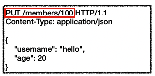
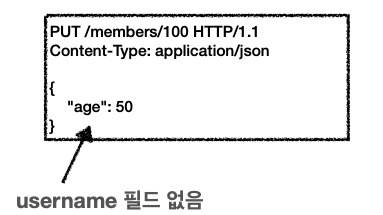
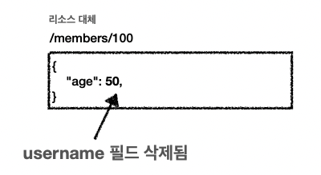
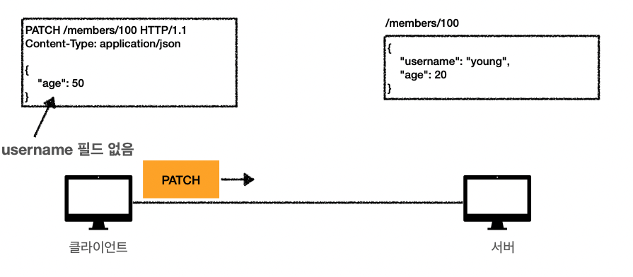
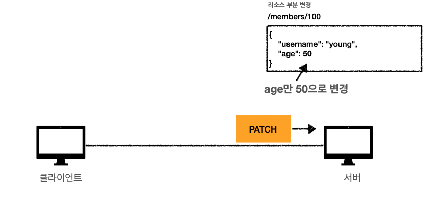
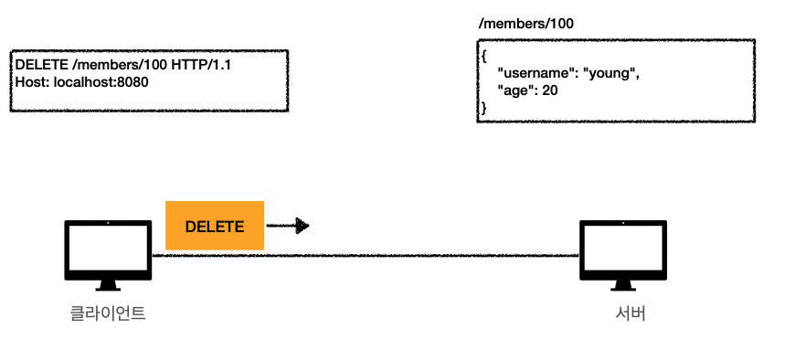
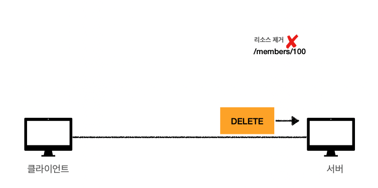

# PUT

- 리소스를 대체

  - 리소스가 있으면 대체
     

    `PUT /members/100`이라는 기록이 기존에 있으면 완전히 덮어쓰기로 대체한다.

  -  리소스가 없으면 생성 

  -  쉽게 이야기해서 덮어버림. 리소스를 부분 수정하는 용도로 쓰지 않는다.

- **중요! 클라이언트가 리소스를 식별**
  - 클라이언트가 리소스 위치를 알고 그것을 반영해 URI 지정한다.
  -  POST와 차이점
    - post전송은 클라이언트 입장에서 members가 100에 만들어질지, 200에 만들어질지 알지 못한다. put은 클라이언트가 직접 `PUT /members/100`라고 100이라는 리소스의 구체적 위치까지 지정하는 것이다.

## PUT의 주의점 : 부분 변경하고 싶을때

 

1. 기존의 username : hello , age : 20 의 정보에서 age를 50으로 변경하고 싶을때 username필드를 넣지 않고 보내본다.

    

2. 그러면 기존에 존재하는 url정보여서 데이터가 대체가 되면서,
    
   의도한것과 다르게 변경이 없는 필드는 사라진다.
3.  만약에 put으로 부분 변경을 하고 싶다면 변경이 없는 다른 필드값들도 그대로 적어줘야 한다.

# PATCH

- 리소스를 부분 변경하는 용도로 사용한다. put의 주의점을 해결할때 patch를 쓰면 된다.

## PATCH : 리소스 변경

 

 

- **주의점 : patch가 지원되지 않는 서버도 가끔 있었다. 물론 요즘에는 거의다 될 것이다. 만약 지원되지 않는다면 post를 쓰면 된다.**

## DELETE

- 해당 url에 존재하는 리소스 제거

 

 

