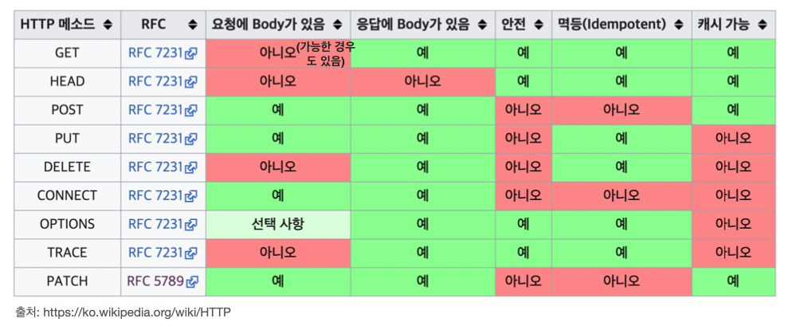

# HTTP 메서드의 속성

- 안전(Safe Methods)
- 멱등(Idempotent Methods)
- 캐시가능(Cacheable Methods)

 

GET의 요청에 Body를 넣는게 가능한 경우도 있지만 지원안하는 웹브라우저도 있어서 가급적이면 body에 넣는걸 시도안하는게 좋음

### HEAD?

get과 용도는 같다. 하지만 body구현 내용이 아예 빠져있다고 보면 된다.

## 안전 Safe

- 호출해도 리소스를 변경하지 않는다. (예 : get, head )
- Q: 그래도 계속 호출해서, 로그 같은게 쌓여서 장애가 발생하면요? 
- A: 안전은 해당 리소스가 변하냐 변하지 않냐만 고려한다. 로그로 인한 장애 등의 부분까지 고려하지 않는다.

## 멱등 Idempotent

- f(f(x)) = f(x)
- 한 번 호출하든 두 번 호출하든 100번 호출하든 결과가 똑같다. (예 : get, put, delete )
- **GET**: 한 번 조회하든, 두 번 조회하든 같은 결과가 조회된다.
- **PUT**: 결과를 대체한다. 따라서 같은 요청을 여러번 해도 최종 결과는 같다. **DELETE**: 결과를 삭제한다. 같은 요청을 여러번 해도 삭제된 결과는 똑같다. 
- **POST**: 멱등이 아니다! 두 번 호출하면 같은 결제가 중복해서 발생할 수 있다.

  

### 멱등 Idempotent의 활용

- 자동 복구 메커니즘
- 서버가 TIMEOUT 등으로 정상 응답을 못주었을 때, 클라이언트가 같은 요청을 다시 해 도 되는가? 판단 근거
  - 예 : delete를 시도했는데 서버에서 응답이 없다. 클라이언트가 제대로 요청을 했는지 알수가 없다. 그러면 클라이언트가 자동으로 요청을 재시도한다. 근데 문제가 안된다. 왜냐하면 멱등하기떄문에 원하는 결과에서 다른 데이터로 변형을 가하지 않는다. 이럴때 멱등한 요청이냐의 판단하는 근거로 이 개념을 사용한다. 그래서 멱등한 요청이라면 자동 복구 메커니즘을 위해 활용이 가능해진다. 

### 이런 경우에도 멱등일까?

- **Q : 재요청 중간에 다른 곳에서 리소스를 변경해버리면?**

  - 사용자1: GET -> username:A, age:20

  - 사용자2: PUT -> username:A, age:30

  - 사용자1: GET -> username:A, age:30 -> 중간에 갑자기 사용자2의 영향으로 바뀐 데이터를 사용자1이 다시 조회 -> 그러므로, 멱등하지 않다! 

    

- A : 멱등은 외부 요인으로 중간에 리소스가 변경되는 것 까지는 고려하지는 않는다.

> 실제로 개발할때는 put때문에 리소스가 중간에 바뀌게 되면 서버가 '어!? 얘 리소스가 바꼈네' 라는 것을 서버에서 체크해주게 짜야 한다.

## 캐시가능 Cacheable

- 응답 결과 리소스를 캐시해서 사용해도 되는가?
  - 나중에 캐시에 대해 자세히 다루겠지만, 웹브라우저를 통해 용량이 큰 이미지를 요청한다고 하자. 그 이후에 똑같은 이미지를 조회하고 싶을때 똑같은 내용을 또 요청하는 것은 자원의 낭비일 것이다. 그래서 한번 응답받은 이미지는 내 로컬PC에 저장하게 된다. 이런것을 해주는걸 캐시라고 한다.
- GET, HEAD, POST, PATCH 캐시가 가능하다. 하지만, 실제로는 GET, HEAD 정도만 캐시로 사용
  - POST, PATCH는 본문 내용까지 캐시 키로 고려해야 하는데, 구현이 쉽지 않음. 즉 똑같은 리소스랑 key가 맞아야 한다. 하지만 post나 patch는 body 내용까지 캐시의 키로 고려해서 만들어져야 하기때문에 너무 복잡하다. 그래서 대부분 구현이 잘 안되어 있다. 반면에 get은 url만 key로 잡고 캐시를 하면 된다.  그래서 실제로는 get, head정도만 캐시로 사용한다.
