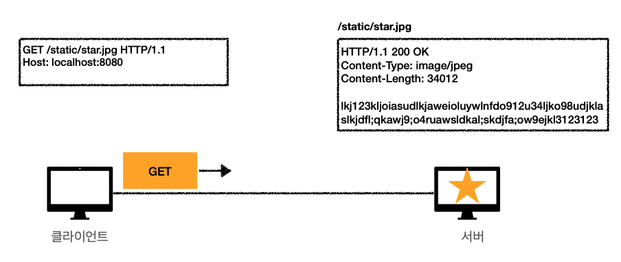
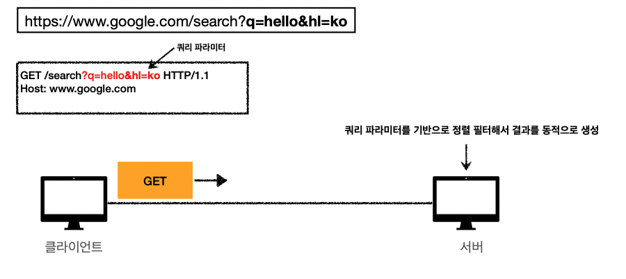
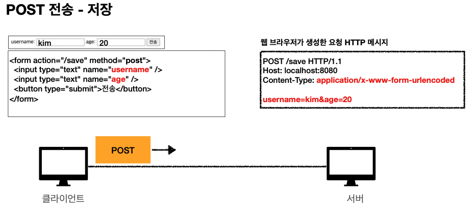
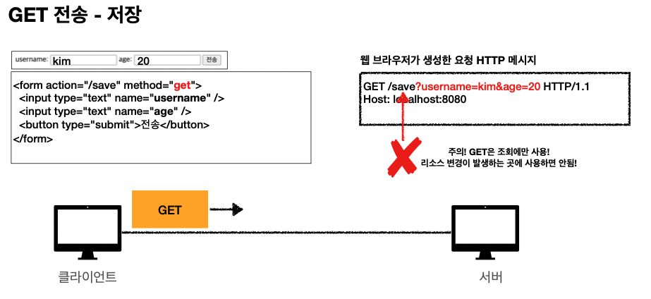
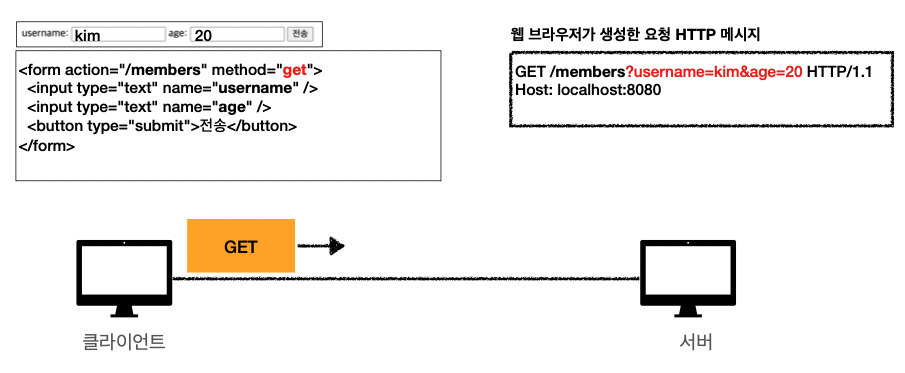
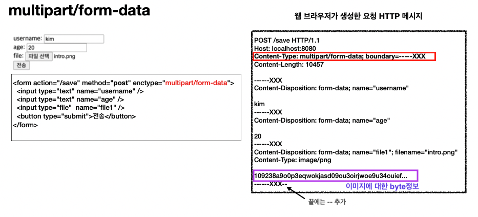

# HTTP 메서드 활용

- 클라이언트에서 서버로 데이터 전송
- HTTP API 설계 예시

## 클라이언트에서 서버로 데이터 전송

- 쿼리 파라미터를 통한 데이터 전송
  - GET
  - 주로 정렬 필터(검색어)

- 메시지 바디를 통한 데이터 전송
  - POST, PUT, PATCH
  - 회원 가입, 상품 주문, 리소스 등록, 리소스 변경

## 클라이언트에서 서버로 전송하는 4가지 상황

- 1. 정적 데이터 조회

  - 이미지, 정적 텍스트 문서

- 2. 동적 데이터 조회

  - 주로 검색, 게시판 목록에서 정렬 필터(검색어) 

- 3. HTML Form을 통한 데이터 전송

  - 회원 가입, 상품 주문, 데이터 변경 

- 4. HTTP API를 통한 데이터 전송

  - 회원 가입, 상품 주문, 데이터 변경
  - 서버 to 서버, 앱 클라이언트, 웹 클라이언트(Ajax) 

### 1. 정적 데이터 조회

#### 쿼리 파라미터 <u>미사용</u>

내가 조회하고 싶은 정적 리소스의 경로의 url을 request target으로 요청을 보낸다.

 

이런 정적데이터를 조회할때는 request메시지에 추가적인 데이터를 담을 필요가 없다.

#### 정적 데이터 조희 내용 정리

- 이미지, 정적 텍스트 문서

- 조회는 GET 사용
- 정적 데이터는 일반적으로 쿼리 파라미터 없이 리소스 경로로 단순하게 조회 가능

### 2. 동적 데이터 조희

#### 쿼리 파라미터를 사용한다!

 

#### 동적 데이터 조희 내용 정리

- 주로 검색, 게시판 목록에서 정렬 필터(검색어를 '필터'라고 칭한다.)
- 조회 조건을 줄여주는 필터, 조회 결과를 정렬하는 정렬 조건에 주로 사용 
- 조회는 GET 사용
- GET은 쿼리 파라미터 사용해서 데이터를 전달
  - 물론 get도 메시지body를 써서 데이터를 전송할 수 는 있지만 실제로 아직 지원하지 않는 서버들도 많아서 실무에서는 권장하지 않는다.

### 3. HTML Form 데이터 전송

#### 	3-1 POST 전송

 

순수하게 html문서만을 가지고 개발을 할때 html의 Form태그를 이용해서 회원가입내용을 자주 만든다.
body에 query parameter와 비슷한 형태로 input의 type = text타입인 내용들이 담겨진다.

> content-type의 내용이 ~~urlencoded 인 이유는, message body내용에 한글이 들어가면은 %~형태로 인코딩되어서 데이터가 넘어간다.

#### 3-2 GET 전송 - 저장

 

참고 주의사항> path에 /save로 했을때는 리소스의 행위가 '저장'을 의미한다. GET은 조회만을 목적으로 하기때문에 리소스의 변경을 요구하는 행위에는 쓰지 않도록 하자! ( 이 내용은 되기는 한다는걸 보여주기 위한 예시일뿐임. 실제로는 위처럼 저장의 행위일때는 POST로 하자! )

#### 3-3 GET 전송 - 조회

 

#### 3-4 multipart/form-data

파일을 전송할때 쓰는 content-type이다.

   enctype=multipart/form-data이게 되면은, username, age같은 text뿐만 아니라 byte로 되어있는 File까지 같이 전송하고 싶을때 사용하는 타입이다. 말 그대로 멀티로 content-type을 여러개 전송하고 싶을때 사용한다.
이럴떄는 multipart/form-data라는, 메시지body에 넣는 데이터 형식을 사용해야 하는데, 
이 형식은 default로 만들어지는 데이터 타입에 boundary=-----XXX가 들어간다.(웹브라우저가 자동(랜덤)으로 이렇게 만들어주는 것임)

보라색 상자내용처럼, content-type:image/png인 곳에는 이미지에 대한 byte정보가 들어간다.

> multipart?
> 여러개의 멀티로 여러 content-type데이터들을 보낼수 있는 타입이다. 얘네들은 주로 바이너리 데이터들을 전송할때 사용한다.

 

#### HTML Form 데이터 전송 정리

- HTML Form submit시 POST 전송
  - 예) 회원 가입, 상품 주문, 데이터 변경

- HTML Form submit의 type은 default로 Content-Type: application/x-www-form-urlencoded 사용
  - form의 내용을 메시지 바디를 통해서 전송(key=value, 쿼리 파라미터 형식)
  - 전송 데이터를 url encoding 처리(application/x-www-form-urlencoded 타입[아마도 utf-8일것임])
    - 예) abc김 -> abc%EA%B9%80 HTML Form은 GET 전송도 가능(한글내용이 인코딩됨)

- Content-Type: multipart/form-data
  - 파일 업로드 같은 바이너리 데이터 전송시 사용
  - 다른 종류의 여러 파일과 폼의 내용 함께 전송 가능(그래서 이름이 multipart) 
- 참고: HTML Form 전송은 **GET, POST**만 지원

### 4. HTTP API 데이터 전송할 때

- 안드로이드폰 or 아이폰의 App에서 처럼 client -> server로 데이터를 바로 전송할때 우리는 보통 http api로 데이터를 전송한다고 말한다.
- Content-type을 수동으로 application/json으로 해준다.(물론 다른 타입으로 할 수 도 있지만 자주 사용하는 타입이 json이다.)

#### HTTP API 데이터 전송 정리

- 서버 to 서버
  - 백엔드 시스템 통신 앱 클라이언트 (서버끼리 통신할때는 html이 전혀 없기때문에 순수하게 전송하고 싶은 데이터만 담으면 됨)

- 아이폰, 안드로이드 웹 클라이언트

  - HTML에서 Form 전송 대신 자바 스크립트를 통한 통신에 사용(이런 방식을 AJAX통신이라고 한다.)

    > ajax 뜻 : '비동기 자바스크립트를 활용한 xml전송'을 의미한다.

  - 예) React, VueJs 같은 웹 클라이언트와 API 통신 

- POST, PUT, PATCH: 메시지 바디를 통해 데이터 전송

- GET: 조회, 쿼리 파라미터로 데이터 전달

- Content-Type: application/json을 주로 사용 (사실상 표준)

  > 예전에는 xml같은 방식을 썼는데 최근 개발방식은 xml을 읽기 쉽지 않고 파일을 구성하는 형태도 여는 태그, 닫는 태그 등 복잡한 모양을 가져서 요즘은 json을 많이 쓴다.
  > json방식은 형태가 심플하고 이해하기 쉬운 형태를 가진다. 또한 데이터 크기도 xml에 비해 상대적으로 작게 차지한다.

  - TEXT, XML, JSON 등등

