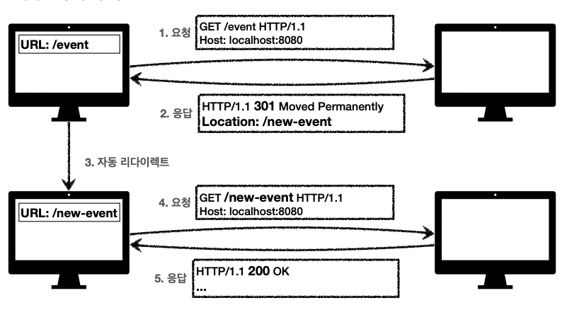
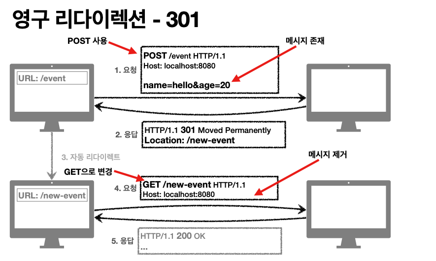
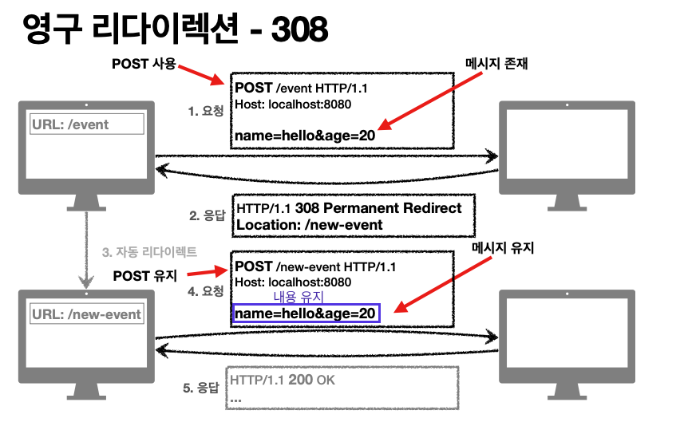
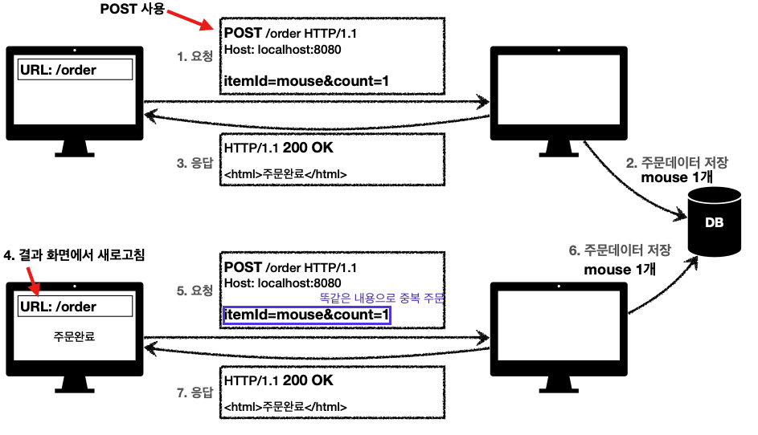
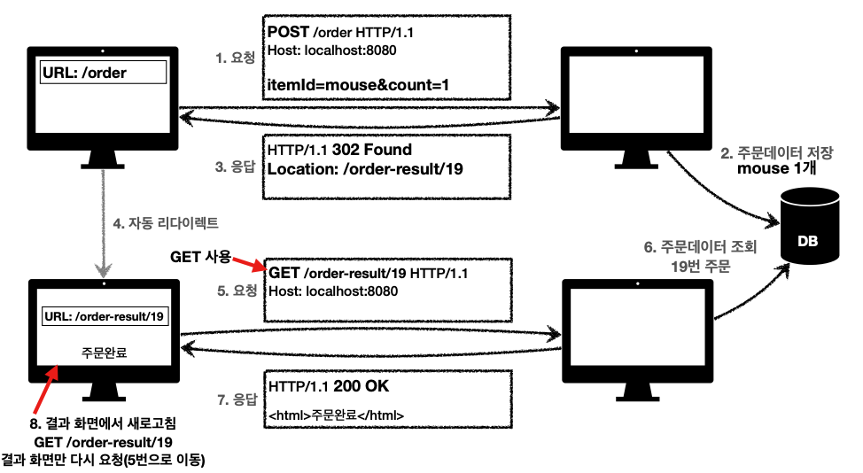

## 3xx - 리다이렉션

: 요청을 완료하기 위해 유저 에이전트(클라이언트 프로그램, 웹에서는 즉, 웹브라우저를 의미할 것)의 추가 조치 필요.

풀어서 말하자면, 클라이언트가 서버에게 요청을 하고 서버가 데이터 내용을 보고 이 요청을 완료하려면 추가적인 작업이 필요하다는 것을 인지하여서 다시 클라이언트에게 보내는 것을 말한다.

- 300 Multiple Choices 
- 301 Moved Permanently 
- 302 Found
- 303 See Other
- 304 Not Modified
- 307 Temporary Redirect 
- 308 Permanent Redirect

## 리아디렉션 이해

- 웹 브라우저는 3xx 응답의 결과에 Location 헤더가 있으면, Location 위치로 자동 이동 (리다이렉트)

### 자동 리다이렉트 흐름

 

1. event페이지를 /event 의 uri로 연결시켰는데 이제 event페이지를 /new-event의 API 내용을 쓰기로 바꿨다고 가정하자. 하지만 기존 사용자들은 링크를 통해 접근할때 /event로 접속하고 있는 상황이다. 하지만 이 사람들도 새로 개설한 /new-event의 내용으로 접근하도록 처리하고 싶다고 하자.
2. 이럴때 서버에서는 http의 상태코드 301을 쓰고 새로운 uri정보를 담을 field내용으로 Location인 것을 추가해준다. (Location: /new-event)
3. 그러면 웹브라우저는 해당 응답메시지의 내용을 보고 웹브라우저 스스로 uri를 /event에서 /new-event로 바꿔주어서 재요청을 보낸다. 

### 리다이렉션의 종류

- 영구 리다이렉션 - 특정 리소스의 URI가 영구적으로 이동 (응답해주는 서버에서 새로운 uri로 접근하라고 보내고 클라이언트쪽에서 다시 요청을 보내면서 영구적으로 uri이 변경됨)

  - 예) /members -> /users 
  - 예) /event -> /new-event 

  

- 일시 리다이렉션 - 일시적인 변경

  - 주문 완료 후 주문 내역 화면으로 이동
  - PRG: Post/Redirect/Get

- 특수 리다이렉션
  - 결과 대신 캐시를 사용 (클라이언트쪽에 캐시가 있는데 캐시기간이 만료된 것 같다고 가정하자. 그래서 클라이언트가 서버에게 캐시기간이 만료된거 같은데 맞냐? 라고 묻기 위해 캐시의 생성일자 등의 정보를 서버에게 넘겨준다. 그러면 서버가 보고 '오!? 그 캐시 그대로 써도 되는데? 굳이 다시 다운로드 받을 필요 없어. 해당 데이터쓸꺼면 기존대로 그냥 캐시에서 조회해서 써'라는 식으로 피드백 해주기 위해 서버에서 응답을 보내는게 특수 리다이렉션에 해당된다.)

#### 1. 영구 리다이렉션

##### 301, 308(둘은 기능이 똑같지만 method처리내용이 다르다.)

- 리소스의 URI가 영구적으로 이동
- 원래의 URL를 사용X, 검색 엔진 등에서도 변경을 인지할 수 있음
- 301 Moved Permanently
  - 리다이렉트시 요청 메서드가 GET으로 변하고, **본문이 제거될 수 있음(MAY)**
    - may인 이유는, 처음에는 스펙일 제정할때 301이던 상관없이 post로 왔으면 다시 보낼떄도 post로 갈 것이라고 생각하고 했는데 브라우저들이 다 get으로 보내는 것을 확인했다. 나중에 스펙자체를 http규칙을 깰 수 없고 그것에 맞춰서 웹브라우저가 구현이 되어 있으니깐 아예 설명 내용을 추후에 get으로 변한다고 수정한 것이다.
    - 처음 클라이언트가 post로 요청해도 2번째 요청에는 get으로 변경된다. 그래서 method body내용이 제거될 수 있다. 

  

4.요청에서 리다이렉트로 새로운 url로 접근할때는 1번의 요청메시지에 담은 'name=hello&age=20'의 데이터를 손실하게 된다!

- 308 Permanent Redirect
  - 301과 기능은 같음
  - 리다이렉트시 요청 메서드와 본문 유지(처음 POST를 보내면 리다이렉트도 POST 유지 / 본문 유지한다는 것은 요청의 내용이 유지된다는 것인지 응답의 내용이 유지가 된다는 것인지 확인해보자.)

 

실무에서는 308같은 예시로 처리하지 않는다. 왜냐하면  /event에서 /new-event로 리다이렉트시킬때 내부적으로 전달되어야 하는 데이터자체가 다 바껴버린다. 그렇기때문에 이런 경우에는 처음 요청이 POST로 와도 리다이렉트 시킬때 get으로 시키는 301로 하는 경우가 많다. 근데 실제로는 이런 예인 경우에 301도 잘 사용하지 않는다. 이런 상황일때 주로 **일시적 리다이렉션(RGB패턴)**을 사용한다.

#### 2. 영구 리다이렉션

#### 302, 307, 303

- 리소스의 URI가 일시적으로 변경(나중에는 영구적으로 바뀐게 적용안될수도 있음)
- 따라서 검색 엔진 등에서 URL을 변경하면 안됨
- 302 Found
  - 리다이렉트시 요청 메서드가 GET으로 변하고, 본문이 제거될 수 있음(MAY)
    - MAY인 이유는 과거에 만들어진 브라우저는 이런식으로 스펙이 작성되었지만 이후로 만들어진 다른 몇 웹브라우저에는 안그럴수도 있기때문에 MAY라고 표현했다.

- 307 Temporary Redirect
  - 302와 기능은 같음
  - 리다이렉트시 요청 메서드와 본문을 무조건 유지한다.(요청 메서드를 변경하면 안된다. MUST NOT) 
- 303 See Other
  - 302와 기능은 같음(302는 get으로 처리안될 수 있다는 애매함이 존재하기때문에 무조건 get으로 처리해주는 것을 약속된 내용이다.)
  - 리다이렉트시 요청 메서드가 GET으로 변경
  - 대부분의 프레임워크나 기술레벨들에서 Redirect를 할때 default로 302로 많이 쓰고 있다. 근데 대부분은 웹브라우저가 302로 했을때 리다이렉트시에 get으로 처리하기때문에 굳이 303으로 변경하지 않고 302로 써도 무방할 것이다. 

#### 3. PRG : Post/Redirect/Get

#### 일시적 리다이렉션 - 예시

- POST로 주문후에 웹 브라우저를 새로고침하면? 
- 새로고침은 다시 요청
- 중복 주문이 될 수 있다.
- 결론 : POST로 주문 후에 주문후의 결과가 그 페이지에 남아 있을 것이다. 이때 새로고침을 누르면 다시 POST요청을 보내게 되서 중복 주문이 발생할 수 있다.

PRG 사용전
 

(물론 원칙적으로는, 이런 경우에 똑같은 중복요청이 오면은 '잘못된 주문이다'라는 경고를 띄우며 요청메시지를 버리돌고 처리하게 해놔야 한다. 하지만 이전에 클라이언트에서도 PRG를 통해 미리 한번 더 막아주는게 좋다.)

PRG 사용할때 처리 과정

- POST로 주문후에 새로 고침으로 인한 중복 주문 방지

  1. POST로 주문후에 주문 결과 화면 페이지를 GET 메서드로 리다이렉트

  2. 결과 화면 페이지가 갖고 있는 요청이 GET으로 남아있기때문에 새로고침해도 결과 화면을 GET으로 조회

  3. 중복 주문 대신에 결과 화면만 GET으로 다시 요청

PRG 사용 모습

 

웹브라우저가 3.응답의 302메시지를 보고 '리다이렉트를 해야한다'라는 것을파악한다. 

- PRG 이후 리다이렉트
  - URL이 이미 POST -> GET으로 리다이렉트 됨
  - 새로 고침 해도 GET으로 결과 화면만 조회

#### 그래서 뭘 써야 하나요? 

#### 302, 307, 303

- 잠깐 정리
  - 302 Found -> GET으로 변할 수 있음
  - 307 Temporary Redirect -> 메서드가 변하면 안됨 
  - 303 See Other -> 메서드가 GET으로 변경

- 역사
  - 처음 302 스펙의 의도는 HTTP 메서드를 유지하는 것
  - 그런데 웹 브라우저들이 대부분 GET으로 바꾸어버림(일부는 다르게 동작)
  - 그래서 모호한 302를 대신하는 명확한 307, 303이 등장함(301 대응으로 308도 등장)

- 현실
  - 307, 303을 권장하지만 현실적으로 이미 많은 애플리케이션 라이브러리들이 302를 기본값으로 사용 
  - 자동 리다이렉션시에 GET으로 변해도 되면 그냥 302를 사용해도 큰 문제 없음

### 기타 리다이렉션

- 300 Multiple Choices: 안쓴다. 
- 304 Not Modified
  - 캐시를 목적으로 사용
  - 클라이언트에게 리소스가 수정되지 않았음을 알려준다. 따라서 클라이언트는 로컬PC에 저장된 캐시를 재사용한다. (캐시로 리다이렉트 한다.)
  - 304 응답은 응답에 메시지 바디를 포함하면 안된다. (로컬 캐시를 사용해야 하므로) 
  - 조건부 GET, HEAD 요청시 사용

