# HTTP 헤더1 : 일반 헤더(일반적으로 자주 사용하는 헤더 내용)

- header-field = field-name ":" OWS field-value OWS (OWS:띄어쓰기 허용) 
- field-name은 대소문자 구문 없음
  

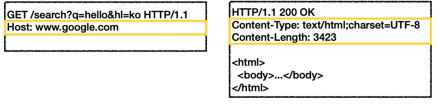 

## 헤더의 용도

- **HTTP 전송에 필요한 모든 부가정보를 담는다.**
- 예) 메시지 바디의 내용, 메시지 바디의 크기, 압축, 인증, 요청 클라이언트, 서버 정보, 캐시 관리 정보...
- 표준 헤더가 너무 많음
  - https://en.wikipedia.org/wiki/List_of_HTTP_header_fields
- 필요시 임의의 헤더 추가 가능
  - helloworld: hihi

## HTTP헤더의 분류

###  과거 모델(RFC2616)

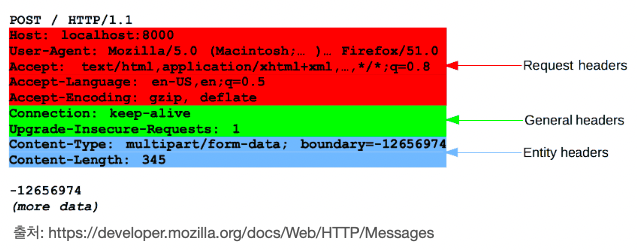 

- 헤더 분류
  - General 헤더: 메시지 전체에 적용되는 정보, 예) Connection: close / Status Code : 200 / Remote Address
  - Request 헤더: 요청 정보, 예) User-Agent: Mozilla/5.0 (Macintosh; ..)
  - Response 헤더: 응답 정보, 예) Server: Apache
  - Entity 헤더: 엔티티 바디 정보, 예) Content-Type: text/html, Content-Length: 3423

- 과거 HTTP Body

  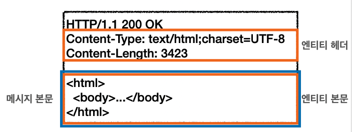 

  - 메시지 본문(message body)은 엔티티 본문(entity body)을 전달하는데 사용 

  - 엔티티 본문은 요청이나 응답에서 전달할 실제 데이터

  - 엔티티 헤더는 엔티티 본문의 데이터를 해석할 수 있는 정보 제공
    - 데이터 유형(html, json), 데이터 길이, 압축 정보 등등

###  최근 모델(2014년 이후로, RFC7230 ~ RFC7235 등장)

- 엔티티(Entity) -> 표현(Representation)

- Representation = representation Metadata + Representation Data(REST의 R이 Representation을 의미.)

- 표현 = 표현 메타데이터 + 표현 데이터

- **<u>현재 HTTP Body</u>**
  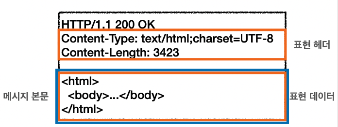 
  - 메시지 본문(message body)을 통해 표현 데이터 전달 
  - **메시지 본문 = 페이로드(payload)**
  - 표현은 요청이나 응답에서 전달할 실제 데이터
  - 표현 헤더는 표현 데이터를 해석할 수 있는 정보 제공
    - 데이터 유형(html, json), 데이터 길이, 압축 정보 등등
  - 참고: 표현 헤더는 표현 메타데이터와, 페이로드 메시지를 구분해야 하지만, 여기서는 생략

## 1. - [1] 표현

데이터베이스에는 데이터가 바이너리코드로 되어 있다.

표현은 리소스 내용을 가진다.(예: 회원 리소스)

 

- a. Content-Type: 표현 데이터의 형식 ( 리소스를  html형식으로 전송할건지, json형식으로 전송할건지 )

  - charSet은 message body의 문자를 어떤 방식으로 인코딩할지를 정한다.(charset = UTF-8)

    

- b. Content-Encoding: 표현 데이터의 압축 방식 (예 : Content-Encoding : gzip)

- c. Content-Language: 표현 데이터의 자연 언어 

- d. Content-Length: 표현 데이터의 길이

  - 사실은 Content-Length은 표현헤더라기보다는, 페이로드 헤더로넣어야 하긴 한다.

- **표현 헤더는 전송, 응답 둘다 사용할 수 있다.**

### b. Content-Encoding : 표현 데이터 인코딩

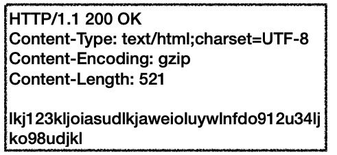 

- 표현 데이터를 압축하기 위해 사용
- 데이터를 전달하는 곳에서 압축 후 인코딩 헤더 추가 
- 데이터를 읽는 쪽에서 인코딩 헤더의 정보로 압축 해제 
- 예)
  - gzip 
  - deflate 
  - identity(압축안한 그대로 형태로 보낸다는 의미)

### c. Content-Language : 표현 데이터의 길이

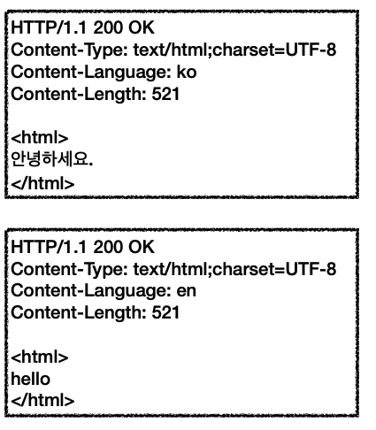 

- 표현 데이터의 자연 언어를 표현 (클라이언트에서 언어를 선택할 수 있게 만드는 용도)
- 예)
  - ko
  - en 
  - en-US

#### d. Content-Length: 표현 데이터의 길이

- 바이트 단위

- Transfer-Encoding(전송 코딩)을 사용하면 Content-Length를 사용하면 안됨
  - 안되는 이유 : Transfer-Encoding내용 자체에 이미 길이도 다 들어가 있다. 그래서 Content-Length를 사용하면 안된다.(구체적인건 나중에 한번 더 다룰 것임)

## 1. - [2] 협상(컨텐츠 네코시에이션)

클라이언트가 요청 메시지를 보낼때 선호하는 표현을 담아 서버에게 요청하는 것
(물론 서버가 지원하지않으면 못주지만 지원되면 최대한 맞춰달라고 요청하는 것임)

###  **⭐️협상 헤더는 요청시에만 사용한다!**

- Accept: 클라이언트가 선호하는 미디어 타입 전달 
- Accept-Charset: 클라이언트가 선호하는 문자 인코딩 
- Accept-Encoding: 클라이언트가 선호하는 압축 인코딩 
- Accept-Language: 클라이언트가 선호하는 자연 언어

### Accept-Language 적용 전

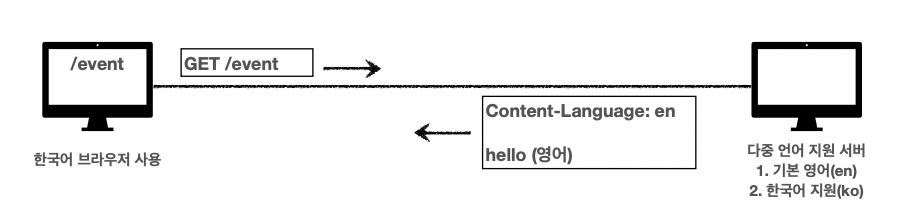 

a. client가 외국에 있는 사이트로 'get/event'요청을 헀다고 가정하자. 서버는 다중 언어를 지원하는 서버라고 가정하자. 하지만 1순위는 영어로, 2순위가 한국어로 지원하는 서버다.

b. 클라이언트가 원하는 언어가 뭔지 지정된게 없기떄문에 message-body내용은 영어로 보내게 된다.

### Accept-Language 적용 후

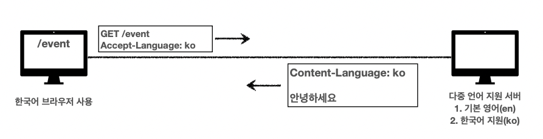 

a. client가 외국에 있는 사이트로 'get/event'요청을 헀다고 가정하자. 서버는 다중 언어를 지원하는 서버라고 가정하자. 하지만 1순위는 영어로, 2순위가 한국어로 지원하는 서버다.

b. 클라이언트가 원하는 언어를  Accept-Language: ko를 담아서 요청을 보내기때문에 응답 message-body내용은 한국어로 보내게 된다. 

### **Accept-Language** **복잡한 예시**

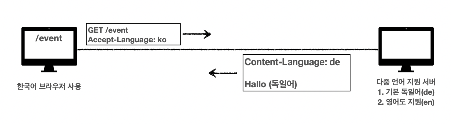 

서버쪽에서 Accept-Language에 맞는언어가 없으므로 서버의 1순위 지원 언어인 독일어로 그냥 보내게 된다.

### 협상과 우선순위1 : 클라이언트에서 언어를 요청하는 우선순위 부여하기

#### Quality Values(q)

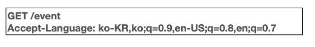 

- Quality Values(q) 값 사용
- 0~1, 클수록 높은 우선순위

- 생략하면 1
- Accept-Language: ko-KR,ko;q=0.9,en-US;q=0.8,en;q=0.7
  - 1. ko-KR;q=1 (q생략)
  - 2. ko;q=0.9
  - 3. en-US;q=0.8 
  - 4. en:q=0.7

### 협상과 우선순위2

- **구체적인 것이 우선한다.**
- Accept: **text/\***, **text/plain**, **text/plain;format=flowed**, *\* 
  1. text/plain;format=flowed
  1.  text/plain
  1.  text/*
  1.  */*

### 협상과 우선순위3

- 구체적인 것을 기준으로 미디어 타입을 맞춘다.

- Accept: **text/\***;q=0.3, **text/html**;q=0.7, **text/html;level=1**,**text/html;level=2**;q=0.4, ***/\***;q=0.

  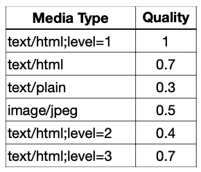

## 1. - [3] 전송방식(응답으로 전송할때 방식)

: Transfer-Encoding  / Range, Content-Range

### 전송 방식 4가지

- a. 단순 전송 
- b. 압축 전송 
- c. 분할 전송 
- d. 범위 전송

### a. 단순 전송 : Content-Length

요청을 하면 응답을 주는데 컨텐츠 길이를 알 수 있을때 같이 써서 응답해준다.
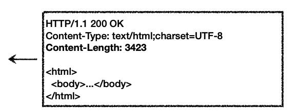 

(한번에 요청하고 한번에 쭉~~ 받는 것)

### b. 압축 전송 : Content-Encoding

Message-body를 content-encoding 내용에 맞춰 압축을 한다.

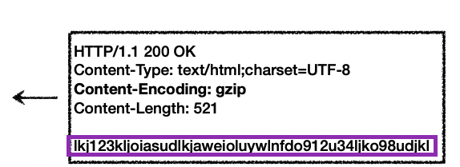 

### c. 분할 전송 : Transfer-Encoding

 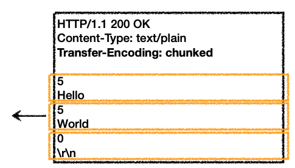 

예시에서, Transfer-Encoding : chuncked는 덩어리라는 의미로, 덩어리로 쪼개서 보내겠다는 의미다.
 쪼개서 보내면 오는대로 바로 표현을 취할 수 있다.

⭐️ Transfer-Encoding일때는 서버에서 content-length를 만들어주면 안된다. 왜냐하면 분할 전송하게 되면  근본적으로, 분할하는 바이트기준에 문자의 길이가 각각 예상하기가 힘들다.

### d. 범위 전송 : Range(클라이언트 쪽 필드명) , Content-Range(서버쪽 필드명)

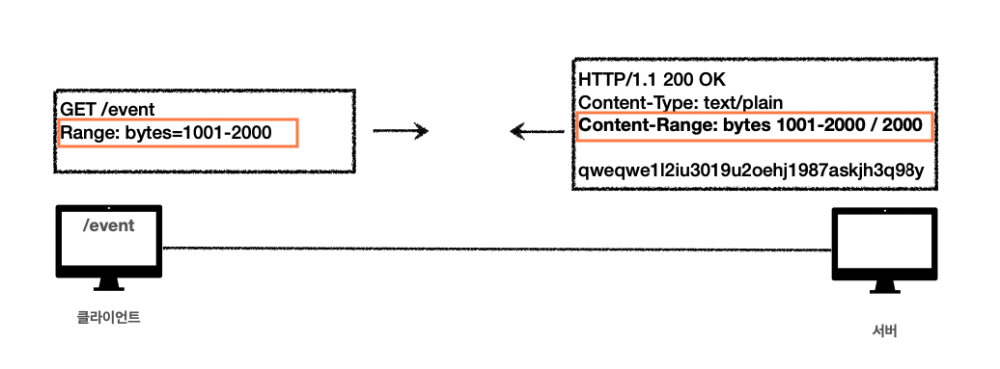 

서버로 부터 이미지를 받을때 절반정도만 받은 상황일때 전송이 끊기면 클라이언트쪽에서 다시 요청을 해야 한다. 근데 이때 처음부터 요청을 하면 용량이 아까울 것이다. 그래서 요청을 할때 끊긴 내용부터 범위를 지정해서 다시 보내달라고 요청을 하는 것이다.

## 1. - [4] 일반 정보

- a. Form: 유저 에이전트의 이메일 정보
- b. Referer: 이전 웹 페이지 주소
- c. User-Agent: 유저 에이전트 애플리케이션 정보
- d. Server: 요청을 처리하는 오리진 서버의 소프트웨어 정보 
- e. Date: 메시지가 생성된 날짜

### a. Form: 유저 에이전트의 이메일 정보

- 일반적으로 잘 사용되지 않음 
- 검색 엔진 같은 곳에서, 주로 사용 
- 요청에서 사용

### b. Referer: 이전 웹 페이지 주소

- 현재 요청된 페이지의 이전 웹 페이지 주소
  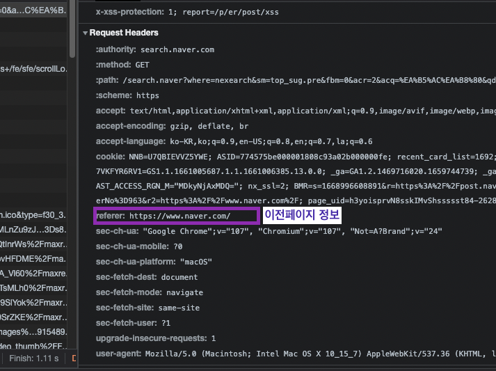 
- A -> B로 이동하는 경우, B를 요청할 때 Referer: A 를 포함해서 요청 
- Referer를 사용해서 유입 경로 분석하는 기능을 개발할때 많이 사용한다. 
- 요청에서 사용
- 참고: referer는 단어 referrer의 오타

### c. User-Agent: 유저 에이전트 애플리케이션 정보

####  **유저 에이전트 = 클라이언트 애플리케이션 정보**

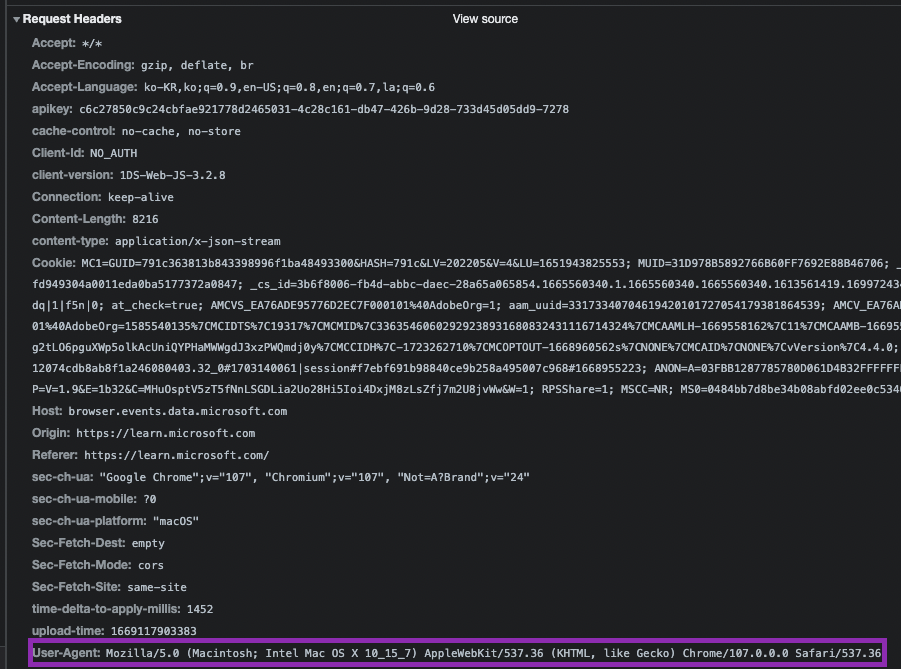 

- user-agent: Mozilla/5.0 (Macintosh; Intel Mac OS X 10_15_7) AppleWebKit/ 537.36 (KHTML, like Gecko) Chrome/86.0.4240.183 Safari/537.36
- 클리이언트의 애플리케이션 정보(웹 브라우저 정보, 등등) 
  - 이 유저 에이전트 정보는 언제 많이 쓸까? 서버 입장에서 굉장히 도움이 많이 되는 정보다. 예를 들어, 특정 브라우저에서만 버그가 생기는 상황이라고 가정해보자. 그러면 정상인 브라우저와 로그 내용을 비교해보면 알 수 있다.
- 통계 정보
- 어떤 종류의 브라우저에서 장애가 발생하는지 파악 가능 
- 요청에서 사용

### d. Server: 요청을 처리하는 ORIGIN 서버의 소프트웨어 정보 

ORIGIN서버? http요청을 보내면 중간에 여러 프록시서버(캐시서버 등등)를 거치게 된다. 그러기때문에 실제 나의 요청이 도착해서 나의 http요청에 대해 http응답해주는 진짜 서버를 말한다.

- Server: Apache/2.2.22 (Debian) 
- server: nginx
- 응답에서 사용

### e. Date: 메시지가 생성된 날짜와 시간

- Date: Tue, 15 Nov 1994 08:12:31 GMT
- 응답에서만 사용(과거에는 요청에서도 사용했는데 최근 스펙에는 응답에서만 사용되도록 다 바뀌었다!)

## 1. - [5] 특별한 정보

- a. Host: 요청한 호스트 정보(도메인)
- b. Location: 페이지 리다이렉션
- c. Allow: 허용 가능한 HTTP 메서드
- d. Retry-After: 유저 에이전트가 다음 요청을 하기까지 기다려야 하는 시간

### a. Host : 요청한 호스트 정보(도메인)

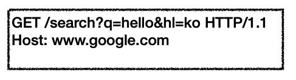 

- 요청에서 사용

- 요청메시지에 들어가는 필수값 헤더 정보다!

- 하나의 서버가 여러 도메인을 처리해야 할 때 하나의 IP 주소에 여러 도메인이 적용되어 있을 때

  예)

  (0) ip가 200.200.200.2인 하나의 서버가 있는데 이 안에 여러개의 APP을 각 다른 도메인으로 구동시켜주는 서버라고 하자.

  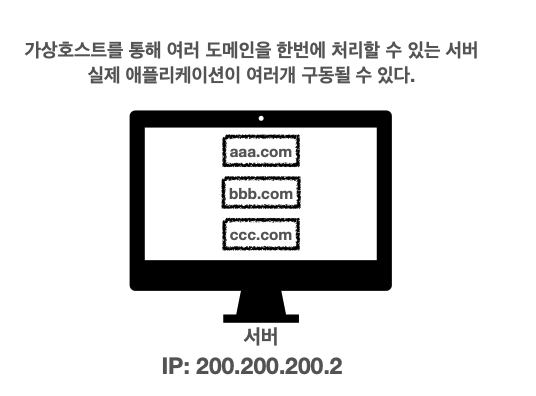 

  (1) 이때 /hello라고 클라이언트쪽에서 요청을 보내면 해당 서버에서 어떤 도메인으로 연결시켜줘야 할지 알수가 없다. 왜냐하면 아래 이미지에서 보듯이 IP로만 통신을 하기 때문이다.
  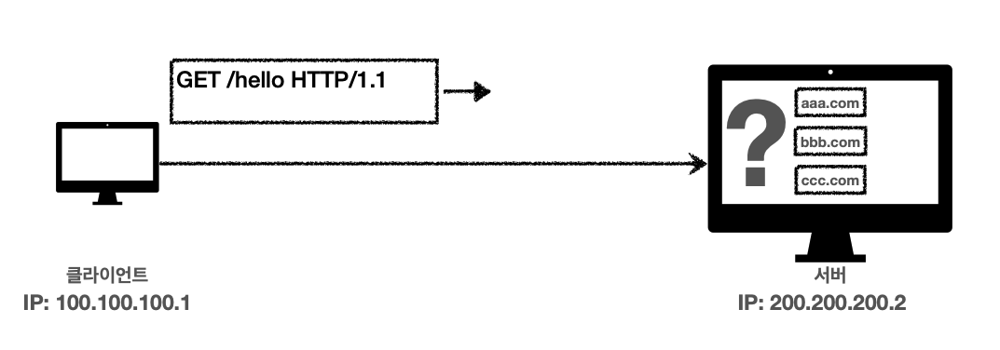 

​		(2) (1)같은 상황을 방지하기 위해 요청메시지를 보낼때 무조건 host헤더를 넣어야 한다고 스펙이 바뀌었다.
​		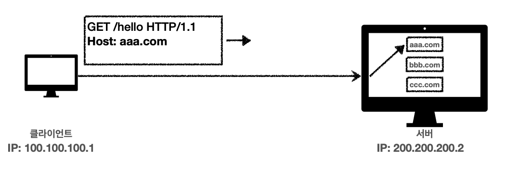 

### b. Location: 페이지 리다이렉션

- 웹 브라우저는 3xx 응답의 결과에 Location 헤더가 있으면, Location 위치로 자동 이동 (리다이렉트)

- 응답코드 3xx에서 설명

- 201 (Created): 201일때 Location 값은 요청에 의해 생성된 리소스 URI 내용이 나온다.

- 3xx (Redirection): 3xx일때 Location 값은 요청을 자동으로 리디렉션하기 위한 대상 리소스를 가리킨다.

### c. Allow: 허용 가능한 HTTP 메서드

예를 들어, 서버가 get, head, put 메서드만 지원한다고 할때 요청 메시지가 post요청을 보냈다고 하자. 그러면 서버는 응답으로 405 코드와 Allow필드 내용을 통해 어떤 메서드만 지원하는지 담아서 보낸다.
하지만! 중요한건 이런 내용 자체가 서버에서 구현하지 않는 경우가 많다. 참고로만 알자.

- 405 (Method Not Allowed) 에서 응답에 포함해야함 
- 헤더내용 예) ' Allow: GET, HEAD, PUT '

### d. Retry-After: 유저 에이전트가 다음 요청을 하기까지 기다려야 하는 시간

- 503 (Service Unavailable): 요청에 해당되는 서버쪽 서비스를 이용 못할때 보내는 응답코드 번호다. 이때 서비스가 언제까지 불능인지 알려줄 수 있다. 
- Retry-After: Fri, 31 Dec 1999 23:59:59 GMT (날짜 표기) 
- Retry-After: 120 (초단위 표기) / 120초 후에 재기될거라는 의미임

## 1. - [6] 인증

- a. Authorization: 클라이언트 인증 정보를 서버에 전달 
- b. WWW-Authenticate: 리소스 접근시 필요한 인증 방법 정의

### a. Authorization: 클라이언트 인증 정보를 서버에 전달

인증과 관련해서는 여러 메카니즘들이 존재한다. O-auth인증, ~~ 인증, 등등 마다 Authorization: 의 value에 들어가는 값 내용이 다르다.

### b. WWW-Authenticate: 리소스 접근시 필요한 인증 방법 정의

- 리소스 접근시 필요한 인증 방법 정의
- 요청으로  Authorization 인증정보와 함께 접근을 했는데 문제가 있다면 401 코드와 Unauthorized 응답과 함께 사용 
- 401코드때 WWW-Authenticate: Newauth realm="apps", type=1, title="Login to \"apps\"", Basic realm="simple"라는 헤더를 넣어줘야 한다. 이 헤더의 내용은 '클라이언트 너가 인증을 하려면 내가 보내준 헤더 내용을 참고해서 제대로된 인증을 만들어서 다시 요청해라!'라는 의미의 내용이 들어간다.

## 1. - [7] 쿠키

Set-Cookie: 서버에서 클라이언트로 쿠키 전달(응답)

Cookie: 클라이언트가 서버에서 받은 쿠키를 저장하고, 저장한 쿠키내용들은 HTTP 요청시 쿠키를 포함하여 서버로 전달한다.

### 쿠키 미사용

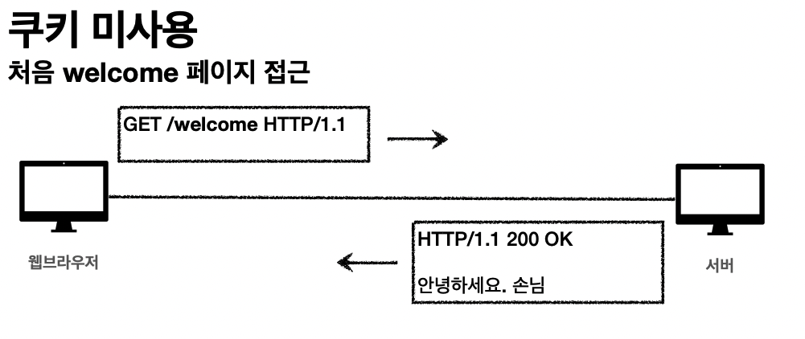 

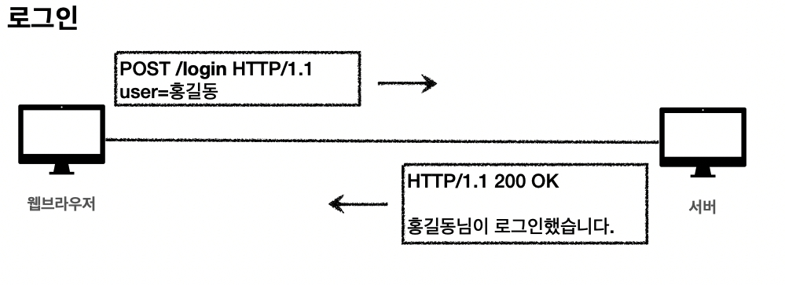 

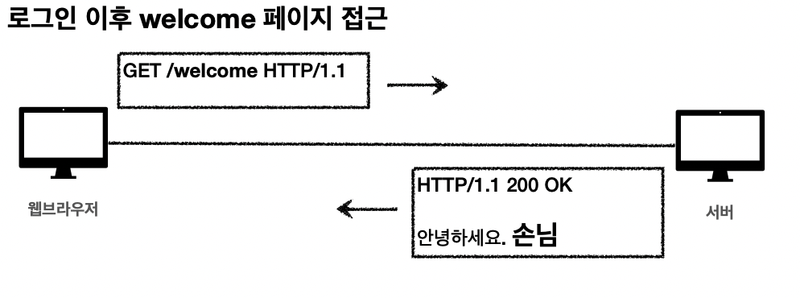 

이렇게 응답하는 이유는,  http프로토콜은 기본적으로 메시지 전송 응답을 받고나면 연결을 끊어버린다. 그래서 다음 요청을 보내면 로그인한 회원인지 알 수 없게 된다.

### 로그인 했지만 다음 요청에서 로그인한 유저인지 인지 못하는 이유

- HTTP는 무상태(Stateless) 프로토콜이다.
- 클라이언트와 서버가 요청과 응답을 주고 받으면 연결이 끊어진다. (물론, **<u>지속연결</u>**이라고 해서 어느정도는 유지되게 내용이 변경되었다.)
- 클라이언트가 다시 요청하면 서버는 이전 요청을 기억하지 못한다. 
- 클라이언트와 서버는 서로 상태를 유지하지 않는다.

### 쿠키 미사용상태로 대안 방법 : 모든 요청보낼때마다 사용자 정보도 항상 담아서 보낸다.

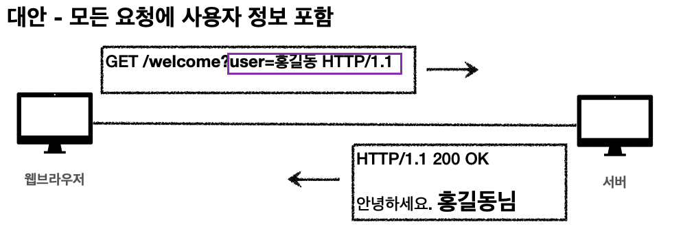 

### 쿠키 미사용으로, 모든 요청에 정보를 넘길때 생기는 문제

- 모든 요청에 사용자 정보가 포함되도록 개발 해야함 

- 브라우저를 완전히 종료하고 다시 열면?

  - 요즘은 web storage라는 개념이 있어서 그곳에 정보를 저장하고 다시 넘기면 되서 브라우저 종료하고 다시 켜도 유지할 수는 있다.

     하지만 모든 요청마다 유저 정보를 넘기게 개발하는 것 자체가 힘들다.

### 인증 유지를 위한 대안 개념 : 쿠키 

1. 웹브라우저 내부에 '쿠키 저장소'라는 공간이 존재한다. 그래서 서버에서 응답 메시지로 보낸 필드에서 Set-Cookie라고 온 정보를 쿠키 저장소에 저장한다.
   **(⭐️ 여기서 쉽게 이해되도록 set-cookie내용으로 직접적인 유저정보를 담았지만 실제로 실무에서 구현할때는 로그인이 성공될때 서버에서는 session key라는 것을 만들어줘서 서버의 DB에 저장해두고 session key(session id)에 해당하는 session value값을 필드네임과 필드값으로 넣어서 응답한다.)**
   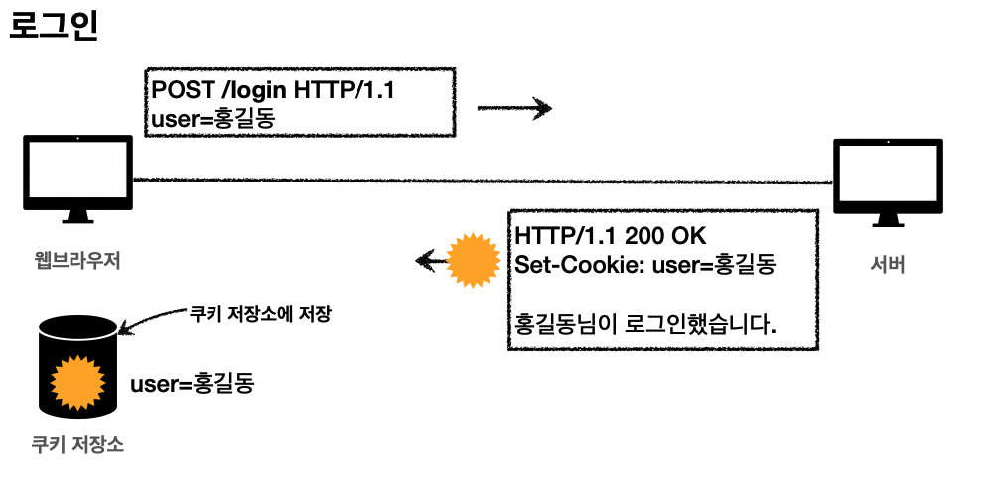  

   

2. 로그인 이후 welcome 페이지에 접근을 시도해보자. 그러면 자동으로 웹브라우저는 set-cookie시킨 서버에 요청을 보낼때마다 해당 쿠키내용도 함께 보낸다.
   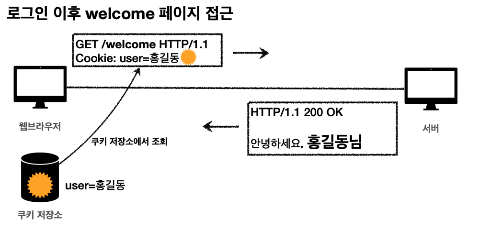 

3. 웹브라우저에 저장한 쿠키정보가 지정한 서버에 대해서 어떤 리소스uri 요청을 보내던 해당 쿠키정보를 실어서 요청을 한다.
   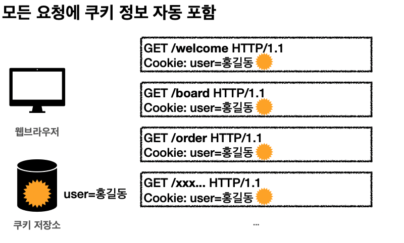 

### 쿠키?

- 쿠키의 예) set-cookie: **sessionId=abcde1234**; **expires**=Sat, 26-Dec-2020 00:00:00 GMT; **path**=/; **domain**=.google.com; **Secure** 
- 쿠키를 사용하는 주 사용처
  - 사용자 로그인 세션 관리
    - ⭐️ 위의 이미지 예에서는 쉽게 이해되도록 set-cookie내용으로 직접적인 유저정보를 담았지만 실제로 실무에서 구현할때는 로그인이 성공될때 서버에서는 session key라는 것을 만들어줘서 서버의 DB에 저장해두고 session key(session id)에 해당하는 session value값을 필드네임과 필드값으로 넣어서 응답한다. 그 후에는 클라이언트는 해당 서버에 요청할때마다 session id의 값을 포함해서 보낸다.
  - 광고 정보 트래킹
    - 이 웹브라우저를 쓰는 사람은 이런이런 광고를 주로 보는구나~ 라는 것을 분석하기 위해 트래킹한다.

- ⭐️ 쿠키 정보는 항상 서버에 전송됨
  - 단점으로, 쿠키정보를 계속 담아 보 내야 하므로 네트워크 트래픽 추가 유발
  - 트래픽을 최대한 제거하기 위해서는 최소한의 정보만 사용해야 한다. (최소함이라하면 세션 id, 아니면 쿠키내용을 OAuth로 구현한다고 하면은 서버에서 인증 토큰을 발급해준다. 이때 인증 토큰과 관련된 정보 정도)
  - 쿠키처럼 클라이언트에 뭔가 저장은 하고 싶은데 서버에 요청마다 데이터를 서버에 전송하지 않고 클라이언트에서 그냥 들고 있었으면 좋겠다 싶을때는 웹 브라우저 내부에 데이터를 저장하는 웹 스토리지 (localStorage, sessionStorage) 내용을 쓰면 된다.( 이렇게 쓸때는 보통 클라이언트 웹브라우저 로직에서 인증이 필요할때만 클라이언트에서만 자바스크립트를 이용해서 웹스토리지에 저장된 정보를 끄집어내서 사용하고 쓴다. 서버로는 보내지 않는다.) 

- 주의!
  - 웹 스토리지 (localStorage, sessionStorage)이여서 클라이언트만 가지고 있는다고 해도! 보안에 민감한 데이터는 저장하면 안된다.(주민번호, 신용카드 번호 등등)

### 쿠키의 생명주기

Expires, max-age

- Set-Cookie: **expires**=Sat, 26-Dec-2020 04:39:21 GMT (참고로 날짜들은 전부 GMT기준으로 넣어줘야 한다.)
  - 만료일이 되면 쿠키가 자동으로 삭제된다.

- Set-Cookie: **max-age**=3600 (3600초)

  - 0이나 음수를 지정하면 쿠키 삭제

  

- 쿠키의 2가지 종류
  - 세션 쿠키: 만료 날짜를 생략하면 브라우저 종료시 까지만 유지 
  - 영속 쿠키: 만료 날짜를 입력하면 해당 날짜까지 유지

### 쿠키 - 도메인

#### Domain

- 예) domain=example.org -> 클라이언트가 가지는 각 쿠키가 어떤 도메인에 접속할때 가지고 가야될 쿠키인지를 쿠키 정보가 갖는 도메인 헤더 정보를 통해 파악한다.

- 도메인을 명시하면? 명시한 문서 기준 도메인 + 서브 도메인 포함을 해서 해당 쿠키를 다 전송한다.
  - 예) domain=example.org를 지정해서 쿠키 생성됐다고 가정하자.
    - example.org는 물론이고 
    - dev.example.org도 쿠키 접근 가능하다.
- 도메인 헤더 정보를 생략한다면? 현재 문서 기준 도메인만 적용
  - 예) example.org 도메인 접근으로 해당 쿠키를 생성하고 domain 지정을 생략했다고 가정하자.
    - example.org 에서만 쿠키 접근 ( 쿠키가 생성된 도메인 기준만 쿠키 접근 가능하다.)
    - dev.example.org는 쿠키 미접근

### 쿠키 - 경로

#### Path

도메인으로 먼저 필터를 한번 하고 그다음으로 경로Path로 추가 필터를 하게 된다.

- 예) path=/home
- 이 경로를 포함한 하위 경로 페이지만 쿠키 접근
- 일반적으로 **'path=/'** 처럼 루트로 지정한다. 왜냐하면 한 도메인에 대한 서브 도메인에 대해서는 쿠키를 다 전송하길 원한다. 근데 특별한 경우에만 path를 구체적으로 작성하게 될 것이다. 
- 예) path=/home 지정했을때?
  - /home -> 가능 
  - /home/level1 -> 가능 
  - /home/level1/level2 -> 가능 
  - /hello -> 불가능

### 쿠키 - 보안

#### Secure, HttpOnly, SameSite

- Secure
  - 쿠키는원래  http, https를 구분하지 않고 전송한다.
  - 하지만 Secure를 적용하면 https인 경우에만 클라이언트에서 서버로 전송한다.
- HttpOnly
  - XSS 공격 방지
  - 자바스크립트에서 원래 쿠키를 접근할 수 있는데 HttpOnly를 넣어주면 자바스크립트에서 쿠키에 접근이 불가(document.cookie) 해진다.
  - 자바스크립트코드인 document.cookie처럼 접근해서는 사용못하고 대신에 HTTP 전송에만 사용가능해진다.
- SameSite (궁금하면 디테일하게 찾아보길 권장 / 이 기능이 적용된지 얼마되지 않아서 이 기능을 쓸때는 브라우저에서 어느정도까지 지원하는 버전인지 확인하고 쓰자.)
  - XSRF 공격 방지
  - 요청 도메인과 쿠키에 설정된 도메인이 같은 경우만 쿠키 전송

# 
