# HTTP 헤더2 : 캐시와 조건부 요청과 관련된 헤더들

## 캐시의 기본 동작

### 캐시가 없을 때

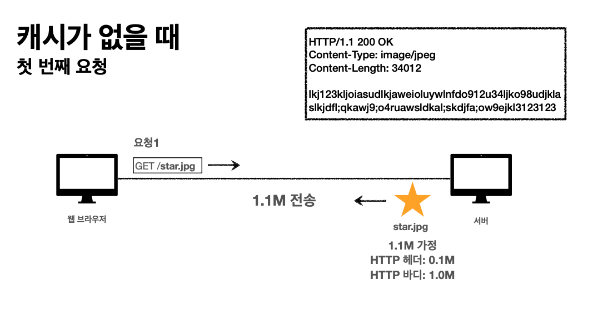 

실제 이미지파일을 표현하는 바이너리코드인 http바디 내용 = HTTP 바디

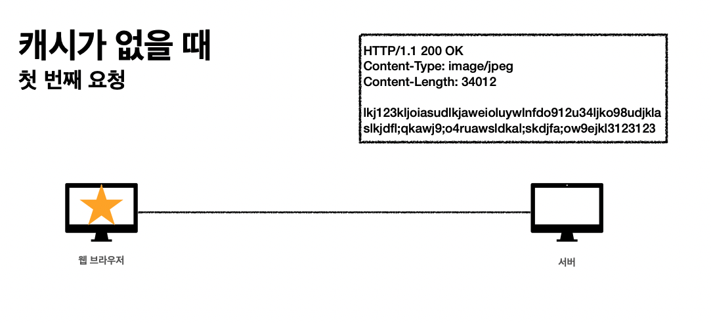 

2번째 요청, n번째 요청에서도 동일한 이미지를 요청할때는 같은 방식으로 똑같은 서버에 계속 요청을 보낼 것이다.

#### 캐시가 없을때 : 결론

- 데이터가 변경되지 않아도 계속 네트워크를 통해서 데이터를 다운로드 받아야 한다. 
- 인터넷 네트워크는 매우 느리고 비싸다.
- 브라우저 로딩 속도가 느리다.
- 느린 사용자 경험

### 캐시 적용

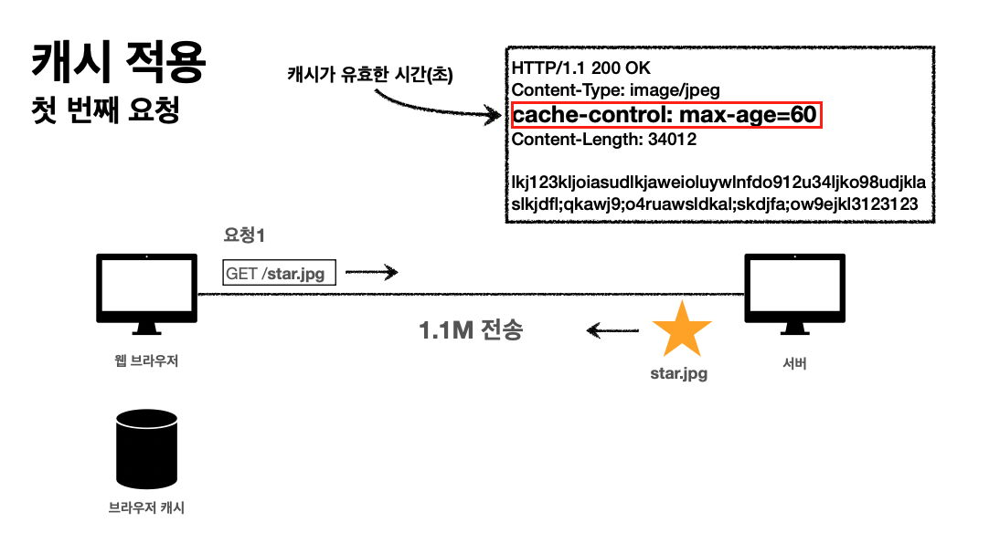 

 

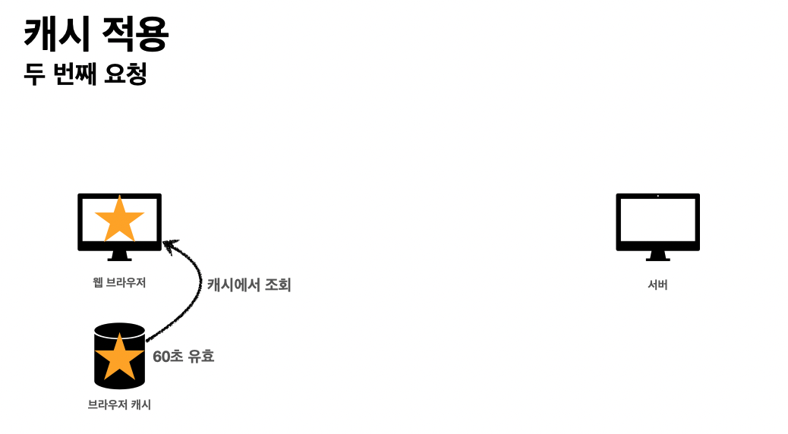 

- 캐시 덕분에 캐시 가능 시간동안 네트워크를 사용하지 않아도 된다. 
- 비싼 네트워크 사용량을 줄일 수 있다.
- 브라우저 로딩 속도가 매우 빠르다.
- 빠른 사용자 경험

#### 캐시 적용된 시간이 초과된다면?

캐시공간에서 유효한 시간 60초가 지난 상태면 해당 데이터는 <u>**stale하지 않은 데이터**</u>가 된다.

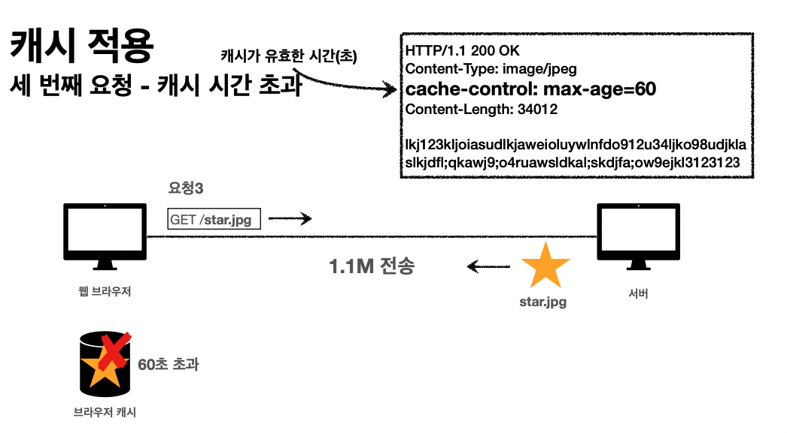 

다시 서버로 요청을 보내야 한다!

---

## 검증 헤더와 조건부 요청1

- 캐시 유효 시간이 초과해서 서버에 다시 요청하면 다음 두 가지 상황이 나타난다. 
  1. 서버에서기존데이터를변경함 : ⭐️ -> 🌙
  2. 서버에서기존데이터를변경하지않음 : ⭐️

캐시가 만료되었지만 필요한 데이터가 서버쪽에서 변경이 없는 데이터라고 가정하자. 하지만 클라이언트가 그걸 알 수 없다. 그래서 알 수 있는 방법이 필요한데, 그때 알아야 하는 개념이 **검증 헤더** 다.

이때 활용되는 필드는 Last-Modified 필드다.
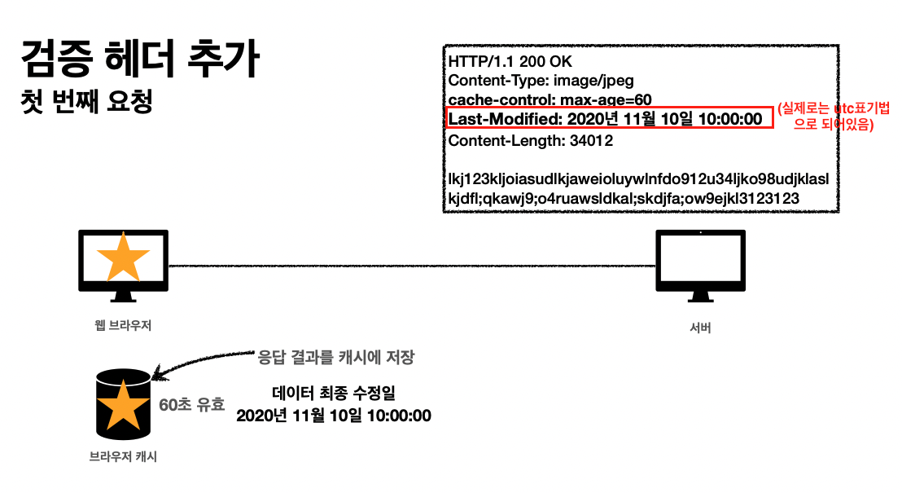 

 똑같은 url 요청을 보낼때 브라우저 캐시에 갖고 있는 해당 데이터의 마지막 최종 수정일(Last-Modifred) 필드를 if-modified-since 필드로 해서 헤더에 붙여 보낸다.

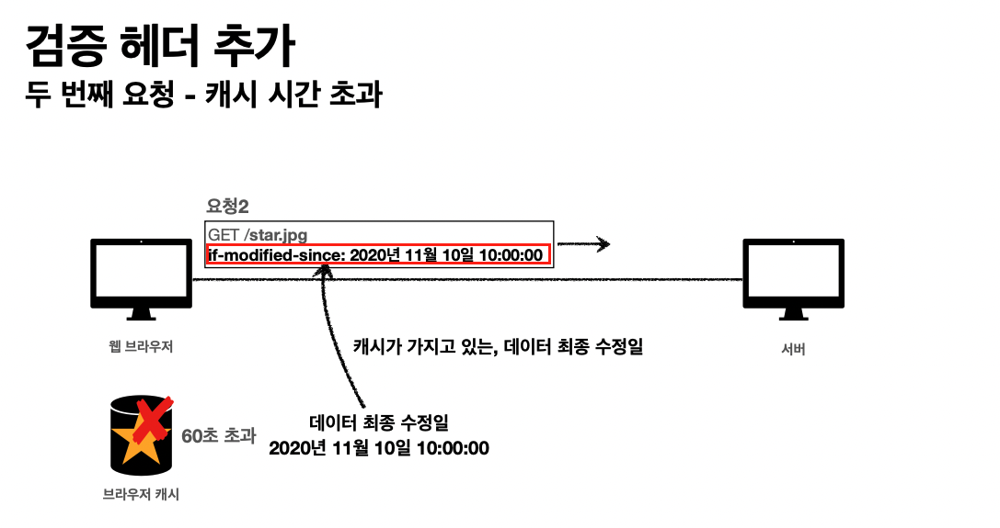 
클라이언트 요청 데이터에  if-modified-since 필드가 오면은 서버는 같은 데이터의 Last-Modifred필드의 값을 확인한다. 그래서 같다면 
Http 응답을 만들때 304 응답코드 Not Modified를 달고 http body내용도 비우고 응답을 보낸다.
304 응답코드는 '너가 요청한 데이터가 캐시공간에 갖고 있는 데이터와 변경된게 없어' 라는 의미다.
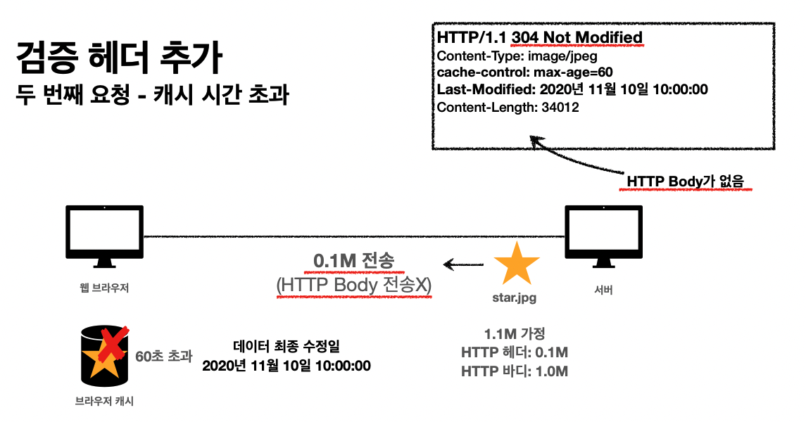 
http body내용이 비어있기 때문에 네트워크 부하가 확 줄어든다.
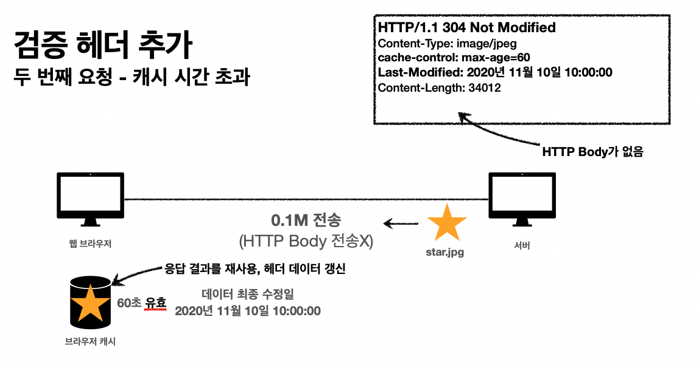 
304 응답코드를 브라우저가 확인 후에 cache-control 값을 갱신한다. Last-Modified 값을 갱신하는거는 브라우저에 따라 다를 것이다.

### 정리

- 캐시 유효 시간이 초과해도, 서버의 데이터가 갱신되지 않으면
- 304 Not Modified + 헤더 메타 정보만 응답(바디X)
- 클라이언트는 서버가 보낸 응답 헤더 정보로 캐시의 메타 정보를 갱신 
- 클라이언트는 캐시에 저장되어 있는 데이터 재활용
- 결과적으로 네트워크 다운로드가 발생하지만 용량이 적은 헤더 정보만 다운로드 
- 매우 실용적인 해결책

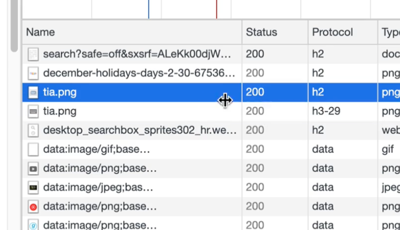 

**Status 200코드가 약간 연한 회색이라면 캐시에서 데이터를 불러왔다는 의미다.**

---

## 검증 헤더와 조건부 요청2 : Last-Modified 단점을 보완

- 검증 헤더
  - 캐시 데이터와 서버 데이터가 같은지 검증하는 데이터
  - Last-Modified , ETag
- 조건부 요청 헤더
  - 검증 헤더로 조건에 따른 분기 
  - If-Modified-Since와 Last-Modified가 같이 비교되어 사용
  - If-None-Match와 ETag가 같이 사용
  - 조건이 만족하면 200 OK
  - 조건이 만족하지 않으면 304 Not Modified

#### If-Modified-Since: 이후에 데이터가 수정되었으면?

- 데이터 미변경 예시
  - 캐시: 2020년 11월 10일 10:00:00 vs 서버: 2020년 11월 10일 10:00:00 
  - 304 Not Modified, 헤더 데이터만 전송(BODY 미포함)
  - 전송 용량 0.1M (헤더 0.1M, 바디 1.0M)

- 데이터 변경 예시
  - 캐시: 2020년 11월 10일 10:00:00 vs 서버: 2020년 11월 10일 11:00:00 
  - 200 OK, 모든 데이터 전송(BODY 포함)
  - 전송 용량 1.1M (헤더 0.1M, 바디 1.0M)

### Last-Modified, If-Modified-Since 단점

- 1초 미만(0.x초) 단위로 캐시 조정이 불가능. 최대로 작은 단위가 1초다.
- 날짜 기반의 로직 사용
- 데이터를 수정해서(예 : 내용의 변경은 없지만 복사붙여 넣기 등) 날짜가 다르지만, 같은 데이터를 수정해서 데이터 결과가 똑같은 경우 
- 서버에서 별도의 캐시 로직을 관리하고 싶은 경우 -> 이때 사용되는 개념이 ETag(Entity Tag)다.
  - 예) 스페이스나 주석처럼 크게 영향이 없는 변경에서 캐시를 유지하고 싶은 경우

### 단점을 보완한 방식 : ETag, If-None-Match

- ETag(Entity Tag)
- 캐시용 데이터에 임의의 고유한 버전 이름을 달아둠
  - 예) ETag: "v1.0", ETag: "a2jiodwjekjl3"(파일을 key값으로 해서 해시 알고리즘에 넣어서 해시의 결과를 받을 수 있다. 이때 해시는 파일의 key내용이 동일하면 동일한 결과가 나온다. 이 개념이 적용된다.)

- 데이터가 변경되면 이 이름을 바꾸어서 변경함(Hash를 다시 생성)
  - 예) ETag: "aaaaa" -> ETag: "bbbbb" 

- 진짜 단순하게 ETag만 보내서 같으면 유지, 다르면 다시 받기!

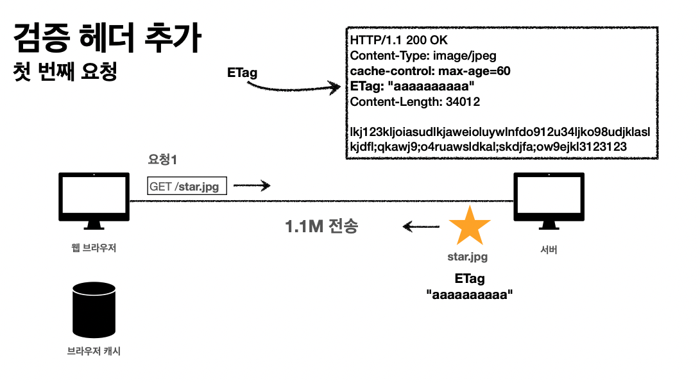 
서버는 첫 요청에 대한 응답 데이터에 ETag 필드를 붙여서 내려준다.
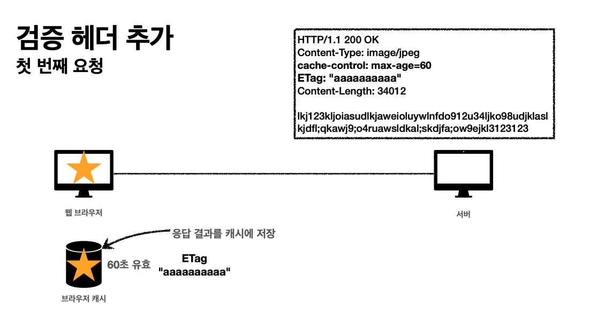
처음으로 받는 데이터이므로 브라우저의 캐시 공간에 저장한다.

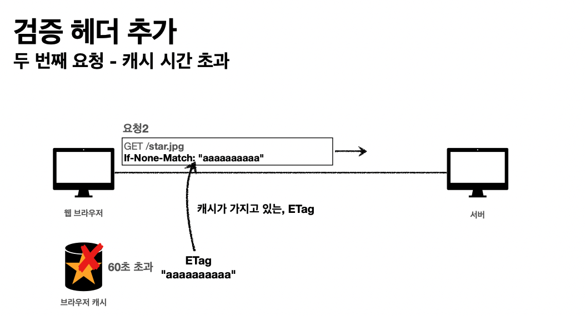 
그러다가 동일한 url 요청을 보내려고 하는데 캐시가 유효한 시간이 초과한 상황일때 If-None-Match 필드에 해당 ETag 키의 value값을 첨부해서 요청을 보낸다.

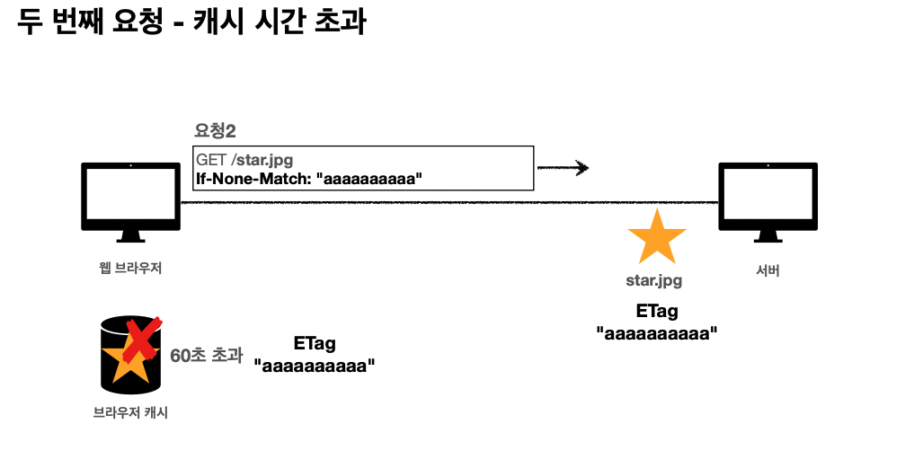 
요청에서 보낸 If-None-Match 값과 ETag값이 같은 상황이다. 그러면 데이터가 변경되지 않았다는 의미다.

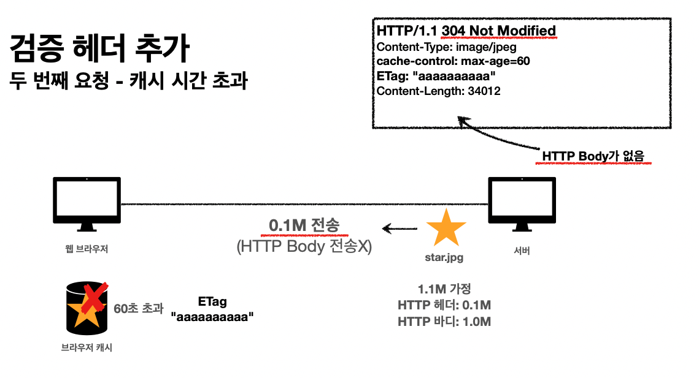 
데이터가 변경되지 않았으면 서버는 304 응답코드, Not Modified를 포함, Http Body 내용을 넣지 않고 응답을 보낸다.

### ETag, If-None-Match 정리

- 진짜 단순하게 ETag만 서버에 보내서 같으면 유지, 다르면 다시 받기!
- 캐시 제어 로직을 서버에서 완전히 관리
- 클라이언트는 단순히 이 값을 서버에 제공(클라이언트는 캐시 메커니즘을 모름) 
- ETag를 설계하는 실무에서의 예시)
  - 서버는 배타 오픈 기간인 3일 동안 파일이 변경되어도 ETag를 동일하게 유지(억지로 든 예시다. 이렇게 복잡하게 구현하는 경우는 적음)
  - 애플리케이션 배포 주기에 맞추어 ETag 모두 갱신

---

## 캐시와 조건부 요청 헤더 정리

### 캐시 제어와 관련된 헤더

- Cache-Control: 캐시 제어 
- Pragma: 캐시 제어(하위 호환) 
- Expires: 캐시 유효 기간(하위 호환)

### Cache-Control : 캐시 지시어(directives)

- Cache-Control: max-age
  - 캐시 유효 시간, 초 단위

- Cache-Control: no-cache
  - 데이터는 캐시해도 되지만, 항상 원(origin) 서버에 검증하고 사용

- Cache-Control: no-store
  - 데이터에 민감한 정보가 있으므로 저장하면 안됨
     (메모리에서 사용하고 최대한 빨리 삭제)

### Pragma: 캐시 제어(하위 호환) 

- Pragma: no-cache 라고 헤더에 적으면 no-cache처럼 동작하는데, 예전 방식이라 현재는 거의 사용되지 않는다. 
- HTTP 1.0 하위 호환

### Expires : 캐시 만료일 지정(하위 호환)

- expires: Mon, 01 Jan 1990 00:00:00 GMT (날짜 자체를 지정하는게 더 좋다고 생각할 수 있지만 Cache-Control: max-age가 훨씬 유연하다.)
- 캐시 만료일을 정확한 날짜로 지정
- HTTP 1.0 부터 사용
- 지금은 더 유연한 Cache-Control: max-age 권장 
- Cache-Control: max-age와 함께 사용하면 Expires는 무시

 

- 검증 헤더 (Validator)
  - ETag : "v1.0", ETag: "asid93jkrh2l"
  - Last-Modified : Thu, 04 Jun 2020 07:19:24 GMT 
- 조건부 요청 헤더
  (정확히는 여기처럼 4가지가 있다.)
  - If-Match, If-None-Match: ETag 값 사용
  - If-Modified-Since, If-Unmodified-Since: Last-Modified 값 사용

---

## 프록시 캐시

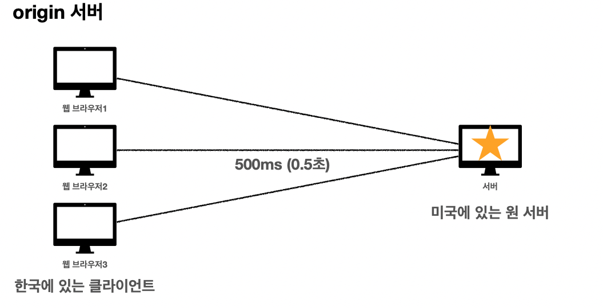 
 위 예시처럼 미국에 있는 내용을 응답받을때는 국내 서버를 둘때보다 응답을 받는데 오래 걸릴 것이다.

### 오래 걸리는 응답에 대한 보완.

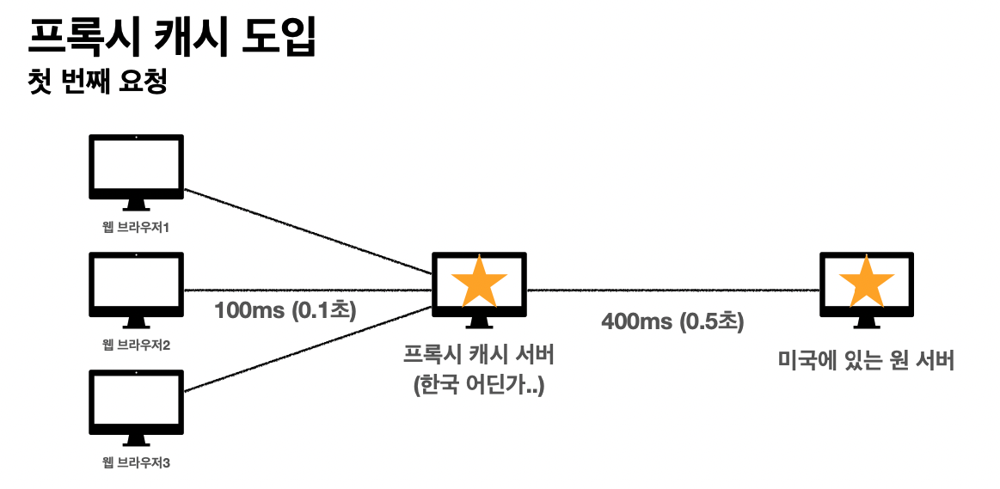 
DNS서버 요청하는 내용을 조작해서 요청이 생기면 미국 원서버로 직접 접근하는 것이 아니라 일단 프록시 서버를 거치게 한다.

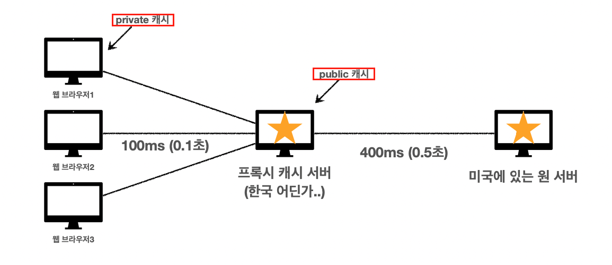 

### Cache-Control 추가 내용

- Cache-Control: public
  - 응답이 public 캐시에 저장되어도 됨 
- Cache-Control: private
  - 응답이 해당 사용자만을 위한 것임, private 캐시에 저장해야 함(기본값) 
- Cache-Control: s-maxage (있는지만 알면 될듯)
  - 프록시 캐시에만 적용되는 max-age 

- Age: 60 (HTTP 헤더) (있는지만 알면 될듯)
  - 오리진 서버에서 응답 후 프록시 캐시 내에 머문 시간(초)

----

## 캐시 무효화

### 확실한 캐시 무효화 응답

- Cache-Control: no-cache, no-store, must-revalidate (이 내용을 응답 메시지에 넣어서 보내면 절대 캐시에 저장되지 않는다.)
-  Pragma: no-cache
  -  HTTP 1.0 하위 호환

- Cache-Control: no-cache
  - 데이터는 캐시해도 되지만, 항상 **원 서버에 검증**하고 사용(이름에 주의!) 
- Cache-Control: no-store데이터에 민감한 정보가 있으므로 저장하면 안됨
   (메모리에서 사용하고 최대한 빨리 삭제)

- Cache-Control: must-revalidate
  - **<u>캐시 만료후</u>** 최초 조회시 원 서버에 검증해야함
  - 원 서버 접근 실패시 반드시 오류가 발생해야함 - 504(Gateway Timeout) 
  - must-revalidate는 캐시 유효 시간이라면 캐시를 사용함

- Pragma: no-cache
  - HTTP 1.0 하위 호환(이 버전 이하는 위에 내용인 Cache-Control~를 모르므로 이걸 적어줘야 하위호환해서 캐시 무효화를 해준다.)

### no-cache vs must-revalidate

#### No-cache 동작 방식

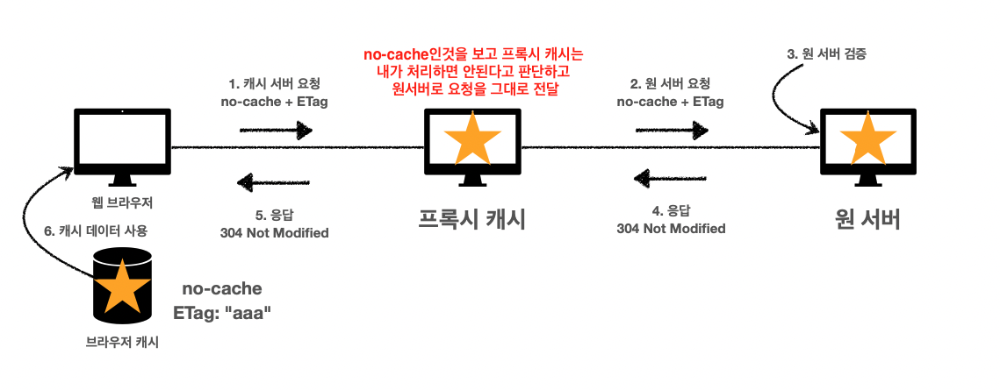 

### 원서버와의 네트워크 접근이 불가할때 생기는 차이점 : no-cache vs must-revalidate

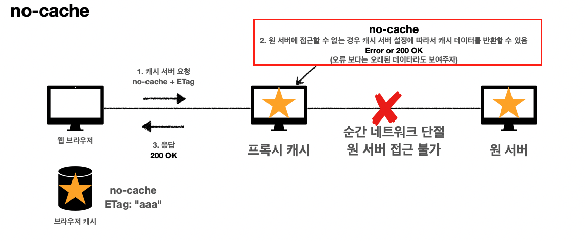 

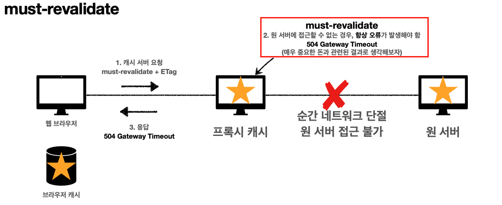 

돈과 관련된 내용일때, 정확한 데이터의 응답이 중요할텐데 이때는 확실하지 않은 데이터로 응답해주면 안될 것이다. 이럴때를 대비해서 확실하게 해주려면은 must-revalidate를 넣어줘야 한다.

