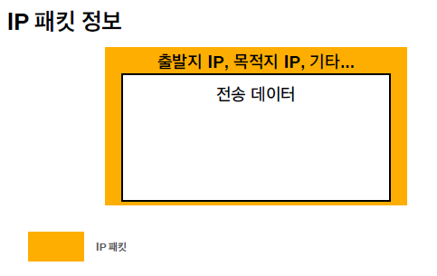
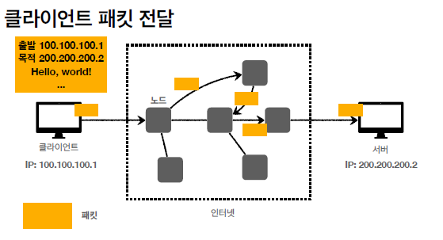
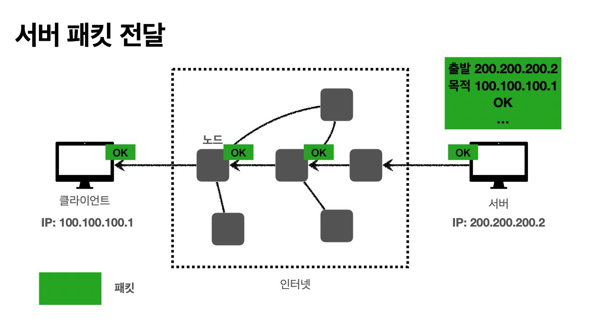
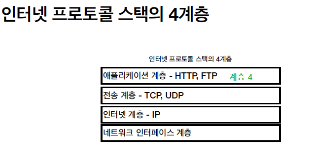
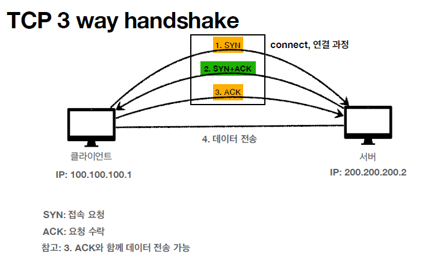
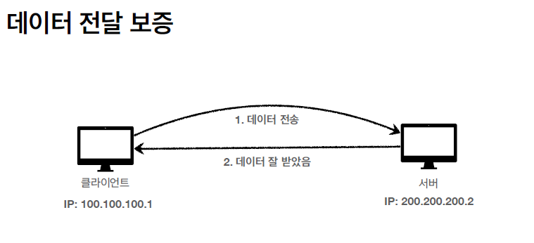
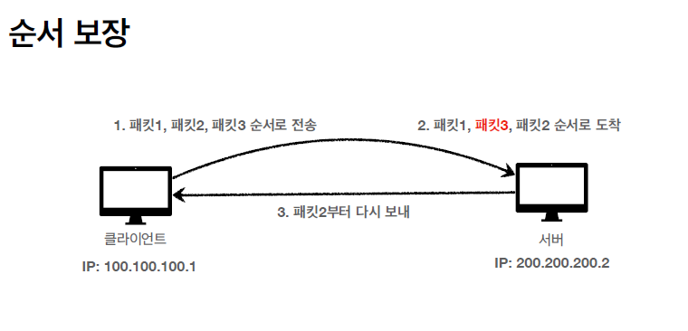

## IP  (인터넷 프로토콜)

 

클라이언트 --> 서버

서버 --> 클라이언트

 

### 1. 비연결성

### 2. 비신뢰성

​	- 비신뢰성떄문에 발생할 수 있는 3가지 대표적 사례

---

## TCP프로토콜

 

TCP프로토콜 3가지 특징

1. 

TCP 3 way handshake

2. 

 

3. 

 

TCP캡슐화 내용

## internet VS Internet 

