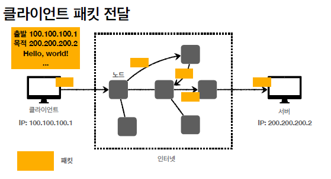

## IP  (인터넷 프로토콜)

:  Internet Protocol

### 인터넷 프로토콜의 역할

+ 지정한 목적지 IP주소(IP address)쪽으로 데이터를 전달할 수 있도록 정해놓은 규칙같은 것

+ 데이터를 통신할때 패킷이라는 통신단위로 데이터를 전달하게 된다.

  (패킷의 구성)

   

  이렇게 IP패킷을 구성하고 '인터넷망'에 던져진다.

 

#### 클라이언트 --> 서버

IP프로토콜에 의해서 노드(서버)들이 그 IP프로토콜 규약을 따르고 있다. 그래서 어떤 패킷이 출발지IP가 뭐고 목적지IP뭔지 다 이해를 한다. 노드들끼리 해당 목적지IP를 받을 수 있는 곳이 어디냐!하면서 서로 던지면서 결국 최종적으로 IP:200.200.200.2에 해당하는 서버에 도착하게 된다.

### 노드란?

- 통신을 하기 위한 주체, 통신장비를 말한다. PC, 노트북, 모바일 등 통신이 가능한 단말도 이해해당하고 

### 노드의 역할?

클라이언트에서 IP패킷을 가장 가까운 노드쪽으로 던지면 그 노드는 목적지IP를 보고 내가 아니면 다른 노드로 IP패킷을 던진다.

 노드의 예 : 각종 통신장비, 라우터, 스위치, 허브 등등을 통들어서 노드라고 한다.

#### 서버 --> 클라이언트

  

서버쪽에서 패킷을 잘 받았다고 하면, 서버쪽에서 잘받았다는 패킷을 만드는데 목적IP주소를 클라이언트주소로 담고 ok와 관련된 신호의 데이터도 담아서 IP패킷을 만들고 근처에 있는 노드한테 던진다.
그러면 적절하게 노드들이 IP프로토콜의 규약에 따라서 패킷을 해석해서 클라이언트를 찾아간다.
(참고로, 클라이언트에서 패킷을 던질때와 서버쪽에서 패킷을 던질때 지나가는 노드들은 다를 수 있다.)

⚙️ IP프로토콜(IP주소를 부여하고 IP패킷에 담고 이거를 찾아가는 방식)은 한계가 있다!!

### IP프로토콜의 한계

+ 비연결성(= connectionless / 즉, 연결성을 보장 못함)
  + 대상서버가 패킷을 받을 수 있는 상태인지 모른다. 즉, 내가 원하는 목적지IP주소가 존재하겠지라고 생각하고 패킷을 던졌는데 받아야할 서버가 서버전원이 꺼져있을 수 있다. 근데 보내는 쪽은 꺼져있는줄 모르고 계속 전달은 하게 된다.

+ 비신뢰성(데이터를 완전히 전송할 수 있는 것에 대해 신뢰성이 떨어진다.)
  + 중간에 패킷이 사라졌을때는 해결을 못함 : 중간에 광케이블같은 랜케이블이 갑자기 멧돼지에 의해 전선이 끊겨있는 상황 등 -> 손실되도 보낸쪽에서 내가 보낸 데이터가 손실되었는지 알지 못한다.
  + 패킷을 여러개 보냈을때 순서대로 도착하지 못하는 경우가 생긴다. 이 부분이 IP프로토콜로는 해결이 안된다.   (뒤에 설명할것임) 
     
  
+ 프로그램 구분 힘듬
  + 같은 IP를 사용하는 서버에서 통신되는 여러 APP가 존재할때 그 APP들을 구분할수가 없음
  + 클라이언트의 같은IP안에서 여러 APP들을 동작시키고 있을때 서버쪽과 네트워크를 통신할텐데 이 서버쪽에서 응답해주는 데이터를 클라이언트의 어떤 APP한테 전달해야할지 구분이 안된다.

+) IP프로토콜은 무상태프로토콜이다.(stateless protocol) / tcp는 stateful한 프로토콜이다.

위와 같은 IP의 한계를 극복해주는 방식이 TCP다.

-----> 다음 내용 : [TCP 프로토콜](../TCP-UDP/README.md)
