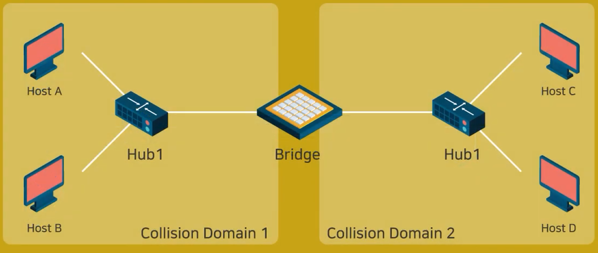

# 이더넷

: 랜선으로 컴퓨터의 인터넷선을 연결. 즉 랜선으로 네트워크를 구성하는 것을 말한다.

- 어떤구성으로 랜선을 연결해야 이더넷이 되는가?
  - 이더넷을 연결하려면 일단 하드장치 메인보드에 랜포트가 존재해야 한다. 즉 이 랜포트가 있다면 컴퓨터에 이더넷을 사용할수있는 유선랜카드가 장착이 되어있다고 알면 된다.(정확히는 메인보드에 내장 랜포트가 있고 유선랜카드를 따로 연결해서 랜포트를 장착하는거다. 유선랜카드기계로 메인보드에 장착하는 랜포트가 아무래도 성능이 더 좋다.)
    그리고 이 랜카드 하드장치를 컴퓨터에서 활용할수있게 도와주는 랜드라이버라는게 설치가 되어있어야 한다. 근데 이거는 요즘 윈도우는 기본default로 설치되어 있다. 
- 랜선의 반대쪽은 어디에 연결되는가?
  - 보통 기본적으로 케이블모뎀(인터넷계약을 하면 해당 인터넷제공업체에서 제공하는 통신장치)에 먼저 연결한다.  해당 인터넷통신회사에서 보내주는 인터넷신호를  집에서 활용할수있도록 변환해주는 장치다.  이 케이블모뎀을 통해서 인터넷통신회사의 네트워크를 이용하게 된다. 이러한 인터넷 연결방식을 **<u>'이더넷'</u>**이라 말한다.

- 최근에 바뀐 이더넷 연결 방식
  - 요즘에는 와이파이를 사용하고 또 컴퓨터도 여러대를 사용한다. 그래서 케이블모뎀으로 들어오는 인터넷통신사의 인터넷신호를 여러기기에 나눠서 쓴다. 이런 기능을 할수있도록 공유기라는 장치를 이용한다.
- 공유기?
  - 인터넷통신사에서 제공하는 인터넷신호(케이블모뎀을 통해)를 분배하는 역할을 한다. 이 분배를 통해서 여러대의 컴퓨터에서 이 하나의 인터넷신호를 활용할수있도록 나눠준다. 보통 요즘은 유무선 공유기를 쓴다.
     

## 이더넷 장치

- 대표적으로 라우터, 스위치 그리고 게이트웨이, 브리지가 있다.
  - 스위치와 라우터는 네트워크의 책임자 역할을 한다. 여러기기를 연결하여 통신이 가능하게 해준다.
     

- 스위치
  - 네트워크 단위를 연결하는 통신장비로 허브와 유사하지만 훨씬 빠른 전송속도를 제공한다.
- 라우터
  - 네트워크간의 중계역할을 한다. 라우터가 패킷을 받았을때 최종목적지로 가기위해 최적의 경로를 지정하여 다음 장치로 전향시키는 장치다.
- 게이트웨이
  - 서로 다른 통신망 간의 통신을 가능하게 하는 역할이다. 즉 다른 네트워크 간의 통로 역할을 하는 장치다. 
     
- 브리지
  - osi모델의 데이터 링크 계층에 있는 여러개의 네트워크 세그먼트를 연결해주는 역할을 한다.
     