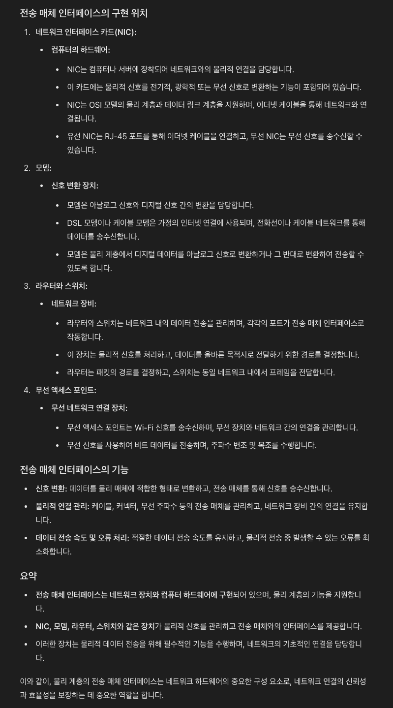

# TCP프로토콜 ( IP프로토콜의 한계를 해결방안으로 나온 프로토콜)

## 배경 지식

### 인터넷 프로토콜(TCP/IP 프로토콜) 스택의 4계층

 

 

TCP는 IP의 규약내용을 보완해준다. 즉, IP위에 TCP내용을 올려서 보완해주는 역할이다.

http인 L4에서는 이 APP을 어떤 host에 전송할것이고 어떤 port번호를 가지는지 등의 정보를 담는 것이다.

애플리케이션 계층 = APP에서 사용하는 계층 = APP에서 사용하는 프로토콜들 (웹서비스를 할때 쓰는 프로토콜이 http프로토콜이다.)

~~~
참고 상식 ) 웹브라우저는 TCP/IP기반으로 데이터를 캡슐화하고 Application영역에서 HTTP프로토콜을 이용할 수 있는 대표적 소프트웨어다.
즉, 인터넷은 TCP/IP 프로토콜에 의해 데이터의 교환이 가능한 글로벌 정보 시스템을 일컫는다.
~~~

 

네트워크 인터페이스 계층 = 랜카드, 랜드라이버 등등을 포함한 네트워크 인터페이스 계층

#### ※ 위 처럼 4개의 계층으로 구분되지만 우리가 컴퓨터를 사용할때 와닿는 부분은 아래그림처럼 3개 정도밖에 안될것이다.

 

 

채팅을 보낼떄는 보통 소켓라이브러리로 구현하는데, 그래서 소켓라이브러리를 통해 OS가 있는 해당계층에다가 메시지내용인 "hello"의 데이터를 넘긴다. 

그러면 이 OS계층에서 'hello' 메시지에다가 TCP정보를 하나 캡슐화(이미지상에서 초록색 껍질) 하게 된다. (TCP패킷까지 완성)

 

이렇게 감싸고 IP계층으로 내려와서 IP와 관련된 데이터를 가지는 IP프로토콜내용을 또 씌운다. (IP패킷까지 완성)

 

TCP규약도 추가한 IP규약은, 결국 IP패킷까지 캡슐화한 상태일때, 이 패킷은 IP정보도 있고 TCP관련된 정보도 있고 제일 안에 내 메시지내용도 있다.   

이제, 이 IP패킷은 결국 1계층인 네트워크 인터페이스에 있는 LAN카드를 통해서 나갈때 'Ethernet Frame'이라는걸 포함해서 나가게 된다. 

※ 참고로 'Ethernet Frame'은 '랜카드에 등록된 MAC주소' 이런 내용을 한번쯤은 들어봤을텐데 이런 물리적인 정보들을 포함하는 단계다. 근데 이런 물리적인 내용까지 다루면 네트워크내용의 너무 깊게까지 들어가기때문에 우리는 웹을 공부하는데에 IP프로토콜까지만 깊게 이해하면 되기때문에 다루지 않고 넘어가겠다.

참고> 

### 패킷이라는 단어의 의미는?

패키지와 덩어리를 뜻하는 버킷의 단어 합성어다.

### 이더넷이란?

~~~
가장 대표적인 네트워크 기술의 하나로, 가정이나 건물과 같은 로컬 환경의 컴퓨터 및 기타장치를 네트워크에 연결하기 위해 개발된 '통신 표준' 방법이다.
이 로컬 환경은 LAN이라 정의되며 여러 장치를 연결하여 다른 사람들과 정보를 작성, 저장 및 공유할 수 있다.

이더넷 장치(= 이더넷 허브)
: 대표적으로 '스위치'과 '라우터'가 있다.
 
~~~

### TCP/IP 패킷 정보

 

ip패킷안에, tcp와 관련된 정보가 들어간다. ip만으로 해결이 안됐던 전송제어, 순서,검증 등의 문제가 해결이 된다.

### TCP의 역할, 특징

: 전송 제어(Transmission Control) 프로토콜(Protocol)

+ 연결지향 - TCP 3 way handshake (가상연결) : 목적지가 제대로 존재하는지,연결할 수 있는지 ACK를 받아서 확인을 받고 연결이 진행된다. 즉, 목적지의 컴퓨터가 꺼져있는것으로 확인되면 연결을 안한다.
+ 데이터 전달 보증
+ 순서 보장
+ 결론 : 신뢰할 수 있는 프로토콜로서 현재는 인터넷통신을 할때 대부분 TCP사용한다.

 

#### TCP 3 way handshake

 

1. 클라이언트쪽에서 처음에 서버로 SYN이라는 접속요청 신호를 보낸다.

2.  서버쪽에서 제대로 SYN메시지를 받으면 ACK를 보내면서 서버쪽의 SYN도 보낸다.

3. 클라이언트에서도 서버쪽에서 보낸 SYN를 제대로 받았으면 ACK를 서버쪽으로 응답해준다. 

4.  서버에서 ACK를 제대로 받고 나면 이제 데이터전송을 할 수 있는 연결이 수립된다. 만약에 ACK를 클라이언트가 못받으면 서버가 데이터를 받을 수 없는 상황이라고 판단하여 connection수립을 하지 않는다.

   (요즘 기술은 최적화가 되어서 `3번의 ACK`를 보내면서 동시에 데이터도 보내준다. )

※

TCP 3way handshake가 성립이 되어서 <u>'연결이 됐다 = 소켓이 연결이 됐다 '</u> 라고 말들을 하는데 여기서 연결의 개념은 실제 물리적으로 연결이 되는 것이 아니라 개념적,논리적으로만 연결이 된것이다. 물리적으로 연결됐다는 의미는 랜선으로 직접 옆에 포트로 꽂아서 연결하는 느낌을 말한다.
그래서 TCP 3way handshake로 ACK를 받았을때는 물리적으로 내가 직접 뭔가 조치를 취한게 아니다. 즉 나를 위한 전용 랜선이 마련된다는 의미가 아니다.
 ACK가 왔기때문에 논리적으로 데이터를 보낼 수 있는 상태라는 것을 파악하는 느낌이다.

연결을 확인하는 과정에서 중간에 거치는 수많은 서버노드들이 있을텐데 그 노드들이 어떤노드들인지 전혀 알지 못한다.

즉, 나를 위한(출발지와 목적지만을 위한)  전용랜선이 보장되는게 아니다!

#### 데이터 전달 보증

 

- 데이터를 잘 받았다고 서버쪽에서 응답해주기때문에 정확히 잘 도착했는지 client쪽에서 인지할 수 있다.

#### 순서 보장

 

- 위 이미지처럼 출발지에서 전송한 패킷순서와 다르게 패킷3이 패킷2보다 먼저 도착하게 되면은 서버쪽에서 잘못된부분부터 다 버려버리고 "패킷2번이 올차례인데 다른게 왔어 패킷2번부터 다시 다 보내!"라고 클라이언트한테 요청을 한다. (구체적으로는 서버자체로 최적화로도 해결하는 기능도 있는데 이런 개념은 이 학습에서는 배제한다.)

### 연결지향, 데이터 전달 보증, 순서 보장 이런 내용들이 다 어떻게 가능한가?

  

캡슐화 할때 그런걸 가능하게 해주는 기능들이 TCP캡슐화(초록색)해주면서 담아주기때문에 해당 내용들을 체크가 가능한 것이다.

---

# ❗️ HTTP프로토콜은 텍스트기반의 개념인데 어떻게 바이트스트림 형태로 데이터를 보내는가? ( 개인 공부 )

HTTP 프로토콜이 텍스트 기반이라는 것은 HTTP 메시지(헤더 + 바디)가 사람이 읽을 수 있는 텍스트 형태로 작성된다는 의미다. 특히 요청과 응답의 시작 부분인 Start Line이 사람이 읽을 수 있는 텍스트로 구성된다는 의미다. 반면에, HTTP 메시지의 바디는 전송해야 하는 데이터의 종류에 따라 텍스트 또는 바이너리 형태가 될 수 있습니다. 예를 들어, HTML, JSON, XML 등의 데이터는 바디에서 텍스트로 포함되지만, 이미지, 동영상, PDF 등은 바이너리 형태로 작성되어 있을 것이다.

## 애플리케이션에서 만든 데이터가 전송되는 계층 과정

**애플리케이션 계층:**

- 데이터가 애플리케이션에서 생성된다. 예를 들어, 웹 브라우저에서는 HTML, JSON, 또는 텍스트 데이터가 생성된다.
- 데이터는 여전히 사람이 읽을 수 있는 형태다.

**전송 계층 (TCP):**

- 애플리케이션 계층에서 받은 데이터를 바이트 스트림으로 변환한다.
- 이 바이트 스트림을 TCP 세그먼트로 나누고, 각 세그먼트에 TCP 헤더를 추가한다. TCP 헤더에는 포트 번호, 시퀀스 번호, 체크섬 등 연결 관리와 오류 검출에 필요한 정보가 포함한다.
- 해당 계층단계에서 HTTP통신을 할때 Three-way handshake를 하는 단계다.
- 자바 웹 개발에서 전송 계층(TCP)과 관련된 작업은 대부분 애플리케이션 서버와 네트워크 스택에 의해 자동으로 처리된다.

**네트워크 계층 (IP):**

- TCP 세그먼트에 IP 헤더를 추가하여 IP 패킷을 만든다. IP 헤더에는 발신자와 수신자의 IP 주소와 같은 라우팅 정보가 포함된다.

- 라우팅이란?

  > 1. 생성된 IP 패킷은 네트워크를 통해 전송되기 위해 라우팅 과정을 거친다. 라우팅은 패킷이 출발지에서 목적지까지 가장 적절한 경로를 찾아가는 과정이다. 이 과정은 라우터와 같은 네트워크 장치에 의해 수행된다. (IP 주소는 패킷을 네트워크를 통해 목적지로 전달하기 위한 라우팅 과정에서 사용된다.)
  > 2. 라우터는 IP 패킷의 목적지 IP 주소를 확인하고, 이를 기반으로 다음 홉(next hop)으로 패킷을 전달한다. 이 과정이 패킷이 최종 목적지에 도달할 때까지 반복된다.

**데이터 링크 계층:**

- IP 패킷을 프레임으로 캡슐화하고, 데이터 링크 계층의 헤더와 트레일러를 추가힌다. 이 단계에서 MAC 주소 등 물리적 네트워크 주소가 추가된다.
- 이 계층은 이더넷, Wi-Fi 등과 같은 프로토콜을 사용하여 MAC 주소를 기반으로 프레임을 전달한다.

**물리 계층:**

- 프레임을 물리적 신호(전기 신호, 무선 신호 등)로 변환하여 실제 전송 매체(예: 이더넷 케이블, 무선 네트워크 등)를 통해 송신한다.
- 비트 수준에서 데이터를 전송하며, 물리적 신호를 처리합니다.

## 자바 개발에서 전송 계층(TCP) 내용은 어떻게 다뤄지는가?

- 자바 웹 개발에서 전송 계층(TCP)과 관련된 작업은 대부분 애플리케이션 서버와 네트워크 스택에 의해 자동으로 처리된다.
-  개발자는 주로 HTTP 요청과 응답에 집중해서 작성하면 되지만, TCP 연결의 개념을 이해하고 필요에 따라 세부 조작을 할 수 있다.

### 자바 웹 개발에서 TCP와 관련된 코드 작성 단계와 개념

1. 웹 서버 및 애플리케이션 서버 설정:

   - 자바 웹 애플리케이션은 일반적으로 Tomcat, Jetty, Spring Boot(내장웹서버) 등의 애플리케이션 서버 위에서 동작한다. 이 서버들이 클라이언트의 HTTP 요청을 처리하기 위해 TCP 연결을 자동으로 설정한다.
   - 개발자는 서버 설정 파일에서 포트(port)와 관련된 설정을 조정하여 TCP 연결의 기본 설정을 다룰 수 있다.

2. HTTP 요청 및 응답 처리:

   - 개발자는 서블릿이나 Spring MVC 컨트롤러를 작성하여 HTTP 요청을 처리한다.
   - 요청이 들어오면 서버(예: 톰캣)는 TCP 연결을 설정하고, HTTP 요청을 처리한 후 응답을 전송한다.
   - TCP 연결 관리(설정 및 해제)는 서버가 처리하며, 개발자는 HTTP 수준의 요청과 응답을 처리한다.

3. **소켓 프로그래밍 (필요한 경우):**

   - 더 낮은 수준의 TCP 통신을 직접 다뤄야 할 경우, `java.net.Socket`과 `java.net.ServerSocket` 클래스를 사용할 수 있다. (주로 애플리케이션 서버가 이 역할을 자동으로 수행하므로, 개발자는 비즈니스 로직과 HTTP 수준의 처리를 더 많이 다루게 된다)

     이를 통해 TCP 소켓을 직접 열고 데이터 스트림(스프링같은 기능이 자동으로 문자데이터든 뭐든 최종적으로 스트림데이터로 변경해줌)을 읽거나 쓸 수 있다. 이는 일반적으로 HTTP 대신 맞춤형 프로토콜이나 비동기 통신이 필요할 때 사용된다.
     ~~~java
     //코드의 예
     // 클라이언트 소켓 예제
     try (Socket socket = new Socket("example.com", 80);
          OutputStream out = socket.getOutputStream();
          InputStream in = socket.getInputStream()) {
     
         // 데이터 전송
         out.write("GET / HTTP/1.1\r\nHost: example.com\r\n\r\n".getBytes());
         out.flush();
     
         // 데이터 수신
         BufferedReader reader = new BufferedReader(new InputStreamReader(in));
         String line;
         while ((line = reader.readLine()) != null) {
             System.out.println(line);
         }
     } catch (IOException e) {
         e.printStackTrace();
     }
     ~~~

4. TCP 연결 최적화 (고급):

   - 대규모 애플리케이션에서는 TCP 연결 최적화가 필요할 수 있다. 예를 들어, keep-alive 설정을 통해 연결을 재사용하거나 타임아웃을 조정하여 성능을 개선할 수 있다.

     이러한 설정은 주로 서버 구성 파일에서 관리된다.

## 네트워크 스택은 어떻게 구현되고 다뤄지는가?

- 네트워크 스택(Network Stack)은 컴퓨터 네트워크에서 데이터 전송을 위해 사용되는 일련의 프로토콜과 계층 구조를 의미한다. 네트워크 스택은 보통 OSI 모델 또는 TCP/IP 모델에 기반하여 설명된다.

### 네트워크 스택의 위치와 구현

1. 운영체제(OS) :
   - 네트워크 스택은 주로 운영 체제의 커널에 구현되어 있다. 이는 모든 네트워크 통신을 중앙에서 관리하고 처리할 수 있도록 한다.
   - 각 운영 체제(Windows, Linux, macOS 등)는 자신만의 네트워크 스택을 구현하여, 이 네트워크 스택이 TCP/IP와 같은 표준 네트워크 프로토콜을 처리한다.
   - 운영 체제의 네트워크 드라이버 및 네트워크 인터페이스와 상호작용하여 데이터를 전송하고 수신한다.
2. 애플리케이션 서버(WAS):
   - Tomcat, Jetty, Spring Boot와 같은 애플리케이션 서버는 운영 체제의 네트워크 스택을 게속 활용하여 클라이언트의 HTTP 요청을 수신하고 응답을 전송한다.
   - 애플리케이션 서버는 전송 계층(TCP) 및 네트워크 계층(IP)에서의 세부사항을 직접 관리하진 않지만 WAS에서 운영체제의 API를 이용해 네트워크 스택에 접근해 애플리케이션 계층(HTTP)에서의 작업을 수행한다.
   - 이러한 WAS서버는 운영 체제의 API를 호출하여 네트워크 스택과 상호작용하며, 요청을 적절히 처리하고 연결을 관리한다.
3. 자바 애플리케이션 :
   - 자바 애플리케이션은 `java.net` 패키지의 클래스(`Socket`, `ServerSocket`, `URLConnection` 등)를 사용하여 네트워크 통신을 구현할 수 있다.
   - 자바 웹애플리케이션은 자바 런타임중에서 이러한 네트워크 관련 클래스에서 운영 체제의 네트워크 스택을 호출하여, 네트워크 연결을 설정하고 데이터를 전송한다.

### 네트워크 스택의 역할

- 데이터 전송 관리: 네트워크 스택은 전송 계층(TCP, UDP)에서 데이터를 세그먼트화하고, 네트워크 계층(IP)에서 패킷화하여 전송 경로를 관리한다.
- 프로토콜 처리: TCP/IP 및 기타 네트워크 프로토콜을 처리하여 데이터가 올바르게 전송되고 수신되도록 한다.
- 연결 관리: TCP 연결을 설정하고 유지하며, 패킷의 라우팅과 데이터 흐름을 제어한다.

### 요약

- 네트워크 스택은 운영 체제의 커널에 구현되어 있으며, 모든 네트워크 통신을 처리하는 역할을 한다.
- 애플리케이션 서버 및 자바 애플리케이션은 운영 체제의 네트워크 스택을 활용하여 네트워크 작업을 수행하며, 주로 애플리케이션 계층의 로직에 집중한다.
- 개발자는 네트워크 스택의 세부 구현을 직접 다루지 않고, 운영 체제의 API를 통해 네트워크 통신을 수행한다.

## 자바 개발에서 네트워크 계층 = 인터넷 계층(IP) 내용은 어떻게 다뤄지는가?

- 자바 개발에서 네트워크 계층(IP) 관련 작업은 일반적으로 개발자가 직접 다루는 부분은 많지 않다. 대부분의 네트워크 계층 작업은 운영 체제와 네트워크 스택에 의해 처리된다. 그러나 특정 상황에서는 개발자가 네트워크 계층과 관련된 기능을 직접 구현하거나 설정해야 할 수 있다. 여기 몇 가지 예를 들어 설명하겠다.

### '네트워크 계층' 관련 작업

1. IP 주소 및 포트 관리:

   - 자바 애플리케이션개발에서 네트워크(계층) 통신을 위해 전송계층에서 `java.net` 패키지를 사용하여 IP 주소와 포트를 직접 설정할 수 있다. 예를 들어, 소켓을 열 때 서버의 IP 주소와 포트를 지정하여 연결을 설정한다.(소켓생성과 해당 설정 내용은 전송계층 내용인데 연관되서 기입함)
     - 예 : Socket socket = new Socket("192.168.1.1", 8080);

2. 멀티캐스트 및 브로드캐스트:

   - 자바는 멀티캐스트와 브로드캐스트 통신을 위한 클래스(`MulticastSocket`)를 제공한다.

   - 이를 통해 특정 IP 범위에 있는 여러 장치와 동시에 통신할 수 있다. 이 기능은 주로 네트워크 서비스 검색 및 미디어 스트리밍 등에 사용된다.
     ~~~java
     InetAddress group = InetAddress.getByName("230.0.0.0");
     MulticastSocket multicastSocket = new MulticastSocket(4446);
     multicastSocket.joinGroup(group);
     
     // 데이터 전송
     byte[] buf = "Hello, Multicast!".getBytes();
     DatagramPacket packet = new DatagramPacket(buf, buf.length, group, 4446);
     multicastSocket.send(packet);
     ~~~

3. 네트워크 인터페이스 관리:

   - `java.net.NetworkInterface` 클래스를 사용하여 네트워크 인터페이스(예: 이더넷, Wi-Fi 등)의 정보를 얻거나 조작할 수 있다.

     이는 특정 네트워크 인터페이스를 통해 통신하거나, 시스템의 네트워크 구성을 확인할 때 유용하다
     ~~~java
     Enumeration<NetworkInterface> interfaces = NetworkInterface.getNetworkInterfaces();
     while (interfaces.hasMoreElements()) {
         NetworkInterface networkInterface = interfaces.nextElement();
         System.out.println("Interface: " + networkInterface.getName());
     }
     ~~~

4. 프로토콜 구현 :

   - HTTP 외에 다른 IP 기반 프로토콜(예: DNS, DHCP 등)을 구현해야 할 경우, 개발자는 네트워크 계층에서의 패킷 형식을 정의하고 이를 처리하는 로직을 구현해야 할 수 있다.
   - 이는 주로 맞춤형 네트워크 서비스나 장치 통신을 위한 프로토콜을 개발할 때 발생한다.

### 요약

- 일반적인 웹 애플리케이션: 개발자는 네트워크 계층(IP)에 직접적으로 관여할 필요가 없다. 이러한 부분은 대부분 애플리케이션 서버 및 운영 체제가 처리한다.

- 특정 네트워크 기능: 멀티캐스트, 네트워크 인터페이스 관리, 특정 프로토콜 구현 등 네트워크 계층에 대한 세부 작업을 필요로 할 때 자바의 네트워크 API를 사용하여 직접 다룰 수 있다.

- 운영 환경 구성: 네트워크 계층의 설정은 주로 시스템 관리자나 DevOps 팀에서 서버 환경을 구성하는 과정에서 이루어진다.

## 물리 계층에서 말하는 물리적 신호가 비트수준의 데이터를 말하는것인가 and 바이트 스트림과 다른 개념인가

- 물리 계층에서 말하는 물리적 신호는 비트 수준의 데이터를 말하며, 이는 바이트 스트림 데이터보다 더 세밀하게 쪼갠 단위다. 물리 계층은 데이터를 전기적, 광학적, 무선 신호로 변환하여 실제 네트워크 매체를 통해 전송하는 역할을 한다.

## 물리 계층의 역할

**1. 데이터 전송:**

- 물리 계층은 데이터를 0과 1로 구성된 비트(bit) 단위로 다룬다.
- 이 비트는 전기적 pulse, 광신호, 무선 주파수 등으로 변환되어 네트워크 매체(예: 이더넷 케이블, 광케이블, 무선 전파)를 통해 전송된다.

**2. 신호 변환:**

- 데이터를 물리 매체에 적합한 형태로 변환하는 과정을 포함한다.
  - 예를 들어, 유선매체(이더넷케이블 등)를 통해 전송할때는 디지털 데이터를 전기적 신호(전기적 pulse)로 변환하거나, 무선 네트워크(Wi-Fi, Bluetooth,셀룰러 네트워크 등)일때는 주파수 변조를 통해 데이터를 전송한다.

**3. 전송 매체 인터페이스:**

- 케이블의 종류, 커넥터, 전송 속도 등을 정의하여 물리적 연결을 관리한다.
   

## WAS에서의 네트워크 계층 및 전송 계층 상호작용

- WAS는 운영 체제의 네트워크 스택을 사용하여 TCP/IP 연결을 설정하고 관리한다.
- 네트워크 스택은 운영 체제의 커널에 내장되어 있으며, TCP 및 IP 계층의 모든 세부 사항(예: 패킷 라우팅, 연결 설정 및 해제, 오류 처리 등)을 관리한다.
- WAS는 운영 체제의 API를 통해 네트워크 스택과 상호작용하여 TCP 연결을 열고, IP 패킷을 전송하는 등의 작업을 수행한다.
- WAS는 TCP/IP 계층의 자동 처리도 한다.
  - TCP의 세부 기능(예: three-way handshake, 연결 유지, 데이터 흐름 제어 등)과 IP의 기능(예: 패킷 라우팅, 주소 해석 등)은 운영 체제의 네트워크 스택이 담당한다.
  - 애플리케이션 서버는 이러한 기능을 직접 구현하지 않으며, 대신 운영 체제에서 제공하는 네트워크 기능을 호출하여 사용한다.

## WAS와 네트워크 스택의 관계

- **WAS의 책임:** WAS는 HTTP 프로토콜을 사용하여 클라이언트와 서버 간의 애플리케이션 데이터 교환을 관리한다. 이를 위해 TCP 연결을 필요로 하지만, TCP/IP의 세부 구현은 WAS에 포함되지 않는다.
- **운영 체제의 역할:** 운영 체제는 네트워크 스택을 통해 TCP/IP 계층의 모든 기능을 처리한다. 이 스택은 물리적 네트워크 인터페이스를 통해 데이터를 송수신하며, 네트워크 연결의 신뢰성을 보장한다.
- **상호작용 방식:** WAS는 운영 체제의 API를 통해 네트워크 스택을 호출하여 TCP/IP 계층의 기능을 사용한다. 예를 들어, 소켓을 열고 닫거나 데이터 스트림을 관리하는 등의 작업이 이에 해당한다.

---

# UDP프로토콜 

  

UDP는 TCP랑 같은 계층에 있는, IP계층 위에있는 계층이다.

※ UDP는 기능이 없다.  IP와 거의 똑같지만 다른 역할로는, 어떤PORT로 보낼지 PORT번호를 붙여준다. 그리고 체크섬(이 메시지에 대해서 제대로 맞는지 검증해주는 데이터)을 추가해준다.
~~~
tcp정보에도 port가 있다. udp정보에도 port가 있다. 하지만 IP정보에는 port가 없다.
~~~

+ UDP의 역할을 보통 '하얀 도화지'에 비유한다. (기능이 거의 없다는 뜻이다.)

+ 연결지향인 TCP처럼 3 way handshake기능이 없다.

+ 데이터 전달을 보증해주지 않는다.

+ 순서 보장 X

+ 데이터 전달 및 순서가 보장되지는 않지만 단순하고 빠르다 .

  

#### PORT의 개념

하나의 IP에서 여러 APP(애플리케이션)을 쓰게 되면 이 하나의 출발지IP에 여러종류의 패킷들이 응답으로 들어올 것이다.(예 : 네트워크 게임도 하고 음악도 듣고 있을때.) 그러면 이때 이 APP들이 ***'이 데이터는 APP1의 데이터(게임용 패킷)이고 이건 APP2(음악용 패킷)의 데이터다.'***  라는걸 구분할 수 있어야 할것이다. 이렇게 구분해주는 역할이 port번호다.
추가로, 체크섬은 이 메시지에 대해서 제대로 맞는지 검증해주는 데이터라고 보면 된다...?  

  

### UDP를 쓸때의 결정적 장점 : 결정적으로 쓰는 이유

1. TCP를 사용하게되면은 3 way handshake라는걸 하기때문에 시간소요가 크고 TCP에서 담아야할 데이터들을 다 담으면 데이터도 좀 클것이다. 하지만 인터넷이라는게 이미 TCP기반으로 다 쓰고 있기때문에 TCP에는 손을 못댄다.  그런데 우리가 더 최적화 할 수 있다라고 하면은 TCP는 그대로 쓰고 UDP라는 것을 건드리면 된다. UDP는 아무것도 안되어있기때문에 내가 원하는 데이터를 <u>application레벨</u>에서 만들어서 넣으면 된다.

 

### ※ 최근의 UDP 기술 근황

UDP는 최근에 각광을 받고 있다. 웹완전 초창기에는 TCP는 신뢰할 수 있는 정보를 보내야하고, 깨져도 되는 동영상같은거는 UDP로 보내도 된다고 배웠다. 하지만 그 이후에 얼마전까지는 TCP가 거의 90%이상으로 기능담당을 점령했다. 그래서 얼마전까지 영상을 보낼때도 TCP를 썼다. 그런데, 이게 또 시대가 바뀌면서 제일 최근에는 UDP가 뜨고 있는 추세다. 그 이유는 웹브라우저에서 http통신을 할때 최근에 http3까지 스펙이 나왔는데 여기서   3 way handshake하려면 syn보내고 ack보내고 해야하는데 그런것까지 다 줄여보자!라고 해서 더 최적화를 하면서 http3같은 경우에 udp프로토콜을 사용하면서 지금 굉장히 뜨고 있다.

-----> 다음 내용 : [PORT](../PORT/README.md)
