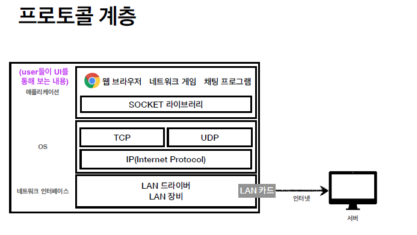

## TCP프로토콜 ( IP프로토콜의 한계를 해결방안으로 나온 프로토콜)

## 배경 지식

### 인터넷 프로토콜(TCP/IP 프로토콜) 스택의 4계층

 

 

TCP는 IP의 규약내용을 보완해준다. 즉, IP위에 TCP내용을 올려서 보완해주는 역할이다.

http인 L4에서는 이 APP을 어떤 host에 전송할것이고 어떤 port번호를 가지는지 등의 정보를 담는 것이다.

애플리케이션 계층 = APP에서 사용하는 계층 = APP에서 사용하는 프로토콜들 (웹서비스를 할때 쓰는 프로토콜이 http프로토콜이다.)

~~~
참고 상식 ) 웹브라우저는 TCP/IP기반으로 데이터를 캡슐화하고 Application영역에서 HTTP프로토콜을 이용할 수 있는 대표적 소프트웨어다.
즉, 인터넷은 TCP/IP 프로토콜에 의해 데이터의 교환이 가능한 글로벌 정보 시스템을 일컫는다.
~~~

 

네트워크 인터페이스 계층 = 랜카드, 랜드라이버 등등을 포함한 네트워크 인터페이스 계층

#### ※ 위 처럼 4개의 계층으로 구분되지만 우리가 컴퓨터를 사용할때 와닿는 부분은 아래그림처럼 3개 정도밖에 안될것이다.

 

 

채팅을 보낼떄는 보통 소켓라이브러리로 구현하는데, 그래서 소켓라이브러리를 통해 OS가 있는 해당계층에다가 메시지내용인 "hello"의 데이터를 넘긴다. 

그러면 이 OS계층에서 'hello' 메시지에다가 TCP정보를 하나 캡슐화(이미지상에서 초록색 껍질) 하게 된다. (TCP패킷까지 완성)

 

이렇게 감싸고 IP계층으로 내려와서 IP와 관련된 데이터를 가지는 IP프로토콜내용을 또 씌운다. (IP패킷까지 완성)

 

TCP규약도 추가한 IP규약은, 결국 IP패킷까지 캡슐화한 상태일때, 이 패킷은 IP정보도 있고 TCP관련된 정보도 있고 제일 안에 내 메시지내용도 있다.   

이제, 이 IP패킷은 결국 1계층인 네트워크 인터페이스에 있는 LAN카드를 통해서 나갈때 'Ethernet Frame'이라는걸 포함해서 나가게 된다. 

※ 참고로 'Ethernet Frame'은 '랜카드에 등록된 MAC주소' 이런 내용을 한번쯤은 들어봤을텐데 이런 물리적인 정보들을 포함하는 단계다. 근데 이런 물리적인 내용까지 다루면 네트워크내용의 너무 깊게까지 들어가기때문에 우리는 웹을 공부하는데에 IP프로토콜까지만 깊게 이해하면 되기때문에 다루지 않고 넘어가겠다.

참고> 

### 패킷이라는 단어의 의미는?

패키지와 덩어리를 뜻하는 버킷의 단어 합성어다.

### 이더넷이란?

~~~
가장 대표적인 네트워크 기술의 하나로, 갖어이나 건물과 같은 로컬 환경의 컴퓨터 및 기타장치를 네트워크에 연결하기 위해 개발된 '통신 표준' 방법이다.
이 로컬 환경은 LAN이라 정의되며 여러 장치를 연결하여 다른 사람들과 정보를 작성, 저장 및 공유할 수 있다.

이더넷 장치(= 이더넷 허브)
: 대표적으로 '스위치'과 '라우터'가 있다.

 
~~~

### TCP/IP 패킷 정보

 

ip패킷안에, tcp와 관련된 정보가 들어간다. ip만으로 해결이 안됐던 전송제어, 순서,검증 등의 문제가 해결이 된다.

### TCP의 역할, 특징

: 전송 제어(Transmission Control) 프로토콜(Protocol)

+ 연결지향 - TCP 3 way handshake (가상연결) : 목적지가 제대로 존재하는지,연결할 수 있는지 ACK를 받아서 확인을 받고 연결이 진행된다. 즉, 목적지의 컴퓨터가 꺼져있는것으로 확인되면 연결을 안한다.
+ 데이터 전달 보증
+ 순서 보장
+ 결론 : 신뢰할 수 있는 프로토콜로서 현재는 인터넷통신을 할때 대부분 TCP사용한다.

 

#### TCP 3 way handshake

 

1. 클라이언트쪽에서 처음에 서버로 SYN이라는 접속요청 신호를 보낸다.

2.  서버쪽에서 제대로 SYN메시지를 받으면 ACK를 보내면서 서버쪽의 SYN도 보낸다.

3. 클라이언트에서도 서버쪽에서 보낸 SYN를 제대로 받았으면 ACK를 서버쪽으로 응답해준다. 

4.  서버에서 ACK를 제대로 받고 나면 이제 데이터전송을 할 수 있는 연결이 수립된다. 만약에 ACK를 클라이언트가 못받으면 서버가 데이터를 받을 수 없는 상황이라고 판단하여 connection수립을 하지 않는다.

   (요즘 기술은 최적화가 되어서 `3번의 ACK`를 보내면서 동시에 데이터도 보내준다. )

※

TCP 3way handshake가 성립이 되어서 <u>'연결이 됐다 = 소켓이 연결이 됐다 '</u> 라고 말들을 하는데 여기서 연결의 개념은 실제 물리적으로 연결이 되는 것이 아니라 개념적,논리적으로만 연결이 된것이다. 물리적으로 연결됐다는 의미는 랜선으로 직접 옆에 포트로 꽂아서 연결하는 느낌을 말한다.
그래서 TCP 3way handshake로 ACK를 받았을때는 물리적으로 내가 직접 뭔가 조치를 취한게 아니다. 즉 나를 위한 전용 랜선이 마련된다는 의미가 아니다.
 ACK가 왔기때문에 논리적으로 데이터를 보낼 수 있는 상태라는 것을 파악하는 느낌이다.

연결을 확인하는 과정에서 중간에 거치는 수많은 서버노드들이 있을텐데 그 노드들이 어떤노드들인지 전혀 알지 못한다.

즉, 나를 위한(출발지와 목적지만을 위한)  전용랜선이 보장되는게 아니다!

#### 데이터 전달 보증

 

- 데이터를 잘 받았다고 서버쪽에서 응답해주기때문에 정확히 잘 도착했는지 client쪽에서 인지할 수 있다.

#### 순서 보장

 

- 위 이미지처럼 출발지에서 전송한 패킷순서와 다르게 패킷3이 패킷2보다 먼저 도착하게 되면은 서버쪽에서 잘못된부분부터 다 버려버리고 "패킷2번이 올차례인데 다른게 왔어 패킷2번부터 다시 다 보내!"라고 클라이언트한테 요청을 한다. (구체적으로는 서버자체로 최적화로도 해결하는 기능도 있는데 이런 개념은 이 학습에서는 배제한다.)

### 연결지향, 데이터 전달 보증, 순서 보장 이런 내용들이 다 어떻게 가능한가?

  

캡슐화 할때 그런걸 가능하게 해주는 기능들이 TCP캡슐화(초록색)해주면서 담아주기때문에 해당 내용들을 체크가 가능한 것이다.

---

## UDP프로토콜 

  

UDP는 TCP랑 같은 계층에 있는, IP계층 위에있는 계층이다.

※ UDP는 기능이 없다.  IP와 거의 똑같지만 다른 역할로는, 어떤PORT로 보낼지 PORT번호를 붙여준다. 그리고 체크섬(이 메시지에 대해서 제대로 맞는지 검증해주는 데이터)을 추가해준다.
~~~
tcp정보에도 port가 있다. udp정보에도 port가 있다. 하지만 IP정보에는 port가 없다.
~~~

+ UDP의 역할을 보통 '하얀 도화지'에 비유한다. (기능이 거의 없다는 뜻이다.)

+ 연결지향인 TCP처럼 3 way handshake기능이 없다.

+ 데이터 전달을 보증해주지 않는다.

+ 순서 보장 X

+ 데이터 전달 및 순서가 보장되지는 않지만 단순하고 빠르다 .

  

#### PORT의 개념

하나의 IP에서 여러 APP(애플리케이션)을 쓰게 되면 이 하나의 출발지IP에 여러종류의 패킷들이 응답으로 들어올 것이다.(예 : 네트워크 게임도 하고 음악도 듣고 있을때.) 그러면 이때 이 APP들이 ***'이 데이터는 APP1의 데이터(게임용 패킷)이고 이건 APP2(음악용 패킷)의 데이터다.'***  라는걸 구분할 수 있어야 할것이다. 이렇게 구분해주는 역할이 port번호다.
추가로, 체크섬은 이 메시지에 대해서 제대로 맞는지 검증해주는 데이터라고 보면 된다...?  

  

### UDP를 쓸때의 결정적 장점 : 결정적으로 쓰는 이유

1. TCP를 사용하게되면은 3 way handshake라는걸 하기때문에 시간소요가 크고 TCP에서 담아야할 데이터들을 다 담으면 데이터도 좀 클것이다. 하지만 인터넷이라는게 이미 TCP기반으로 다 쓰고 있기때문에 TCP에는 손을 못댄다.  그런데 우리가 더 최적화 할 수 있다라고 하면은 TCP는 그대로 쓰고 UDP라는 것을 건드리면 된다. UDP는 아무것도 안되어있기때문에 내가 원하는 데이터를 <u>application레벨</u>에서 만들어서 넣으면 된다.

 

### ※ 최근의 UDP 기술 근황

UDP는 최근에 각광을 받고 있다. 웹완전 초창기에는 TCP는 신뢰할 수 있는 정보를 보내야하고, 깨져도 되는 동영상같은거는 UDP로 보내도 된다고 배웠다. 하지만 그 이후에 얼마전까지는 TCP가 거의 90%이상으로 기능담당을 점령했다. 그래서 얼마전까지 영상을 보낼때도 TCP를 썼다. 그런데, 이게 또 시대가 바뀌면서 제일 최근에는 UDP가 뜨고 있는 추세다. 그 이유는 웹브라우저에서 http통신을 할때 최근에 http3까지 스펙이 나왔는데 여기서   3 way handshake하려면 syn보내고 ack보내고 해야하는데 그런것까지 다 줄여보자!라고 해서 더 최적화를 하면서 http3같은 경우에 udp프로토콜을 사용하면서 지금 굉장히 뜨고 있다.

-----> 다음 내용 : [PORT](../PORT/README.md)
