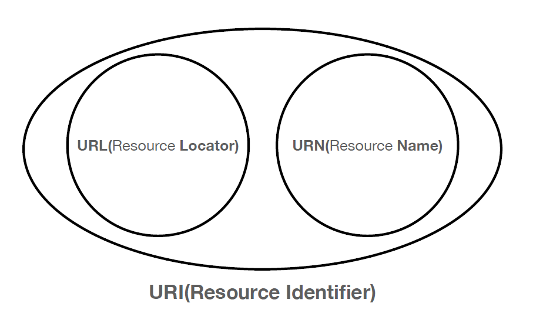
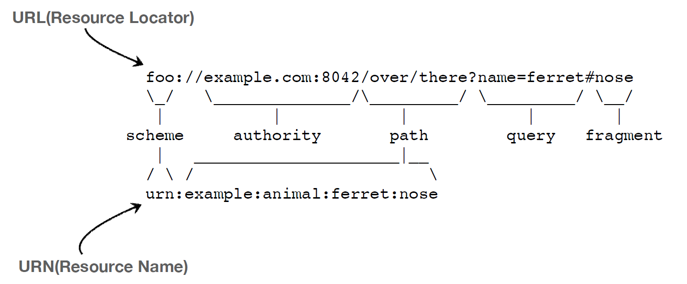
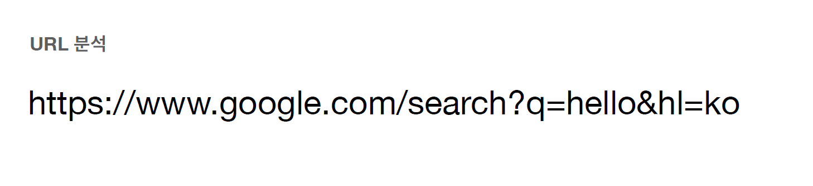
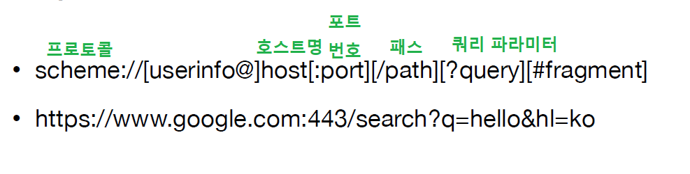

# URI와 웹 브라우저 요청 흐름

## URI

: Uniform Resource Identifier => 직역하면 '통합 자원 식별자'라고 하고, 인터넷에 있는 리소스를 식별하는 주소 다.

리소스를 식별한다는 것은 쉽게 비유하면 사람들을 주민번호로 식별한다고 생각하면 된다.

+ Uniform: 리소스 식별하는 통일된 방식
+  Resource: 자원, URI로 식별할 수 있는 모든 것(제한 없음)을 resource라고 한다.
  + resource의 예 : 웹브라우저의 html파일 같은것만 의미하는게 아니다. 실시간 교통정보, 우리가 구분할 수 있는 모든 것들을 말한다.

+ Identifier: 다른 항목과 구분하는데 필요한 정보

+ URL: Uniform Resource Locator
+ URN: Uniform Resource Name

### URI? URL? URN?

> "URI는 로케이터(locator), 이름(name) 또는 둘
> 다 추가로 분류될 수 있다" ( https://www.ietf.org/rfc/rfc3986.txt )

  

URL : 리소스가 있는 위치

URN : 리소스의 이름

 

웹브라우저에서 적는 형태가 'URL' 이다. 현실에서는 URN은 쓰는 일 없으니 URL만 알면 된다.

+ URL - Locator: 리소스가 있는 위치를 지정
+  URN - Name: 리소스에 이름을 부여
+  '위치'는 변할 수 있지만, '이름'은 변하지 않는다.
+  urn:isbn:8960777331 (어떤 책의 isbn URN)
+  URN 이름만으로 실제 리소스를 찾을 수 있는 방법이 보편화 되지 않음
+  **★ 앞으로 URI를 URL과 같은 의미로 이야기하겠음**

 

schema 는 보통 여기에 '프로토콜'정보가 들어 간다.

## URL

전체 문법

  

+  프로토콜(https)
+  호스트명(www.google.com)
+  포트 번호(443)
+  패스(/search)
+  쿼리 파라미터(q=hello&hl=ko)

1. ### Scheme

+ 주로 프로토콜 사용
+  프로토콜: 어떤 방식으로 자원에 접근할 것인가 하는 약속 규칙
+  예) http, https, ftp 등등
+  http는 80 포트, https는 443 포트를 주로 사용.
  +  http나 https의 프로토콜을 쓰면은 포트번호는 생략 가능하다. 프로토콜을 보고 알아서 포트번호 판단하게 되는 것이다.
+  https는 http에 보안 추가 (HTTP Secure)

2. ### userinfo

   : 참고) 이거는 거의 안쓰는 내용이다.

+ URL에 사용자정보를 포함해서 인증
+  거의 사용하지 않음

3. ### host

+ 호스트명
+  도메인명 또는 IP 주소를 직접 사용가능

4. ### port

+ 포트(PORT)
+  접속 포트
+  일반적으로 생략, 생략시 http는 80, https는 443

5. ### path

+ 리소스 경로(path), 계층적 구조 (예 처럼 / 로 아래로 내려가는게 계층적 구조임)
+  예)
  +  /home/file1.jpg
  +  /members
  +  /members/100, /items/iphone12

6. ### query

+ key=value 형태
+  ?로 시작, &로 추가 가능 ?keyA=valueA&keyB=valueB
+  query parameter, query string 등으로 불림, 웹서버에 제공하는 파라미터, 문자 형태
  + ★ query string이라고도 불리는 이유는 ?q=2324 처럼 숫자가 넘어가도 문자형태로 넘어간다.

7. ### fragment

:  잘 사용하진 않는다. 하지만 의미를 말하자면, html내부에서 중간에 이동하고 싶을때 html내부 북마크 등에서 사용한다.

+ scheme://[userinfo@]host[:port][/path][?query][#fragment]
+  https://docs.spring.io/spring-boot/docs/current/reference/html/gettingstarted.html#getting-started-introducing-spring-boot
+ fragment
+  html 내부 북마크 등에 사용
+  서버에 전송하는 정보 아님

다음 내용 : url을 호출 했을때 실제 웹브라우저에서 네트워크를 어떤 식으로 패키지를 만들어서 어떻게 흘러가고, 서버에 도착하고 그리고 서버는 어떻게 응답을 주는지 전체 흐름을 볼 것이다.

