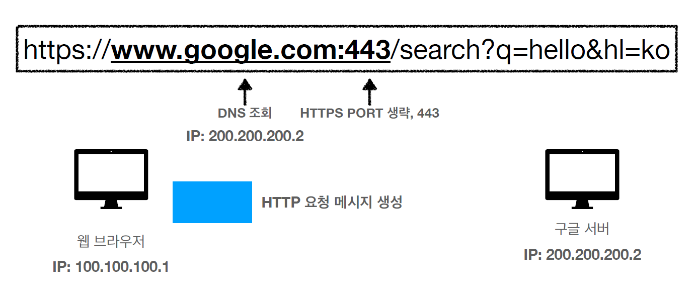
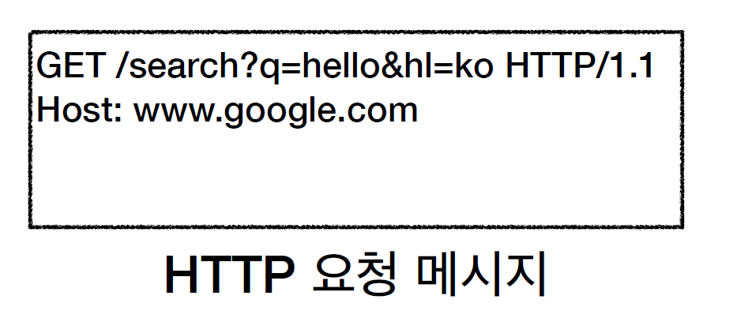
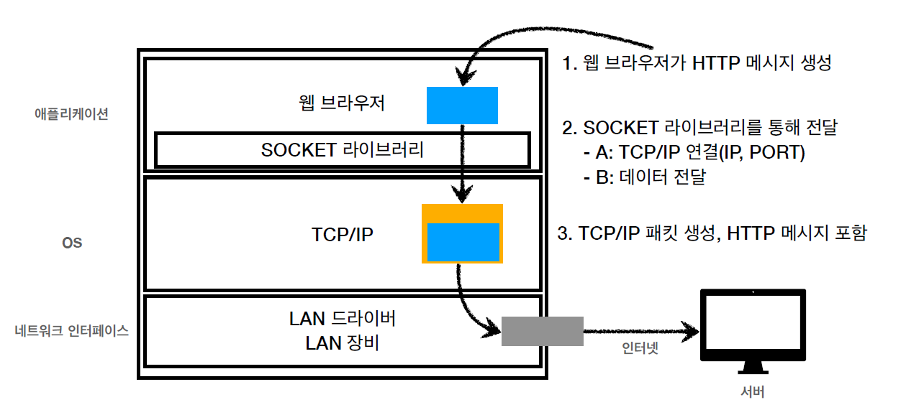
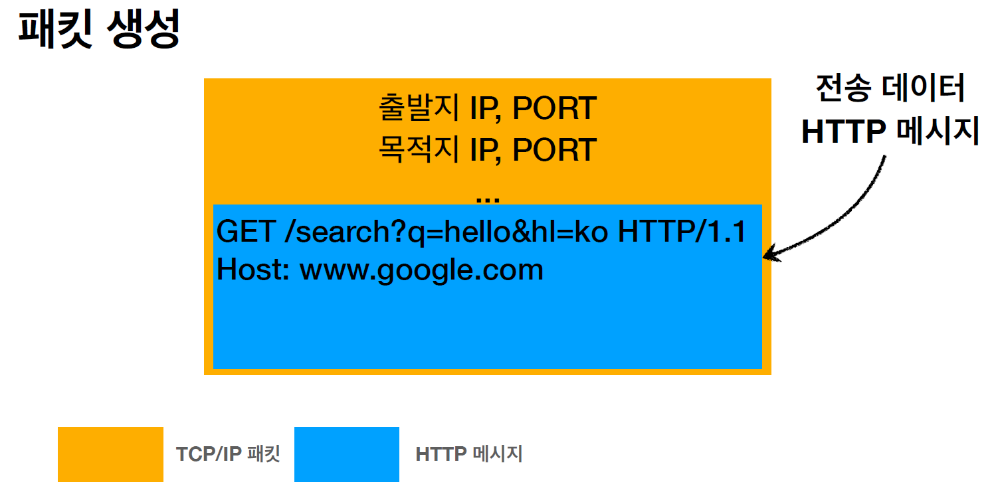
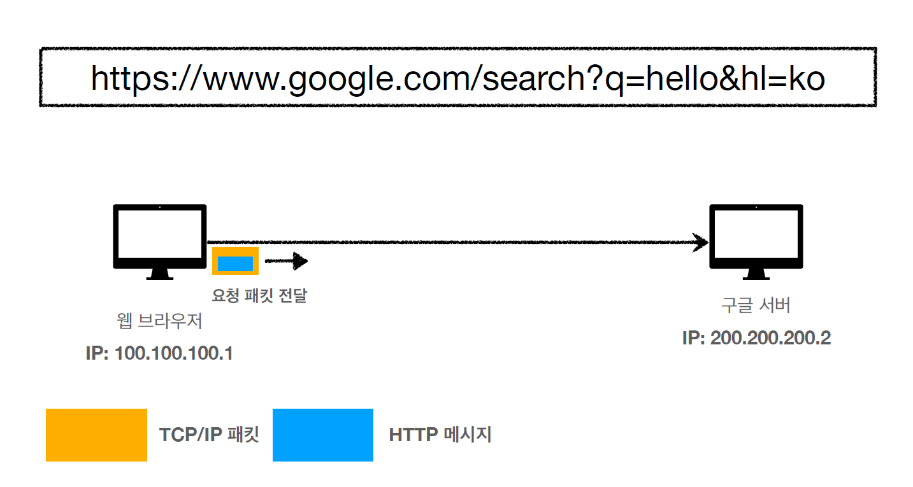
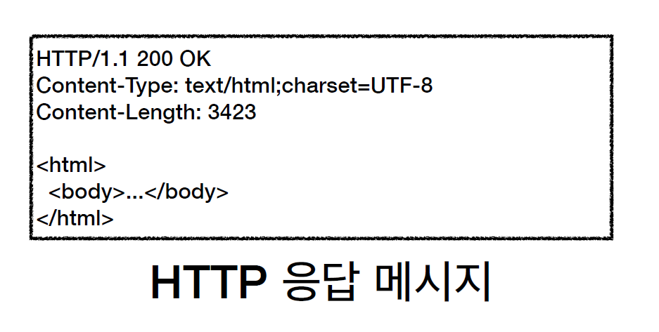
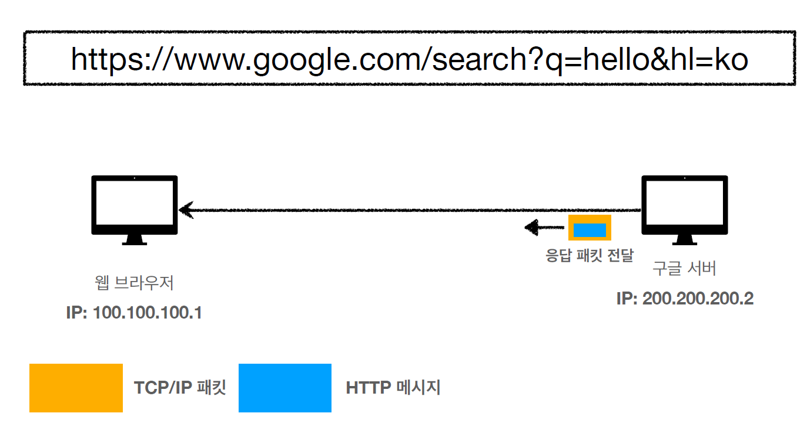

# 웹 브라우저 요청 흐름

 

- 스키마를 https로 작성하고 만약에 port번호를 작성안하면 https의 default 포트인 443으로 알아서 인지하고 요청 url이 보내진다.

## http요청 메시지는 어떻게 생겼는가?

 

위의 이미지가 'HTTP요청 메시지'에 들어 있는 데이터내용들이다.(구체적으로는 부가정보들이 더 들어 있음.)

여기서 'HTTP/1.1'은 버전정보를 의미

HOST는 내가 찾으려는 서버의 도메인명인 것이다.

## HTTP 메시지 전송

1. 웹브라우저가 http메시지를 생성
2. 소켓라이브러리를 통해서 OS의 TCP/IP계층에다가 http메시지를 전달한다.
   + 일단, 알아낸 IP랑 포트번호를 이용해서 구글서버랑 연결을 한다.(syn, ack을 해서)
   + 그런 다음에 소켓라이브러리를 통해서  TCP/IP로 http메시지를 전달한다. 
   + 그러면,  TCP/IP계층에서 http메시지에다가 저 주황색패킷을 씌운다. 그 주황색패킷에는 IP와 port정보가 들어있다. 
   + 이렇게 만들어진 패킷정보가 '인터넷망'을 통해서 서버로 흘러 들어갈 것이다.

 

 

3. http메시지는 수많은 노드를 통해서 200.200.200.2로 전달이 될 것이다.

## HTTP 메시지 전송

1. 이 요청패킷이 구글서버에 도착을 하게 되면은, 구글서버가 TCP/IP패킷을 까서 http메시지를 해석하게 된다.
2. 

 

그리고 이미지처럼 구글서버(웹서버)에서 'http응답메시지'를 만든다.

> Content-Type : 밑에 message body부분에 나오는 <html> <body> ...~ 인 내용이 어떤 데이터형식인지 알려주는 역할을 한다.
>
> Content-Length : 응답하는 데이터의 길이

3. 

 

응답패킷을 만드는 구글서버도 똑같이 TCP/IP패킷을 씌어서 클라이언트쪽으로 보낸다.

4. 그러면 클라이언트에서 응답메시지를 까서 웹브라우저가 html내용을 렌더링을 하면 우리가 평상시에 보는 html결과의 출력화면을 볼 것이다.

   ​	 

다음 내용 : http란?

