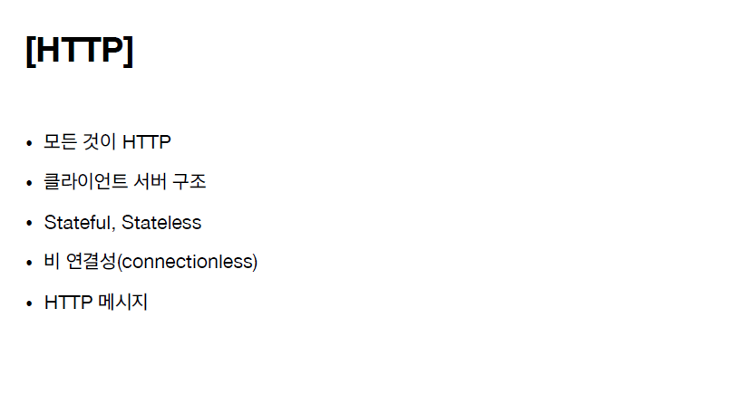
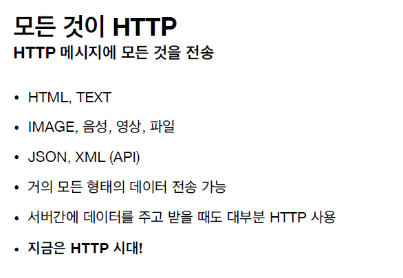
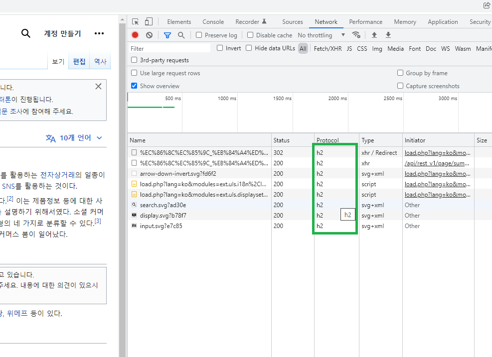
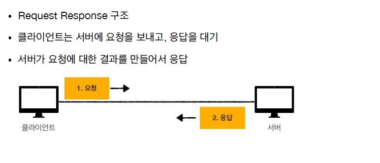

 

# HTTP

HyperText Text Transfer Protocol

HyperText = html

html문서와 같은 리소스를 url링크를 통해서 연결할 수 있고 전송할 수 있는 프로토콜 을 말한다.

지금은 모~든것을 HTTP프로토콜에 데이터를 담아서 전송한다.

 

JOSN, XML : 서버끼리 통신할때 사용하는 대표적인 방식

기억할 내용 > 실무에서 서버간에 통신을 할때 TCP프로토콜을 직접 이용해서 데이터를 전송하는 경우는 거의 없다. 대부분 HTTP프로토콜로 연결한다. 
( 하지만 http프로토콜의 기저에는 tcp/ip프로토콜이 존재한다는 것을 기억하자. )

TCP프로토콜을 직접 연결하는 경우는 게임서버 등 처럼 특수한 경우에만 이용한다.

심지어 요즘에 모바일게임은 http로 열어서 통신하는 구조로 많이 개발을 한다.

  

## HTTP 역사

+ HTTP/0.9 1991년: GET 메서드만 지원, HTTP 헤더X
+  HTTP/1.0 1996년: 메서드, 헤더 추가
+  ⭐️ HTTP/1.1 1997년: 가장 많이 사용, 우리에게 가장 중요한 버전★(여기에 모든 기능이 다 들어있음)
+  RFC2068 (1997) -> RFC2616 (1999) -> RFC7230~7235 (2014)
+  HTTP/2 2015년: 성능 개선
+  HTTP/3 진행중: TCP 대신에 UDP 사용, 성능 개선

 (2버젼,3버젼은 거의 성능 개선에 초점되어있는 업데이트 내용이다.)

## HTTP의, 기반 프로토콜 내용

+ TCP기반 : HTTP/1.1, HTTP/2
  + HTTP/1.1, HTTP/2는 TCP프로토콜 위에서 동작한다.
+  UDP기반 : HTTP/3
  + HTTP/3는 UDP기반으로 개발이 되어있다.
+  현재 HTTP/1.1 주로 사용
+  HTTP/2, HTTP/3 도 점점 증가

### TCP통신이 UDP보다 안정적인 것 아닌가? 왜 HTTP/3 UDP 기반인가?

> TCP는 3way handshake도 해야되고 기본적으로 내부 안에 데이터도 너무 많다. 그래서 기본적인 메카니즘자체가 속도가 빠른 메카니즘이 아니다.
>
> 그래서 http/3는 통신할때 속도가 빠른 UDP프로토콜 위의 애플리케이션 계층에서 UDP의 성능을 최적화하도록 새로 설계해서 나온 것이다.

### 인터넷 상에서 어떤 http버전으로 통신이 되는지 확인하기

 

## HTTP 특징

( 다음 수업의 예고내용 )

+ 클라이언트와 서버구조로 되어있다.
+  무상태 프로토콜(스테이스리스)을 지향한다 / 비연결성
+  HTTP 메시지를 통해서 통신을 한다.(보낼때, 받을때 전부)
+  단순하고 확장 가능하다.

### 1. 클라이언트와 서버 구조로 되어있다.

클라이언트와 서버는 메시지 교환을 통해 통신을 한다.

 

a. 클라이언트는 http메시지를 통해서 서버에 요청을 보낸다.

+ 예전과 달리 요즘에는 클라이언트와 서버의 개념을 분리해냈다. 이렇게되면 클라이언트와 서버가 각각 독립적으로 개선할 수 있다. 비즈니스로직이랑 데이터같은 것들은 다 서버에다가 밀어 넣는다. 그리고 클라이언트(스마트폰, PC)는 UI, 사용성에 집중한다.  반대로 트래픽이 갑자기 100배폭주를 하게 되면은 클라이언트에는 손될필요 없이 서버의 아키텍처를 어떤식으로 할지, 백엔드 기술을 어떻게 대용량트래픽으로 더 고도화하고 더 진화할지를 백엔드에서 고민하면 된다. 예를 들어서 php를 쓰다가 언어를 java로 바꾸던가 하는것이다. 이렇게하더라도 클라이언트는 서버에서 일어나는 이런 일들에 대해서 전혀 몰라도 된다.
+ 결론 : 클라이언트와 서버로 나눠서 구조를 만들게 되면은 양쪽이 독립적으로 진화를 할 수 있다.

> 참고> 여기서 클라이언트는 크게 2가지 의미로 해석된다.
> 하나는, 앱을 이용하는 사용자를 가리킨다.
> 2번째는, URL 링크를 접속했을때 처음에 다운받아오는 UI구성내용을 통해 보여지는 웹브라우저 내용 컨텐츠, 또는 다운 받은 특정 프로그램 구성내용을 말한다.

> 참고 링크 : https://www.zerocho.com/category/HTTP/post/5b344f3af94472001b17f2da

