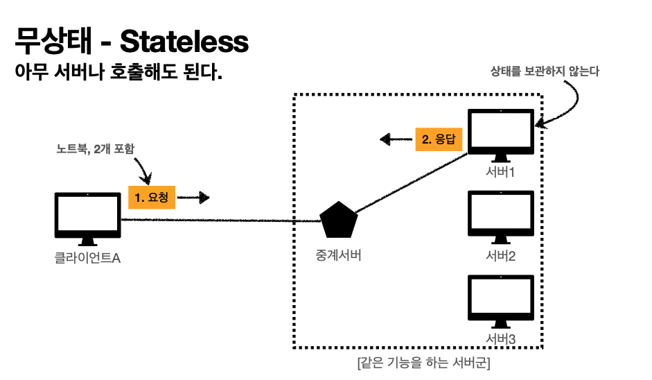

# 무상태 프로토콜

## 무상태 프로토콜을 지향한다. = Stateless하다.(http 특징)

- 서버가 클라이언트의 상태를 보존X
-  장점: 서버 확장성 높음(스케일 아웃) 
- 단점: 클라이언트가 추가 데이터 전송

## 상태를 유지 한다? = Stateful

: 상태를 유지한다는 것은 서버가 이전 클라이언트의 요청한 내용을 저장하고 있는 것이다.

고객: 이 **노트북** 얼마인가요? 점원: 100만원 입니다.

고객: **2**개 구매하겠습니다.

점원: 200만원 입니다. **신용카드**, **현금중**에 어떤 걸로 구매 하시겠어요?

고객: 신용카드로 구매하겠습니다. 점원: 200만원 결제 완료되었습니다.

  

## 무상태 = Stateless

: 무상태라는 것은 서버는 클라이언트가 보낸 한번의 request를 응답해주고 기존 request 내용을 보존하지 않는다.

고객: 이 **노트북** 얼마인가요? 점원: 100만원 입니다.

고객: **노트북**을 **2**개 구매하겠습니다.

점원: 노트북의 2개는 200만원 입니다. **신용카드**, **현금중**에 어떤 걸로 구매 하시겠어요?

고객: **노트북** **2**개를 신용카드로 구매하겠습니다. 점원: 200만원 결제 완료되었습니다.

서버1의 내용을 서버2, 서버3은 모른다.

  내용 상태를 보관하지 않고 요청한 내용에 충실해서 그것에 맞춰 응답만 한다. Statelss 환경에 맞춰 client가 요청을 보내기때문에 서버1에서 문제가 생겨도 서버2는 request에 맞춰서 잘 response 한다.

### 무상태의 단점

- 이전 내용을 포함해서 보내야 하므로 데이터를 너무 많이 보내야 한다.

## Stateful, Stateless 차이 정리

**상태 유지 ( Stateful )** : 중간에 다른 점원으로 바뀌면 안된다.

(중간에 다른 점원으로 바뀔 때 상태 정보를 다른 점원에게 미리 알려줘야 한다.)

**무상태 ( Stateless ) ** : 중간에 다른 점원으로 바뀌어도 된다.

갑자기 고객이 증가해도 점원을 대거 투입할 수 있다.

갑자기 클라이언트 요청이 증가해도 서버를 대거 투입할 수 있다. 무상태는 응답 서버를 쉽게 바꿀 수 있다. -> **무한한 서버 증설 가능**

## Stateless 실무 한계

- 모든 것을 무상태로 설계 할 수 있는 경우도 있고 없는 경우도 있다. 
- 무상태
  - 예) 로그인이 필요 없는 단순한 서비스 소개 화면 -> 무상태로 개발하기 편하다.
- 상태 유지
  - 예) 로그인
  - 로그인한 사용자의 경우 로그인 했다는 상태를 서버에 유지
  - 이럴 경우에는, 일반적으로 브라우저 쿠키와 서버 세션등을 사용해서 이런 필요한 부분만 상태 유지를 사용
  - 상태 유지는 최소한만 사용

