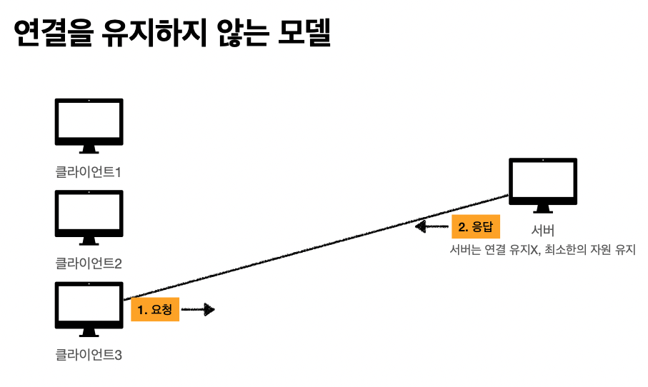
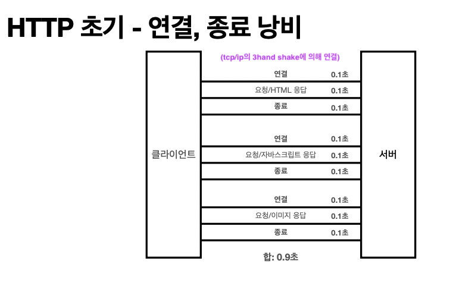

# Connectionless : 비연결성

### TCP/IP는 기본적으로 연결을 유지한다.

(TCP의 connection oriented개념과 다르다.)

### 연결을 유지하는 모델

 

 

### 연결이 유지되어 있는 곳(클라1,클라2,클라3)들은 메시지를 보내지 않을때에도 계속적으로 서버의 자원이 소모된다.

### 연결을 유지하지 않는 모델

 

http는 기본적으로 비연결성의 특징을 갖고 있기때문에 TCP/IP로 연결 후, 통신을 한번 한 다음에 바로 연결을 끊게 한다. 요청을 보낸 것에 대해 응답을 받으면 연결을 바로 끊는다. 

 

### 이렇게 되면, 서버가 유지하는 자원을 최소한으로 유지할 수 있다.

## Http는 기본적으로는 비연결성 모델이다.

- HTTP는 기본이 연결을 유지하지 않는 모델
-  일반적으로 초 단위의 이하의 빠른 속도로 응답
- 1시간 동안 수천명이 서비스를 사용해도 실제 서버에서 동시에 처리하는 요청은 수십개 이 하로 매우 작음
  - 예) 웹 브라우저에서 계속 연속해서 검색 버튼을 누르지는 않는다. 
- 서버 자원을 매우 효율적으로 사용할 수 있음

## 비연결성의 한계와 극복(단점)

- TCP/IP 연결을 처음에 한번 하는게 아니라 매번 req보낼때마다 새로 맺어야 함 - 3 way handshake 시간 추가
- 웹 브라우저로 사이트를 요청하면 HTML 뿐만 아니라 자바스크립트, css, 추가 이미지 등등 수 많은 자원이 함께 다운로드
- 지금은 HTTP **❗️지속 연결(Persistent Connections)**로 문제 해결(예전에는 이 용어를 keep alive라고 했음)  / 내부적으로 마다 다 다른데 예를 들어, 몇십초동안 유지하거나 등의 내부 매커니즘이 있다. 웬만한 html페이지 1개 내용을 전체 받을때까지는 연결을 유지한다.
- HTTP/2, HTTP/3에서는 이 지속연결개념이 더 많은 최적화됨

### HTTP의 초기 연결 방법

 

### HTTP의 현재 연결 방법

 

 

## Stateless를 기억하자

###  서버 개발자들이 어려워하는 업무

- 정말 같은 시간에 딱 맞추어 발생하는 대용량 트래픽
  - 예) 선착순 이벤트, 명절 KTX 예약, 학과 수업 등록
  - 예) 저녁 6:00 선착순 1000명 치킨 할인 이벤트 -> 수만명 동시 요청

