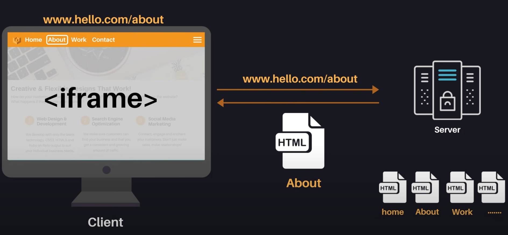
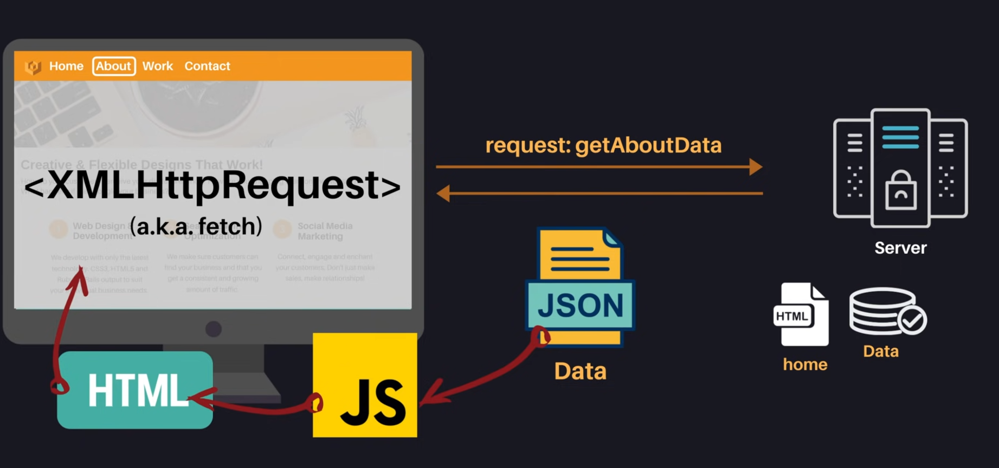

링크 : https://www.youtube.com/watch?v=iZ9csAfU5Os&t=15s

## 1990s mid : Static Sites

각 uri에 대해 하나의 정적내용을 받아와서 화면을 구성한다.

1996 : 문서내에서 문서를 또 담을 수 있는 <iframe>태그가 도입

 

1998 ~ : fetch api의 원조인 XMLHttpRequest API의 탄생

  

이때부터는 HTML문서 전체가 아니라 JSON과 같은 포맷으로 서버에서 필요한 데이터만 가볍게 받아 올 수 있게 되었다.

그 JSON데이터를 JS Obj로 변환해서 동적으로 HTML요소를 생성해서 페이지에 업데이트하는 방식이다. 

2005 : AJAX( 구글에서도 이걸 이용해서 gmail, google maps같은 웹어플리케이션을 만들고 있다.)

=> 이것이 현재 많이 쓰고 있는 'SPA ( = Single Page Application )' 이다.

: 사용자가 한페이지내에 머무르면서 필요한 데이터를 서버에서 받아와서 부분적으로만 업데이트를 하게 된다. 

