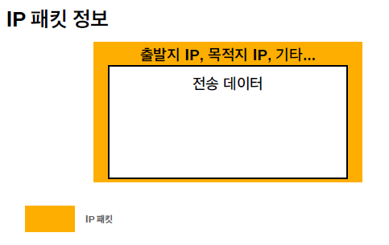

## IP  (인터넷 프로토콜)

:  Internet Protocol

### 인터넷 프로토콜의 역할

+ 보내려는 IP주소(IP address)에 데이터를 전달

+ 패킷이라는 통신단위로 데이터를 전달하게 된다.

  (패킷의 구성)

   

  이렇게 IP패킷을 구성하고 '인터넷망'에 던져진다.

 

#### 클라이언트 --> 서버

ip프로토콜 내에서 모든 노드들은 정해진 서버들의 규약을 따르고 있기때문에 어떤 패킷이 출발지IP가 뭐고 목적지IP뭔지 다 이해를 한다. 노드들끼리 해당 목적지IP를 받을 수 있는 곳이 어디냐!하면서 서로 던지면서 결국 최종적으로 IP:200.200.200.2에 해당하는 서버에 도착하게 된다.

#### 서버 --> 클라이언트

 

IP프로토콜(IP주소를 부여하고 IP패킷에 담고 이거를 찾아가는 방식)은 한계가 있다!!

### IP프로토콜의 한계

+ 비연결성
  + 받아야할 서버가 서버전원이 꺼져있을 수 있다. 근데 보내는쪽은 꺼져있는줄 모르고 계속 전달은 하게 된다.

+ 비신뢰성
  + 중간에 패킷이 사라졌을때는 해결을 못함 : 중간에 광케이블같은 랜케이블이 갑자기 멧돼지에 의해 전선이 끊겨있는 상황 등
  + 패킷을 여러개 보냈을때 순서대로 도착하지 못하는 경우가 생긴다.(뒤에 설명할것임)

+ 프로그램 구분 힘듬
  + 같은 IP를 사용하는 서버에서 통신되는 여러 APP가 존재할때 그 APP들을 구분할수가 없음

-----> 다음 내용 : TCP 프로토콜
