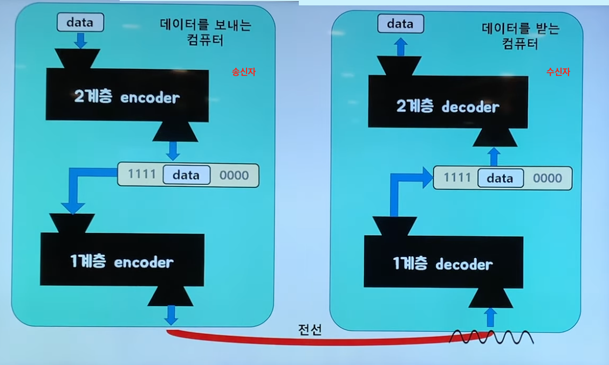

## 1계층 : Physical Layer

두 대의 컴퓨터가 통신하려면?

- 모든 파일과 프로그램은 0과 1의 나열이다. -> 결국 0과 1만 주고 받을 수 있으면 된다. 

두대의 컴퓨터를 전선 하나로 연결한다고 상상해보자.

 

  주파수(헤르츠)란?
: 1초당 진동한 횟수

### 두대의 컴퓨터가 0(-5v)과 1(+5v)를 통신할때 문제점

 

- 수직선과 수평선이 있는 전자기파는 항상 0 ~ 무한대[Hz]의 주파수 범위를 가진다. 따라서 위 이미지의 전기 신호를 통과시킬 수 있는 전선은 없다.

### 신호를 전선을 통해 전송하려면 어떻게 해야할까?

 
아래 이미지처럼 **<u>전기 신호 --> 아날로그 신호</u>** 로 바꿔서 전송해야 한다.

### 정리 : Physical Layer란

2대의 컴퓨터가 통신을 하려면, 0과 1의 나열을 아날로그 신호로 바꾼 상태로(인코딩) 전선으로 흘려 보내고 전선으로 아날로그 신호로 들어오고, 수신쪽 컴퓨터로 들어온 데이터를 0과 1의 나열로 해석(디코딩)하는 과정을 해야 한다. 이러한 기능을 해주는 모듈이 **<u>Physical Layer</u>** 다.

> 잠깐!
> 여기서 모듈이란 우리가 프로그래밍할때 함수같은거라고 간단히 생각하자.(근데 여기서는 그러한 함수같은 역할을 해주는 것이 하드웨어로 만들어져있으므로 '회로'로 짜여져 있다.) 

 

인코더 : 아날로그 신호로 변조 해주는 애
 

 

### Physical Layer 기술은 어디에 구현되어 있을까?

- PHY칩 이라는 곳에 해당 기술이 구현되어 있다고 한다.
- 1계층 모듈(회로)은 하드웨어적으로 구현되어 있다.

---

## 2계층 : Data-Link Layer

이 계층을 알아보기 전에 여러 대 컴퓨터 간의 통신에 대한 배경지식을 알아보자.
 망형으로 연결할 시 비효율적일 것이다.
 

따라서, 전선 하나를 가지고 여러 대의 컴퓨터와 통신할 방법을 모색해야 한다.
 
이런식으로 전선을 깔게 되면 하나의 전송을 통해 모든 컴퓨터가 데이터를 수신할 수 있다.

이 하나의 구리선을 하나의 상자모양으로 묶어보자.
 
하지만, 이렇게 연결할 시 단점으로, 예림이가 혜림이에게 데이터를 보내려고 하면 다른 두 대의 컴퓨터도 그 메시지를 읽을 수 있게 된다.

#### 큰 상자 허브가 목적지로 정한 대상에게만 메시지를 전달하게 해주려면 어떻게 해야 할까?

 
 이러한 기능이 가능하도록 상자 허브를 똑똑하게 만든 것을 **<u>스위치</u>** 라고 한다.

> 참고
> 위 이미지처럼 하나의 허브(스위치)에 직접적으로 연결된 장치까지 묶음으로 **<u>하나의 네트워크</u>**라고 한다. 또한 이것을 또 다른 말로 **<u>인트라넷</u>** 이라고 한다.

2개의 네트워크가 구축되어 있는데 다른 네트워크에 있는 장치에게 데이터를 전송하고 싶다면?(예림 -> 혜림)
 

스위치 장비를 라우터로 바꾸면 된다.
 

라우터 : 다른 네트워크끼리 연결시켜 줄 수 있는 장비를 말한다. 라우터는 스위치 역할도 포함해서 할 수 있다.

-  엄밀히 따지면 '라우터'장비는 '스위치 + 라우터' 역할을 둘다 하므로 **<u>L3스위치</u>** 에 해당한다. 하지만 그냥뭉뚱그려 생각하고 그린 그림이다.
- 그리고 여기에서 말하는 라우터는 우리가 흔히 아는 **<u>공유기</u>** 라고 볼 수 있다.

 

#### 2개가 아니라 더 많은 네트워크를 연결할때는? 

 

이렇게 컴퓨터가 연결된 전체 네트워크가 묶인 개념을 인터넷이라고 한다.

1계층에 속하는 기술만으로는 여러대의 컴퓨터가 통신하도록 만들 수 가 없다.
아래 이미지처럼 3대의 컴퓨터가 동시에 예림 컴퓨터에게 데이터를 보낸다고 해보자. 그러면 데이터를 잘못 끊어 읽으면 구분없이 제대로 해석하지 못할 것이다.

그래서 이 끊어 읽기의 성공을 위해서 송신자는 데이터 앞뒤에 특정한 비트열을 붙여서 보낸다.
 

- 예를 들어서, 송신자가 데이터를 보낼때 앞에는 1111, 뒤에는 000을 붙인다고 가정한 내용이다.(단지 예이다. 0000,1111인지 기계마다 다른듯...)

 
결과 : 이런식으로 읽은 결과, 예림이는 3명의 송신자로 부터 데이터를 구분해서 받게 되었다.

### 정리 : Data Link Layer란

- 같은 네트워크에 있는 여러 대의 컴퓨터들이 데이터를 주고받기 위해서 필요한 모듈을 말한다.
- Framing은 Data Link Layer에 속하는 작업들 중 하나다. 앞서 말한것처럼 원본 데이터에 감싸는 과정이 Framing(인코딩 과정)이고 Framing의 결과 데이터를 Frame이라고 한다.

#### 이미지 요약

  

### Data-Link Layer 기술은 어디에 구현되어 있을까?

- 랜카드에 해당 기술이 구현되어 있다고 한다.
- 2계층 모듈도 1계층 모듈처럼 하드웨어적으로 구현되어 있다.

----

## 3계층 : Network Layer

A가 B에게 데이터를 보내고 싶다고 가정해 보자.
 

1. A는 B에게 데이터를 보내기 위해 데이터에 목적지B의 IP주소를 붙인다.(캡슐화한다. = IP주소를 캡슐화한 것을 '패킷'이라고 한다.) -> 웹브라우저의 웹통신을 시도하는거라면, 웹브라우저에 도메인을 치면 자동으로 IP주소가 할당되고 그 IP주소가 보내려는 요청데이터에 감싸지게 될 것이다.
2. A가 자신한테 직접적으로 연결된 라우터(가)에 패킷 데이터를 먼저 보낸다. (가)는 패킷의 디캡슐화해서 목적지IP를 확인해본다. 
3. (가)는 자신이 속한 네트워크에는 해당되는 IP주소가 없다는 것을 인지하게 되면 (가)와 가장 가까운 다른 라우터(마)에게 다시 데이터를 캡슐화하여 전송한다.
4. (마)라우터는 (가)라우터가 그랬던 것처럼 데이터의 패킷을 디캡슐화해서 IP주소를 확인한다. 이때 (마)라우터는 라우팅이라는 것을 통해서 B에게 보내려면 어떤 라우터로 보내야 하는지 알게 된다. (라우팅에 대해 궁금하면 찾아서 공부해보길 권장)
5. (마)는 패킷으로 다시 캡슐화하고 (바)에게 넘긴다. (바)는 (마)와 같은 방식으로 라우팅을 통해 (라)에게 보낸다.
6. 최종적으로 (라)는 목적지가 자신의 네트워크에 있는 것을 알고 있기때문에 바로 그곳으로 전달한다.

### 정리 : Network Layer란

- 수많은 네트워크들의 연결로 이루어지는 inter-network 속에서 어딘가에 있는 목적지 컴퓨터로 데이터를 전송하기 위해 IP주소를 이용해서 길을 찾고(routing), 자신 다음의 라우터에게 데이터를 넘겨주는 것(forwarding)을 해주는 모듈이 속한 계층이다.

#### 이미지 정리

데이터를 3계층 인코더를 통해 인코딩되는 방법 : 해당 데이터가 자바를 예를 들어, 객체(C언어일경우 구조체)를 거쳐서 목적지의 ip주소가 추가된다.
   

### Network Layer 기술은 어디에 구현되어 있을까?

- 운영체제의 커널에 소프트웨어적으로 구현되어 있다.

---

## 4계층 : Transport Layer

- 데이터를 받는 수신자는 전 세계의 컴퓨터로부터 데이터를 받고 있다고 하자. 그런데 이 하나의 컴퓨터에 여러개의 프로그램들이 실행되고 있다.
  이때 데이터를 받고자 하는 프로세스들은 아래 이미지처럼 각 포트번호를 가져야 한다.

   
  

> 참고
> 기본적으로 웹브라우저에서 도메인을 검색하면 default로 80 포트번호로 전송을 보내고 응답을 받는다.

### 정리 : Transport Layer란?

- 송신할 데이터에다가 목적지 프로세스에 맞는 port번호를 붙여줘서 컴퓨터의 최종 도착지인 프로세스에 까지 데이터가 도달하게 하는  모듈이 속한 계층이다.

#### 이미지 정리

 

### Transport Layer 기술은 어디에 구현되어 있을까?

- 운영체제의 커널에 소프트웨어적으로 구현되어 있다.

---

## 5계층 : Application Layer

> 참고
> OSI Layer 7 계층이란?
> OSI모형은 ISO에서 컴퓨터 통신 구조의 모델과 앞으로 개발될 프로토콜의 표준적인 뼈대를 제공하기 위해서 표준안을 만들고 있던 네트워크 시스템 모델이었다.
>
> TCP/IP 5계층이란?
> 미국 국방부(DoD)에서 개발한 통신 프로토콜이자 네트워크 시스템 모델이다. 네트워크 프로토콜 suite(밀접하게 관련된 프로그램의 그룹)로, 온라인상에서 안전하고 효율적인 데이터 전송의 필수 요건을 정의한 내용이다. OSI의 7계층 모델은 전 세계적인 표준 기구에서 추친하는 내용이다보니 절차상 진척이 느릴 수 밖에 없어 표준안의 확정이 지지부진하였다. 그래서 결국 미국 국방부가 긴박한 필요성에 의해 만들어낸 것이 TCP/IP 계층모델이다.
> 현재는 인터넷 통신하는 데 있어 가장 널리 사용되는 계층 방식이다.
>
> TCP/IP 5계층은 OSI 계층의 5,6,7계층이 하나로 묶여 있다.

 

### TCP/IP 소켓 프로그래밍?

- 운영체제의 Transport layer에서 제공하는 API를 활용해서 통신 가능한 프로그램을 만드는 것이 **TCP/IP 소켓 프로그래밍** 또는 **네트워크 프로그래밍**이라고 한다.
- 소켓 프로그래밍 만으로도 클라이언트, 서버 프로그램을 따로따로 만들어서 동작시킬 수 있다.
- 뿐만 아니라 TCP/IP 소켓 프로그래밍을 통해서 누구나 자신만의 Application Layer 인코더와 디코더를 만들 수 있다.

### Application Layer 기술은 어디에 구현되어 있을까?

- Application Layer 기술을 구현한 프로토콜의 대표적인 것 하나가 HTTP프로토콜이다. HTTP프로토콜 내용을 구현한 인코딩, 디코딩에 대해 살짝 살펴보자.(HTTP를 이해하기 위해서는 먼저 클라이언트, 서버 패러다임을 알고 있어야 한다. [예 : header, body, request, response, Status code 등등])

 

#### 이미지 정리

 

### 추가 개념

- 소프트웨어 아키텍처 중 하나가 MVC패턴이다.
- MVC패턴처럼 소프트웨어 아키텍처 중에 Layered Architecture라는게 있다. Layered Architecture를 따르는 대표적인 예가 네트워크 시스템이다. 그러므로 네트워크 시스템은 하나의 커다란 소프트웨어라고 할 수 있다.
- OSI 7 Layer 모델은 거대한 네트워크 소프트웨어의 구조( = 네트워크 시스템의 구조 = Layered Architecture 중의 하나)를 설명하는 것이다.

