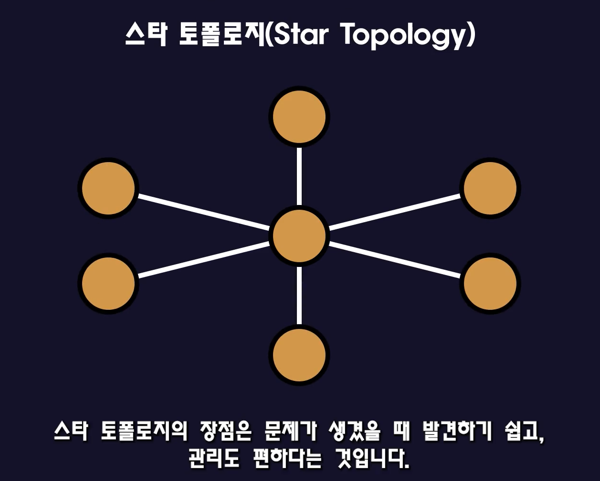
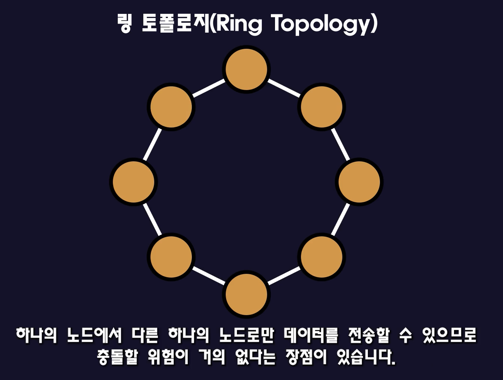
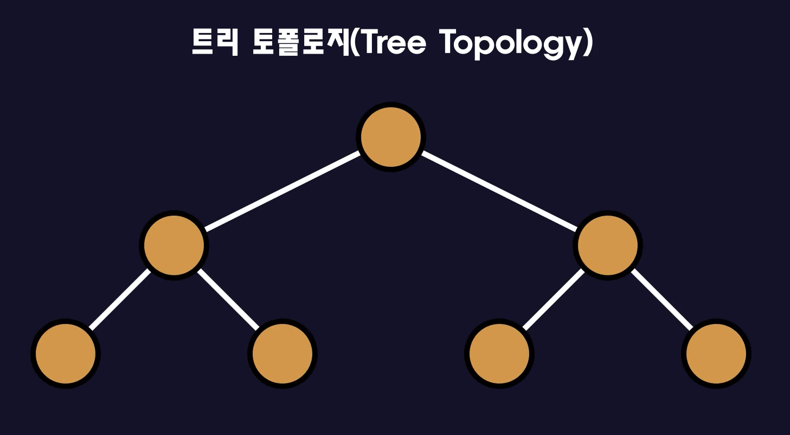
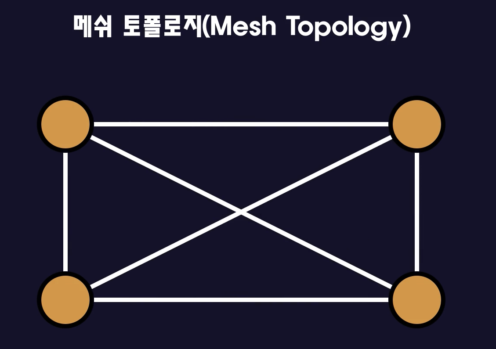
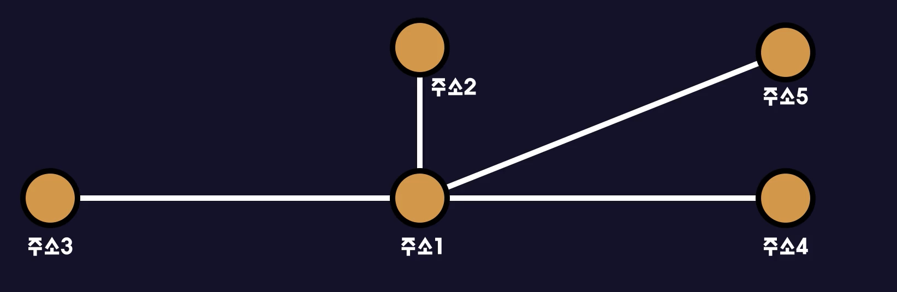
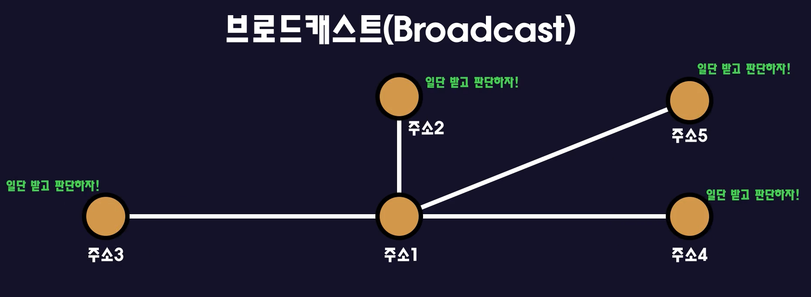
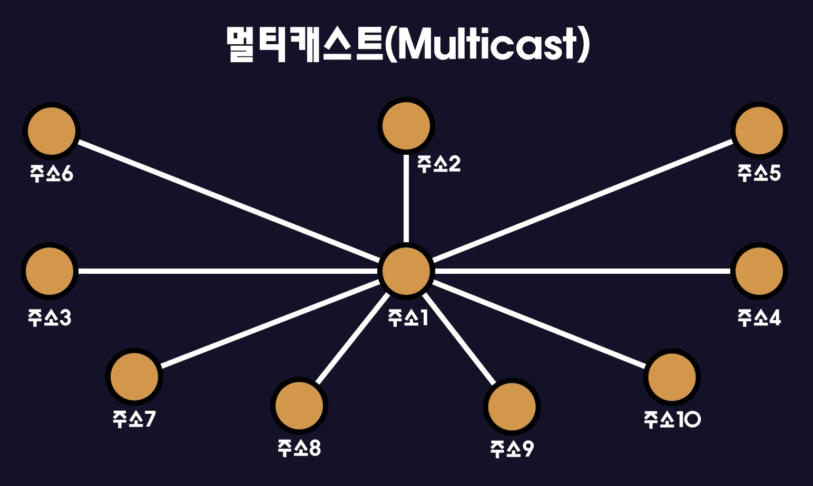
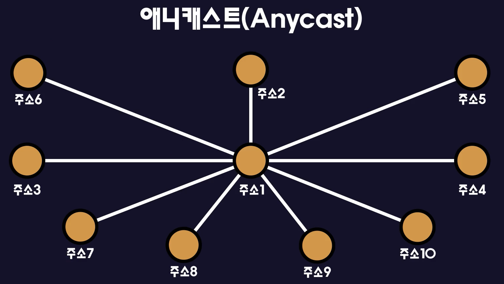

## VIP ( Virtual IP)

ARPAnet = > 인터넷으로 발전

노드 = 네트워크에 연결된 장비(예: 허브, 라우터, 컴퓨터)

요즘 OS에는 TCP/IP프로토콜기능이 기본적으로 내장됨

하나의 IP를 가진 하나의 컴퓨터에 웹서버를 만들고 ftp서버를 만들고 ssh서버를 만들수있는건가요?

# 구글인터넷에 접속하는 과정

공유기(라우터) : 이 공유기는 통신사(ISP)에서 설치한 모뎀에 연결된다.

모뎀은 집마다 어디에 두는지 다르지만 일반적으로 세대통신단자함에 넣어둔다.

이 세대통신단자함은 각 층 복도에 있는 '중간배선반(IDF = Intermediate Distribution Frame)'에 연결된다.

중간배선반의 예:

 

  

주배선반 ->

  

 

ISP는 우리가 흔히 통신사라고 말하는 곳이다. (SK, KT,LG)

 

ISP들은 속도가 아주 빠른 광케이블을 이용해서 네트워크를 만든다. 이 부분을 흔히 백본 또는 코어라고 말한다.

한국의 ISP는는 2티어로 분류되는데 이 2티어 ISP는 미국의 1티어ISP에게 일정금액을 내고 연결이 된다!

1티어로의 연결은 광케이블을 이용해서 바닷속으로 연결되어 있다.

 

미국의 ISP로 전달된 요청 데이터는 미국의 ISP와 연결된 구굴의 웹서버에 요청데이터를 전달한다.

(참고 : 구글은 '구글파이버'라는 사업으로 ISP기업으로도 운영됨)

 

간단하게 설명했지만 여기 구글웹서버까지 데이터가 전달되는데까지 수많은 프로토콜을 이용한다.

## 연결방식 : 토폴로지

: 네트워크의 다양한 형태를 '토폴로지'라고 말한다.

### 버스 토폴로지

장점 :한개의 노드에 문제가 생겨도 다른 노드에 영향을 주지 않는다. 즉 다른 노드들끼리 통신하는데는 문제가 없다.

단점 : 중앙통신 회선을 노드들이 공통적으로 공유하기때문에 트래픽이 증가하면 충돌이 발생해 성능이 떨어진다.(다른 노드에 데이터가 전달될떄 지연발생)

 

### 스타 토폴로지

중앙노드를 중심으로 다른 노드들이 다 연결되어 있는 형태다.

 

장점 : 문제가 생겼을때 발견하기 쉽고 관리도 편하다. 만약에 모든 노드가 동작하지 않는다면 주노드가 고장났다고 추측할 수 있고 반대로 하나의 노드가 동작하지 않는다면 해당노드가 고장났다고 추측할 수 있다.

단점 : 주노드에 문제가 발생하면 전체 네트워크가 다운된다.

### 링 토폴로지

 

장점 : 하나의 노드에서 다른 하나의 노드로만 데이터를 전송할 수 있으므로 충돌할 위험이 거의 없다.

단점 : 

1. 하나의 노드에 문제가 발생하면 전체네트워크에 문제가 생길 수 있다.
2. 노드를 제거하거나 새로운 노드를 추가하기가 힘들다.

### 트리 토폴로지

: 트리 자료구조의 형태로 연결한다.

 

장점 :

1. 노드를 제거하거나 새로운 노드를 추가하는 것이 쉽다.
2. 자식 - 부모 관계를 맺기때문에 네트워크의 장애를 해결하는 것도 어렵지 않다.

단점:

1. 루트노드에 문제가 생기면 전체 네트워크가 다운될 수 있다.
2. 특정 노드에 트래픽이 집중되면 네트워크의 속도가 떨어질 수 있다.  

### 메쉬 토폴로지

 

장점 : 특정 노드에 문제가 발생하더라도 전체 네트워크에는 이상이 없다. 예를 들어 소련이 첩보를 받아 미국의 어떤 노드를 공격하더라도 전체 통신은 멈추지 않아서 보복을 할 수 있는 구조인 것이다.

단점 : 모든 노드를 연결해야 하므로 케이블이 많이 필요하다.

## 네트워크의 통신 방식 : ~캐스트(유니,브로드,멀티, 애니)

### 유니캐스트

 

1.  노드끼리 1:1로 통신하는 방식이다.
2. 모든 노드들에게 데이터를 보내고 그 데이터에 담긴 목적지주소를 보고 나한테 보낸건지 아닌지 체크를 한다.(참고로 주소를 확인하는 작업은 랜카드가 한다. 그래서 CPU에 부담을 주지 않는 방식이다.)
3. 우리가 가장 많이 사용하는 통신 방식이다.

~~~
<참고>
유니캐스트는 논리적으로 1:1통신합니다.

하지만 LAN영역에서 거치는 기계에 따라서 다르게 동작합니다.

거치는 기계가 허브라면 모든 노드로 전송하고, 스위치라면 해당 노드로 전송합니다.(물론 스위치라도 테이블에 등록되어 있지 않다면 모든 노드로 전송해 테이블을 먼저 채워줍니다)

자세한 내용은 허브와 스위치편을 참조해주세요!
~~~

### 브로드캐스트

 

1. 출발지에서 연결된 모든 노드에게 데이터를 전송하는 방식이다.
   - 그 후에 모든 노드들은 데이터를 수신하게 되고 그리고 난 후 랜카드가 인터럽트를 발생시키고(인터럽트를 발생시켜 주소가 맞는지 판단하는 역할을 건너 뜀) CPU에게 넘겨서 CPU가 이 데이터를 처리할지 말지를 결정하게 된다.
   - 따라서 CPU에 부하를 주게 된다.
2. 브로드캐스트가 많이 발생하는 네트워크라면 네트워크 구성을 변경해야 한다.

### 멀티캐스트

 

1.  1:N으로 데이터를 전송하는 방식이다.
2. 유니캐스트와 브로드캐스트의 단점을 보완하는 방식이다.
3. 일부 그룹에만 데이터를 전송할때 유니캐스트, 브로드캐스트에는 각각 단점이 존재한다. 근데 이 각각의 단점을 해결한게 멀티캐스트다.
   유니캐스트처럼 데이터를 여러번 보낼 필요가 없고 브로드캐스트처럼 불필요한 장비에게 CPU를 사용하게 만들지도 않는다.
   하지만!! 멀티캐스트로 통신하려면 장비가 멀티캐스트 기능을 지원해야만 쓸 수 있다는 단점이 있다.

### 애니캐스트

: 네트워크에 연결된 노드 중 가장 가까운 노드에만 전송하는 방식이다.

 

1. 브로드캐스트의 문제를 해결하는 방식으로 IPv6에서 사용된다.

## 전송방식에 따른 통신의 종류